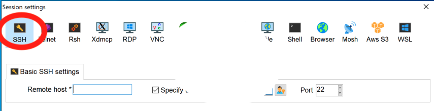
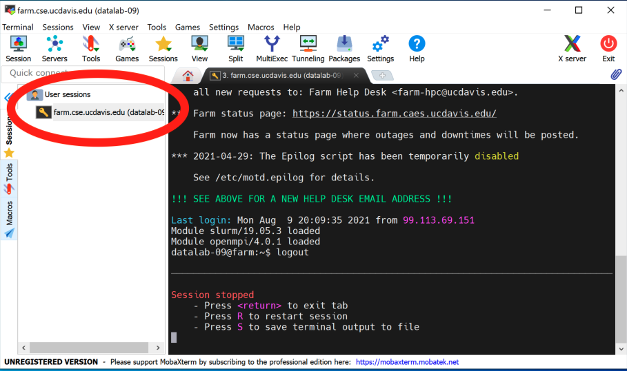
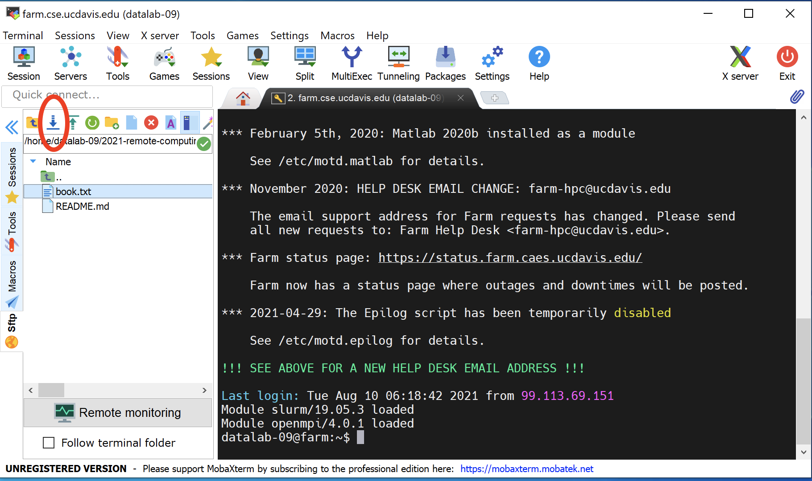

# Connecting to remote computers with ssh

This two hour workshop will show attendees how to connect to remote
computers using ssh software, which is the most common way to do
so. We will discuss usernames and passwords, introduce ssh software
clients, and work through the most common challenges attendees will
face in connecting to remote computers.

## SSH and Clients

We're going to be using [SSH, the Secure Shell
protocol](https://en.wikipedia.org/wiki/Secure_Shell), to connect to a
remote computer - in this case, the 'farm' computer at UC Davis.  We'll use it for the next 7 workshops, and then in [workshop 11](making-use-of-on-demand-cloud-computers-from-amazon-web-services.html), we'll use ssh to connect to a computer that we rent from Amazon instead.

ssh is a standard way to connect to remote computers, both to run
commands and to retrieve files. It uses an encrypted connection so
nothing you type can be seen by anyone else, which protects your
passwords as well as any other data you send.

### Some security thoughts

A few points on the security front -

* you still need to use a secure authentication method (password, or
  private key - we'll show you that in workshop 4!)
* people can still look over your shoulder, and if they have access to your
  computer they can do things like install keyloggers.
* ssh doesn't hide the fact that you're communicating with a
  particular remote computer, which is sometimes what snoopers care
  about (e.g. nation-states)

But, by and large, security for researchers is _not_ about stealing your
data, it's about breaking into the remote computers for other reasons.

ssh is a pretty good protection against network eavesdroppers and so on.

### ssh as a protocol - many clients!

ssh operates as a network "protocol", which means that the sender
(your local computer, in this case) and the receiver (the farm computer)
can be running any software that "speaks" ssh, and they can communicate
just fine. In particular, this means you can use many different software
packages that speak ssh - known as ssh "clients" - and we link to some
below.

For our lessons, we're going to use two specific ssh clients, one for
Mac OS X that's just called "ssh", and one for Windows that's called
MobaXterm.  We've chosen these because ssh comes with Mac OS X, so we
don't need to install it, and we have a lot of experience with
MobaXterm.  Unfortunately they're (mostly) quite different in
appearance, so we're going to run through them separately the first
time through.

There are _many_ alternatives - for example, for Mac OS X there are
[many different free SSH
clients](https://www.geckoandfly.com/31890/putty-ssh-alternatives/),
and here is [a list of 10 ssh clients for
Windows](https://www.smarthomebeginner.com/best-ssh-clients-windows-putty-alternatives/). They
will all look and feel somewhat different, but they will all get you the
same place!

**Windows users:** While we're working through the Mac OS X ssh
connection, please [go to the Windows instructions and start
downloading MobaXterm -
thanks!](#windows-connecting-to-remote-computers-with-mobaxterm).

## Mac OS X: Using the Terminal program

Find and open the Terminal program using Spotlight - it's under
Applications. It will look and feel a lot like the things you saw in
Workshops 1 and 2 :).

(Congratulations! You have unlocked a secret of Mac OS X - it's got a
command line underneath, because it's actually a UNIX operating system!)

Now type
```
ssh datalab-XX@farm.cse.ucdavis.edu
```
where you replace XX with your user number (between 10 and 60). (You
should received an e-mail from "Titus Brown" with the subject "Farm
account name (remote computing 2021 workshop series)". Ask a TA for
help if you can't find this e-mail.)

You will be confronted with a "password:" prompt. Copy and paste in the
password from your farm account e-mail. Ask a TA for help if you need it!
**Note that the password does not display, so it will look like nothing
is being entered when you paste.**)

And voila, you are now logged into farm! You should be at a prompt
that looks like this:

> ~~~
> datalab-09@farm:~$ 
> ~~~

## Windows: Connecting to remote computers with MobaXterm

Steps:

1. Go to the [MobaXterm download page](https://mobaxterm.mobatek.net/download.html).

2. Select "Home Edition".

3. Select "Portable edition". It's 25 MB and will take about a minute to download.

4. Find the downloaded Zip file in your Downloads folder (should be named "MobaXterm_Personal_21.2"), and double click on it.

5. In the `MobaXterm_Personal_21.2` folder, run the MobaXterm 21.2 Application.


Note: You may need to "allow access on all networks for this
application" if Windows asks.

6. Click on Session... (upper left).

7. In the new window, click on SSH (upper left).



8. Under "Basic SSH settings", set "Remote host" to "farm.cse.ucdavis.edu".

This is the computer name you are connecting to.

9. Click on "specify username", and enter the username you received in the e-mail from "Titus Brown" with the subject "Farm account name (remote computing 2021 workshop series)". (Ask a TA for help if you can't find this e-mail.)

   Then select OK.


10. It will now open up a terminal-looking window that will ask for your password. Select your password from your e-mail and copy it (ask a TA for help if you can't find your password). Then use right-click to paste it. (It may open a pop-up window asking what you want right-click to do. Select the default.)

11. Hit enter, and it should log you in!


Congratulations!

It will probably ask you if you want to store the password in your
password store, and then ask you for a master password. You can then
use this master password to "unlock" _all_ your ssh passwords for
MobaXterm to use. You can pick something short and simple to remember
since (at least for now) you'll only be using it to log into the
temporary account at farm, but if you end up using MobaXterm a lot you
may want to change it.


## Logging out and logging back in.

OK. Now that you're in, ...log out and log back in!

To log out, type 'logout'.

Then go back through the above to make sure you've got it all right.

A few notes -

* for Mac OS X, you can use the up arrow to go to the previous command and run it. You'll need to type your password in again, though.
* for MobaXterm, you'll be able to do use the saved password so you won't need to type your password in again; see the screenshot below.



## You're logged on to a remote computer. Now what?

The magic of UNIX and the command line is that once you're logged onto a
remote computer, ...everything works the same.

Yes, you will have access to different files, and maybe different software,
and different compute resources (more disk space, maybe more CPUs or more
memory) but the command line basically works the same whether you're logged
in to your laptop, a workstation next door, or an HPC across the world.

Let's start by reprising some of the basics from [workshop 1 (the command line)](introduction-to-the-unix-command-line.html) and [workshop 2 (editing text files)](creating-and-modifying-text-files-on-remote-computers.html).

### Welcome to your account!

Start by running:
```
pwd
```
and you will see something like `/home/ctbrown`, although it will vary
with the account name you used. This is because we're all using different
accounts with different default home directories.

### Loading some files into your account

Before we go any further, we need some files!

You'll note that if you do an `ls`, there's nothing in your home directory.
That's because most UNIX accounts start out empty. (Sometimes there will be
generic files like "Desktop" and so on in there - it depends on the
system.)

Well, actually, it's not *quite* empty. Try:
```
ls -la
```
and you'll see a few configuration files and directories. All of these
are created automatically for you and you don't need to worry about them
for now.

So, basically, your account is empty of user files.

So let's get some files!

There are actually many ways to download files, and we'll show you a few
over the next few workshops.

We'll start by mimicking the setup of the binders on days 1 and 2 by
copying a bunch of files from GitHub into your account.

The following command will take the set of files [here](https://github.com/ngs-docs/2021-remote-computing-binder/) and make them appear in your account:
```
git clone https://github.com/ngs-docs/2021-remote-computing-binder/
```
-- note that git and GitHub are something we'll cover more thoroughly
in week 8. For now, just accept it as one way to go out and get files :).

Now if you do
```
ls
```
you'll see a directory `2021-remote-computing-binder/`. Let's cd into it -
```
cd 2021-re<TAB>
```
if you hit the TAB key where it says &lt;TAB&gt;, you'll get command-line completion to work.

If you type
```
ls -F
```
you should see some familiar sights (at least if you attended workshops 1 and 2) -

> > ~~~
> > 2cities/  binder/  data/  README.md  SouthParkData/
> > ~~~

-- yep, these are the files we worked with on those two days!

### Revisiting file and path manipulation

If you
```
cd data/
```
and do
```
ls
```
you'll see the following files:

> > ~~~
> > MiSeq		Slide1.jpg	hello.sh	nano1.png
> > README.md	gvng.jpg		nano2.png
> > ~~~

and with
```
ls -a
```
we will see the following:

> > ~~~
> > .		MiSeq		Slide1.jpg	hello.sh	nano1.png
> > ..		README.md	gvng.jpg	.hidden		nano2.png
> > ~~~

Now, if you navigate into the `tmp1` directory located in the
`.hidden` directory,
```
cd .hidden/tmp1
```
you will be in a different _absolute_
directory than you were on in the binder - now it'll be something like
`/home/ctbrown/2021-remote-computing-binder/data/.hidden/tmp1`, rather
than `/home/jovyan/data/.hidden/tmp1`.

That's because we're on a different system, with a different user
account than before, and (unlike with the binder) we are going to be
doing more things than just exploring the contents of the binder, so
we've put things in the folder _underneath_ `2021-remote-computing/`
to contain data for today and [workshop 4](running-programs-on-remote-computers-and-retrieving-the-results.html).

This is an example of home directory organization and project management,
which we'll be talking about in [workshop 6 (project organization)](structuring-your-projects-for-current-and-future-you.html) - how to organize your account
so that you can figure out what the files in it probably mean.

At this point, you could do the rest of [workshop 1's
lesson](introduction-to-the-unix-command-line.html), but rather than
do that, let's just note that all of the _relative_ path navigation
you did will continue to work, even though you're on a _different_
computer in a _different_ account than you were using for workshops 1 and 2.

For example, you can copy files between directories using the same
relative path as before,
```
cp thisinnotit.txt ../tmp2
```
and we navigate to the tmp2 directory and list the files that are in it we will see the `thisinnotit.txt` file has been copied to the tmp2 directory.

```
cd ../tmp2
ls -l
```
-- but the difference is that this directory is now under
`/home/ACCOUNT/2021-remote-computing-binder/data/` rather than
`/home/jovyan/data/`. Try running `pwd` and you'll see that:
```
pwd
```

### Revisiting file editing

Now go back to the 2021-remote-computing binder directory --
```
cd ~/2021-re<TAB>
```
Here, the `~/` refers to the _absolute_ path to your home directory,
whatever your username is - it's different for everyone in the class! -
and then the `2021-remote-computing-binder/` is a directory underneath it.

We can use the `file` command as in [workshop 2](creating-and-modifying-text-files-on-remote-computers.html#ok-ok-what-does-this-all-mean-in-practice) to look at the file type of
`2cities/book.txt.gz` --
```
file 2cities/book.txt.gz
```
-- and then uncompress it,
```
gunzip 2cities/book.txt.gz
```
which will produce the uncompressed file `2cities/book.txt` from the compressed file `2cities/book.txt.gz`. If we run `head` on the .txt file, we'll see the
first 10 lines of the file:
```
head 2cities/book.txt
```

Conveniently, all three editors that we showed you in [workshop 2](creating-and-modifying-text-files-on-remote-computers.html#lets-edit-this-file) are
available here - let's use nano (or an editor of your choice) to edit
the book.txt file.  If you're using nano, run
```
nano 2cities/book.txt
```
and use the arrow key to go down 9 lines to a blank line, and type
`kilroy was here!` or something else silly and identifiable.

Now save, using CTRL-X, then 'y', then ENTER.

Now, if you run
```
head 2cities/book.txt
```
you should see that your edits are there.

A difference from what we did in workshops 1 and 2 is that these changes
are now _persistent_. Unlike binder, the files on farm don't go away
when you log out!

## Copying files to and from your local computer.

So, we've just edited files on the 'farm' computer, which is a remote
computer system (located on the UC Davis campus). Suppose that we want
to get a copy of that file locally. How do we do that?

The method varies depending on which ssh client you're using.

### Mac OS X: Copying files using ssh.

If you're on Mac OS X, log out of farm by typing
```
logout
```
and now you will be still in the Terminal program, but your shell
prompt will be running on your local computer instead of farm.

**Note: it's important that you're no longer at the farm prompt! You should
_not_ see 'farm' in the command-line prompt!

Now run the following command, replacing '-XX' with your datalab
account number:
```
scp datalab-XX@farm.cse.ucdavis.edu:2021-remote-computing-binder/2cities/book.txt /tmp
```
and you should see output that looks something like this:

> ~~~
> book.txt                                      100%  788KB   2.6MB/s   00:00
> ~~~

The `scp` command stands for "secure copy" and it mimics the syntax of the
`cp` command: `scp <from> <to>`, where either `<from>` or `<to>` can be a remote location of the form `login@computer:path/to/location`.

Now open your `/tmp` folder - you can do that with `open /tmp` - and you should
see 'book.txt' there!

### Windows: Copying files using MobaXterm.

This is actually pretty easy :). Go to the file pane in your MobaXterm
window, and select 2021-remote-computing-binder. Then select the 2cities
folder. Then select 'book.txt', and click the 'download' button. (See
screenshot below.)



It will ask you where to put it; just put it somewhere you can find it,
like your Desktop.

### View and change the file you just downloaded

Go ahead and open the file you just downloaded on your local
system. You should see the changes you made with the `nano` editor on
the remote system. Congratulations!!

Now, edit it using whatever editor you like and change something recognizable.

Be sure to save it!

### Copy the file back to farm.

On Windows with MobaXterm, you can use the "upload" button (next to the
download button :) to upload `book.txt` from your Desktop back to farm.

On Mac OS X, you need to run the command:

```
scp /tmp/book.txt datalab-XX@farm.cse.ucdavis.edu:2021-remote-computing-binder/2cities/
```

CHALLENGE: Now verify that your `book.txt` file on farm contains the
changes you made on your local computer, by:

* if you're on Mac OS X, logging into farm
* changing to the `2021-remote-computing-binder/2cities/` directory
* using `head`, `less`, or an editor to look at the `book.txt` file.

### Digression: why do you need to log into/log out of farm on Mac OS X?

You may have noticed that, on Mac OS X, we're logging out of farm to
run commands on the local machine. That's because `scp` is a shell command
that's running on your local computer.

That brings up two questions. First, why aren't we running it on farm?
And second, is there any way that we can avoid logging out, the way the
Windows folk can avoid logging out?

The answer to the first question is that 

## Some commands are available! Others are not.

You may remember looking at the South Park CSV data set in [lesson 2](creating-and-modifying-text-files-on-remote-computers.html#working-with-csv-files) -
```
cd ~/2021-remote-computing-binder/SouthParkData/
gunzip All-seasons.csv.gz
head All-seasons.csv
```
and those commands are all standard UNIX commands. You can also use cut, grep,
sort, and uniq just fine - for example, let's calculate how many
times a character in South Park (in column 3) has "computer" in its name --
```
cut -d, -f3 All-seasons.csv | grep Computer | sort | uniq -c
```

So those commands all work. But `csvtk` doesn't -- this command fails,
```
csvtk cut -f Character All-seasons.csv | grep Computer | sort | uniq -c
```
because csvtk isn't installed. And that's what we'll be showing you how to
do in workshop 5 - [install software like csvtk using conda](installing-software-on-remote-computers-with-conda.html).

## Summing it all up - a challenge!

Let's all do the following:

* Download the file `All-seasons.csv` from the directory `2021-remote-computing-binder/SouthParkData/` on farm to your local computer.
* Open it in a spreadsheet program and edit the first line.
* Export it to a CSV file with the name `All-seasons-changed.csv`
* Upload the file back to farm, to the directory `2021-remote-computing-binder/SouthParkData/`
* Log into farm and confirm it's there and that the changes are present, using `head All-seasons-changed.csv`.

## Working on shared systems

Let's all log back into farm.

### Shared disk space

Wait one minute...

...and now do:
```
ls ~datalab-09/
```
what do you see?

That's right, that's _my_ account, and _my_ files.

By default, home directories on many systems are readable by everyone.
However, they're never _writeable_ unless you enable that intentionally
for a directory.

We'll show you how to control permissions a bit in Workshop 4.

### Configuring your account on login

Edit the file `~/.bashrc` with nano:
```
nano ~/.bashrc
```
and type `echo Hello and welcome to farm` at the top of the file.
Save with `CTRL-X`, "yes", enter.

Now log out and log back in.

You should see 'Hello and welcome to farm' everytime you log in!

You can add commands like
```
alias lf=ls -FC
```
in your .bashrc if you want to configure your account that way; we'll
cover more configuration commands in [workshop
6](structuring-your-projects-for-current-and-future-you.html) and
beyond.

To see the changes without having to log out and log back in, run
```
source ~/.bashrc
```

### Using multiple terminals

On Mac OS X, you can use Command-N to open a new Terminal window, and then
ssh into farm from that window too.

On Windows, you can open a new connection from MobaXterm.

These are different command-line prompts on the same system.

They share:

* directory and file access (filesystem)

They do not have the same:

* current working directory (`pwd`)
* running programs, and stdin and stdout (e.g. `ls` in one will not go to the other)

These are essentially different _sessions_ on the same computer, much like
you might have multiple folders or applications open on your Mac or Windows
machine.

You can log out of one independently of the other.

We'll cover more of this in workshops 7 and later.

### Looking at what's running

You can use the `ps` command to see what your account, and other accounts,
are running:
```
ps -u datalab-09
```
the key column here is the last one, which tells you what program they're
running.

You can also get a sort of "leaderboard" for what's going on on the shared
computer by running
```
top
```
(use 'q' to exit).

### Summing things up

Today, you learned how to log into remote systems, execute commands, and
transfer files to and from your local computer.

We also talked a bit about network security, shared disk space, and
shared process space.

In workshop 4, we will do more with running remote commands, getting
files onto your remote system, file permissions, and actually working
effectively on remote systems.
