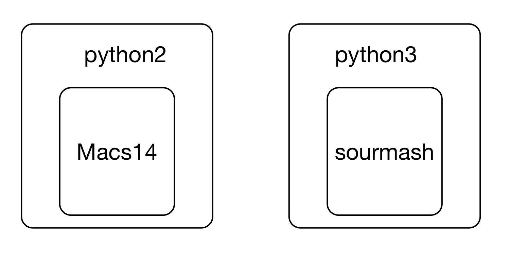

# Installing software on remote computers with conda

This two hour workshop will show attendees how to install and manage
software using the conda installation system. We will give examples of
installing Python and R software, and managing conda environments on
remote systems.

This lesson was adopted from [a lesson](https://github.com/ngs-docs/2021-GGG298/tree/latest/Week3-conda_for_software_installation) co-authored by Shannon Joslin for GGG 298 at UC Davis. There is also a really nice binder-based tutorial [on the NIH CFDE training Web site](https://training.nih-cfde.org/en/latest/General-Tools/Introduction-to-Conda/)!

Learning objectives:

* learn the basics of software installation, software dependencies, and isolation environments
* learn about conda and how to use it
* learn about conda-forge and bioconda and how to install software from them
* learn to use conda to manage R and Python installations

Other references:

* [ANGUS 2019 lesson](https://angus.readthedocs.io/en/2019/conda_tutorial.html)
* [Why you need Python Environments and How to Manage Them with Conda](https://www.freecodecamp.org/news/why-you-need-python-environments-and-how-to-manage-them-with-conda-85f155f4353c/)

## Why is software installation hard?

It's a confusing ecosystem of operating systems (Mac OS X, many versions of Linux, Windows)

Many software has many dependencies (e.g. just consider base language -- C++, Java, Python, R, and their different versions)


This leads to confusing situations where different versions of underlying software are need to run two different programs -- what if you wanted to run Macs14 and sourmash both, but one wanted 'python' to mean python2 and the other wanted 'python' to mean python3?



Decoupling user-focused software from underlying operating systems is a Big Deal - imagine, otherwise you'd have to rebuild software for every OS! (This is kind of what conda does for you, actually - it's just centralized!)

Also, lot of software installation currently requires (or at least is much easier with) sysadmin privileges, which is inherently dangerous.

**Why do you need isolated software install environments? Some specific reasons:**

* your work relies on a bunch of specific versions (perhaps old versions?)
* working with a collaborator who really likes a particular feature!
* experiment with new packages without messing up current workflow (reproducibility!)
* publication ("here's what I used for software", repeatability!)
* sometimes workflows rely on incompatible software packages! see [my twitter question](https://twitter.com/ctitusbrown/status/1218252506335080449)

Conda tries to solve all of these problems, and (in my experience) largely succeeds. That's what we'll explore today.

Conda is a solution that seems to work pretty well, and can be used by any user. Downsides are that it can get big to have everyone install their own software system, but it's not that big... (The farm admins like it, too!)


Note that conda emerged from the Python world but is now much broader and works for many more software packages, including R!

## Getting started with conda

### Installing conda

We installed conda in your account already for you. In case you want to
install it on another computer, or in another account, [the miniconda
installation instructions are pretty good!](https://conda.io/projects/conda/en/latest/user-guide/install/index.html#regular-installation)

Note that we also added the following software sources to your installation,
```
conda config --add channels defaults
conda config --add channels bioconda
conda config --add channels conda-forge
```
and we'll talk about this later. But if you install miniconda on your own,
you'll need to run these commands in your new installation to set up the
software sources correctly.

### Log into farm

As per the instructions in [workshop
3](connecting-to-remote-computers-with-ssh.html) and [workshop
4](running-programs-on-remote-computers-and-retrieving-the-results.html),
log into farm.cse.ucdavis.edu using your datalab-XX account.

When you log in, your prompt should look like this:

> ~~~
> (base) datalab-09@farm:~$
> ~~~

If it doesn't, please alert a TA and we will help you out!

The 'base' part of the prompt is new and it indicates that conda has
been activated in your account and that you are in the base
environment. Read on!

### Creating your first environment & installing csvtk!

#### What is a conda environment?

A conda environment is a specific collection of packages/tools that
you have installed. For example, you may have one environment with
Python 2.7 and its dependencies, and another environment with Python
3.4, both for legacy testing. And then you might have a Python 3.9
environment for the latest version of Python. Environments are
isolated from each other: if you change one environment, your other
environments are not affected. You can easily `activate` new
environments, which is how you switch between them.

### Installation!

Let's install some software! We'll start with csvtk, which we introduced in [workshop 2, working with text files](creating-and-modifying-text-files-on-remote-computers.html#use-csvtk-when-working-with-csv-files-maybe.).

Here's the command to `create` a new conda environment, named 'csv', with csvtk installed.

```
conda create --name csv -y csvtk
```

Here, we are installing the csvtk package into an environment named `csv`.
The -y indicates that we don't want conda to ask us for confirmation - it
should just go ahead and create the environment.

Now, activate the new environment:

```
conda activate csv
```

Your prompt should change to have `(csv)` at the beginning.

Let's run csvtk on some real data now! We'll use the files from workshop 2
(see [these instructions for getting them](running-programs-on-remote-computers-and-retrieving-the-results.html#first-download-some-files)) -- make sure
this works:

```
cd ~/2021-remote-computing-binder/SouthParkData
gunzip All-seasons.csv.gz
ls -l All-seasons.csv
```
(FYI, you may get an error in the gunzip command if you've already run that -
it's fine!)

You should now be able to run:
```
csvtk cut -f Character All-seasons.csv | grep Computer | sort | uniq -c
```
and you should see:

> ~~~
>    13 Computer
>     3 Computer Voice
> ~~~

### csvtk in a bit more detail

Let's explore csvtk a bit - what's going on here?

csvtk is [a cross-platform library for working with CSV and TSV
files](https://bioinf.shenwei.me/csvtk/). It's written and maintained
by Wei Shen, and it's free and open source.

It's relatively new - I found out about it only a year or two ago - and
while it doesn't do anything I couldn't do with other commands, it packages
a bunch of really nice functionality together into one tool.

For example, I can find the headers in a csv file like so,
```
csvtk headers All-seasons.csv
```

and I can then cut out one particular column and summarize things -- e.g.
```
csvtk cut -f Character All-seasons.csv | sort | uniq -c | sort -n | tail
```
(which tells me that Cartman is by far the most quoted character in this file).

What I'm doing here is using [piping and filtering (from workshop 2)](creating-and-modifying-text-files-on-remote-computers.html#piping-and-filtering) to:

* take the contents of the Character column, produced by csvtk
* sorting the contents (`sort`)
* counting the number of distinct elements (`uniq -c`)
* sorting the counts from least to most by number (`sort -n`)
* and then showing only the last 10 (`tail`)

(It looks complicated, but as you start using these commands more and more,
it will become second nature!)

**CHALLENGE:** How would I find the _least_ quoted characters in this file?

---

The key thing about csvtk for _this_ lesson is that it's new software, and
it's mostly useful for data scientists, so it's not "built into" UNIX
operating systems yet (and may never be).

So when you try running it in the _base_ environment,
```
conda activate base
csvtk
```
you'll get "command not found" because it's not installed.

But conda lets us install it from bioconda, a community repository of
software! And then we can use it! Yay!

If you go back to your csv environment, you'll see that you can run it
again:

```
conda activate csv
csvtk
```

### Where is the software coming from!?

When we run `conda create` to install csvtk, where is conda looking for
and finding the software?

The short answer is "the Internet", and more specifically,
pre-prepared conda software repositories, or "channels". Bioconda is
one such channel, as is conda-forge. We'll talk more about channels
below.

### Digression: there are many ways to install software!

If you're at all familiar with UNIX, you might be saying "wait! but I already
use homebrew! or apt! or yum! or containers! or ...!"

Or you may point your sysadmins at this tutorial and they'll say "well
you should just use the modules system on your HPC."

Yes, there are many ways to install and use software! Why conda?

We like conda, because it's straightforward, flexible, cross-platform,
supports version pinning, and does not require systems administrator
access. In the past 12 years of teaching bioinformatics and data
science, conda has come closest to being the thing that works for
everyone, on every platform. As they say, "your mileage may vary"
(YMMV). But we like conda :).

## Installing more software in your current environment

Once you're in an environment, you can install new software with `conda install -y <software_name>` like so:

```
conda install -y fastqc
```
and that should work too! You'll be able to run the `fastqc` command now.

Here, FastQC is a completely separate application that we use in
bioinformatics for looking at FASTQ files. We talk about that more in
some other workshops we run, but: the main point is that it's just
some more "non-standard" software that you can install!

Generally you want to avoid installing too many packages in one
environment, as it starts to get slow to figure out whether or not
something can be installed. We'll talk more about this below.

You can list software with `conda list`:
```
conda list
```

which is less useful than you might think, given how many packages
we've installed... in the future you will be able to list only the
user-requested packages and *not* the dependencies needed for them,
but for now, there's no good way to do that.

(Why are there so many? Because most software is built on top of
_lots_ of other software... and so you need to install all of that other
software, too!)

### Finding and specifying versions

To see what version of a particular piece of software you have installed, run:
```
conda list csvtk
```
and look at the second column. (Note that `conda list` doesn't need an exact match, so e.g. you can find all packages with 'csv' in the name by doing `conda list csv`).

As of Aug 2021, conda installs csvtk version 0.23.0. You can force conda to install _exactly_ this version in the future like so,
```
conda install csvtk==0.23.0
```

Unfortunately there's no good way to know if a new version of a
software package is "significant" or not, unless they use [semantic
versioning](https://semver.org/)... Generally if there's a big number
update (1.0 -> 2.0) the software will work quite differently, but
there's no guarantee on that.

For example, our software sourmash 1.0 was very different from 2.0,
while sourmash 3.0 was virtually identical to 2.0 in usage (but not in
implementation). The next version, sourmash 4.0, broke things.

(The lesson is, don't trust software projects to be consistent in
their versioning!)

**CHALLENGE:** Use the `conda create` command to create a new environment
and install the latest version of sourmash in it. Then activate that
environment and verify that you can run 'sourmash'.

---

Make sure to switch back to your csv environment when you're all done:
```
conda activate csv
```

### Making and using environment files

What if you want to specify collections of software that you use together?
And/or send collaborators or colleagues the set of software they need,
all in one nice file?

conda has a nice human-readable format for that, called an
**'environment file'**. These are supposed to be reasonably portable
files that you can ship around to different computers and have them
automatically install the right stuff. You can see the one for the
binder for workshops 1 and 2
[here](https://github.com/ngs-docs/2021-remote-computing-binder/blob/latest/binder/environment.yml),
for example.

(These are [YAML files](https://en.wikipedia.org/wiki/YAML), which are
in a format that's structured for computers to read but not super
difficult for humans to write. You'll see these used occasionally in
configuration files for bioinformatics software, too.)

If you have a complicated environment that you want to save, you can make an environment file from your current environment like so:

```
conda env export > export.yml
```

To look at the environment files we've just created, do:
```
cat export.yml
```

and you can create a new environment from this file like so:
```
conda env create -n csv2 -f export.yml
```
This would create a new environment called `csv2` that has all the same things installed in it as `csv` does (because that's where we ran `conda env export`!)

### Updating, removing, etc software

You can update software with `conda update`, and remove software with
`conda remove`. Generally there's not too much need for these commands
tho, as we recommend just creating new environments with a pinned
version, OR the latest version. Then, when you want to update your software,
you create a new, clean environment.

### Creating multiple environments

As you can probably infer from the above, you can have multiple
environments with different (potentially incompatible) things
installed in each one.

The default is `base`. Other environments will have their own set of
packages. Environments do not include packages from other environments;
you'll need to install each package in every environment that needs it.

You can list environments with `conda env list`:

```
conda env list
```

It will list all of the available environments as well as denote the environment you are currently in with an \*.

Switch environments with `conda activate <environment_name>`, and remove environments with `conda env remove -n <environment_name>`.

Note that switching environments *doesn't switch your directory*, it just switches *the software you're running.*. Whoa...

### Tech interlude: what is conda doing?

What conda does when it switches environments is change the location
where it searches for software -- the PATH (and other environment
variables) -- so that the software packages are searched for in
different places.

Try changing environments and each time doing `echo $PATH`. You should
see that the first element in the PATH changes each time you switch
environments!

(You can also use `type <program>` or `which <program>` to see where a
program is located, and which program you are running when you type
`<program>`.

### Challenges with using one big environment

We generally recommend using a task-specific environments for each
task (e.g. one environment for your R work, and another for your
bioinformatics work), because this can dramatically simplify
installation and speed up new conda installs. This is because conda
needs to make sure that any new package (and all of its dependencies)
you would like to install doesn't conflict with all the existing
packages.

### How Titus uses conda

That having been said, my experience is that I rely on a core set of
packages for my daily work, and so I usually have my "daily work"
environment where I have a bunch of stuff installed, and then when I'm
working on data analysis, I don't want to constantly install new
things or switch environments.

So I usually have a default environment that I work in, and when I use
non-standard software (stuff I use infrequently or for specific tasks)
I create software-specific environments to work in.

snakemake (which we'll be talking about [in workshop
9](automating-your-analyses-with-the-snakemake-workflow-system.html))
helps with this by letting you use analysis-specific environments.

### Finding packages within conda

To search for all available versions of a particular package from the
command line, do:

```
conda search <software>
```

## Using the 'bioconda' and 'conda-forge' channels

[Conda-forge](https://conda-forge.org/) and
[Bioconda](https://bioconda.github.io/) are "software channels" for
conda, that provide collections of conda-packaged software.

In particular, conda-forge contains an awful lot of general community
packages as well as many Python and R libraries, while bioconda is more
focused on biology/bioinformatics tools specifically.

You can install stuff directly from these channels by specifying the
bioconda channel explicitly: `conda install -c bioconda ...`. Or, you
can add it to your "default" set of channels to search, as we did
above:

(You don't need to run these, but you can:)
```
conda config --add channels defaults
conda config --add channels bioconda
conda config --add channels conda-forge
```

this sets up your .condarc file -- take a look,
```
cat ~/.condarc
```
This will automatically make conda install search for packages in bioconda.

Note: if you get the error

>~~~
>PackagesNotFoundError: The following packages are not available from current channels:
>~~~

but you're pretty sure the package exists, you probably need to configure
your channels properly :)

### Mac OS X and Linux, but not Windows

Note conda itself works on Windows, OS X and Linux!

But unfortunately many conda-forge and bioconda packages are only
available for OS X and Linux, and not Windows :(. This is because
they are built for Linux or a UNIX-like OS.

### How to engage with conda-forge and bioconda

Both conda-forge and bioconda are community-driven libraries of
software. They rely upon people (like you!) to package software; this
involves writing a recipe, like [the sourmash
recipe](https://github.com/bioconda/bioconda-recipes/blob/master/recipes/sourmash/meta.yaml).

Some tips and tricks for using conda-forge and bioconda:

* Both are community maintained, please be respectful and friendly - no one is working _for_ you, and no one is making money doing this.
* Help advocate for your favorite software to be added, and/or do it yourself! (e.g. [gtdbtk](https://github.com/Ecogenomics/GTDBTk/issues/30#issuecomment-431707687)) - we can help!
* File bug reports, but be respectful and helpful. See [a sterling example :)](https://github.com/GATB/bcalm/issues/44).

## Conda and data science: R and Python

Conda emerged from the Python community initially, but it now has some pretty
good support for R as well, through the conda-forge channel.

Why use Conda for R and Python? What does it give you? A few things -

* with conda, you can manage multiple R and Python installations, each containing different (and incompatible!) versions of packages.
* where libraries are available via conda, you can install them without compiling them. This can be (much) faster than using the standard `install.packages` or `pip install` supported by R and Python.
* where libraries are _not_ available via conda, you can still install them, and you don't need to do anything special or tricky - just run the standard installation commands.

### Conda and R

conda-forge now has some pretty good support for R - see [this
environment
file](https://github.com/ngs-docs/2020-ggg-201b-rnaseq/blob/latest/binder/environment.yml)
for RNAseq, for example. It installs both tidyverse packages and
bioconductor packages!

Let's install R with RMarkdown support.

First, let's figure out what the right package name is. We _could_ go to
[the conda-forge page](https://conda-forge.org/feedstock-outputs/) and search
for rmarkdown, but it turns out that google is often your best bet :).

Google 'install rmarkdown with conda' and you'll see that the first hit is
`r-rmarkdown`. Let's try it!

Side note: we're going to switch to using the mamba command, because
it's faster. More on that below.
```
mamba create -n rmd -y r-rmarkdown
```

This will go ahead and install R itself, as well as all of the packages needed
to compile RMarkdown documents (like this Web site, in fact).

Activate the environment:
```
conda activate rmd
```

Now, try `type R` to see where R is installed - under your own account. Yay!
If you want, you can run `R` and then `library(rmarkdown)` to verify that
it's installed.

I've found that the majority of R packages I use in bioinformatics are readily
available via conda-forge, which is nice. Again, your mileage may vary...

**CHALLENGE:** What would be the command to install the dplyr library for
R in either the existing rmd environment, or in a new environment? (You can run it if you like, but it might take a few minutes.)

### Conda and Python

Python is heavily used in data science as well, and it is also well supported
by conda. Conveniently, you can install different versions quite easily:

```
mamba create -n py39 -y python==3.9
```
will install Python v3.9.

Then
```
conda activate py39
type python
python -V
```
will show you that Python is v3.9 in this environment.

Conveniently, as with R, you have full installation privileges - so you could
run the python package installer, pip, to install stuff. For example, run:
```
pip install screed
```
to install the screed library in your very own Python environment.
(screed is another library my lab built for reading sequence data files;
here we're just using it as an example of something that you can install
with conda :).

### Supporting interactive packages (RStudio and JupyterLab)

Many (most?) people now use R and Python packages via RStudio and
JupyterLab, and it's totally possible to use conda installs with that.

Unfortunately, showing you how to run RStudio Server and JupyterLab on
farm is a bit out of scope for this workshop series, but please drop
us a note at datalab-training@ucdavis.edu if you're interested.

## Tricky things to think about with conda

### It can take a long time to install lots of software

This is because conda needs to make sure to resolve version incompatibilities before proceeding.

Solution: use isolated environments to install single packages, instead.

Another solution: use the mamba command, a drop-in replacement for
conda. All of the commands above will work with `mamba` instead of
`conda`, except only `conda activate` which _must_ be done using
`conda`.

### Explicit package listing

You can grab an explicit list of version pinned software that is OS specific like so -
```
conda list --explicit > package-files.txt
conda create --name myenv --file spec-file.txt
conda install --name myenv --file spec-file.txt
```
this will guarantee _identical_ environments.

See [the conda docs](https://docs.conda.io/projects/conda/en/latest/user-guide/tasks/manage-environments.html#building-identical-conda-environments) for more information.


## Reference list of Conda Commands

| Conda commands | action |
| -------- | -------- |
| `conda install <package_name>`     | install a package     |
| `conda list`     | list installed packages     |
| `conda search <package_name>`     |  search for a package––this can be the full or partial name of a package   |
| `conda info`     | list of information about the currently active environment     |
| `conda list`     | list out all the installed packages in the currently active environment    |
| `conda remove <package_name>`     | remove a conda package     |
| `conda config --get channels`     | list out the active channels and their priorities     |
| `conda update`     | update all the installed packages     |
| `conda config --remove channels <channel>` | remove unwanted channel |
| `conda env list` | list the different environments you have set up | 
| `conda activate <new_environment_name>` | activate the a new conda environment conda (this also works for activating our `base` environment |
| `conda info --envs` | list the locations of conda directories |

## More Reading on Conda

+ Conda [Documentation](https://conda.io/en/latest/)
+ Drawing credit: Gergely Szerovay. Read original article [here](https://www.freecodecamp.org/news/why-you-need-python-environments-and-how-to-manage-them-with-conda-85f155f4353c/)

## Discussion items:

* What happens if something isn't conda installable?
  * You can install it as normal, and it will be usable as normal.
  * However, it won't be "managed" via conda (or snakemake)
* Disk, vs environment, vs login shell
  * especially note that multiple terminals all look at the same disk

## In summary

Conda is one way you can install software on computers, including most
especially HPC and cloud computers.

Conda lets you create separate "environments" containing collections of
software that are isolated from other collections.

Conda supports a pretty normal data science set of tools, and also
provides tools to support computational reproducibility via environment
files and version pinning.

Go conda!!
