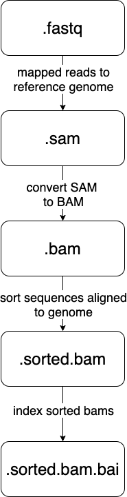

# Structuring your projects for current and future you

In this two hour workshop, we will discuss folder structures for
organizing your projects so that you can track inputs, outputs, and
processing scripts over time, and keep yourself organized as your
projects evolve.

## Learning Objectives

By the end of this lesson, students will:

* know how to transfer files around efficiently
* understand how to set up a data-driven project for tracking and proper iteration
* know how to store and work with mass quantities of data
* understand _why_ to setup projects in a specific manner
* gain an ability to work with subsets of data to test run workflows

## Transferring files around efficiently

We've spent some time transferring single files around with 'scp', and
hopefully you feel comfortable with that now.  But many people (myself
included) find 'scp' kind of annoying because you have to already know
the path to the filename, and it's kind of inconvenient for transferring
multiple files around.

For this, we're going to make the MobaXterm folk use a shell window:


OK, so what options are there when using 'scp'?

### recursive `scp` with `-r`

First, you can copy entire directories with `scp` by using `-r` --
from your laptop, try doing
```
scp -r datalab-XX@farm.cse.ucdavis.edu:2021-remote-computing-binder/2cities 2cities
```
this will transfer the entire directory to your local computer.

### `sftp`

You can use a command line _within_ a command line with sftp.

Briefly,
```
sftp datalab-XX@farm.cse.ucdavis.edu
```
will open up a "secure file transfer" shell, that has its own set of
commands. Try typing:
```
cd 2021-remote-computing-binder
cd 2cities
ls
get README.md
```
-- I use this quite a bit when I want to be able to use 'cd' and 'ls'
to find the right file to download.

### `zip -r` to create collections of files

Zip files work on pretty much all systems, and are handy ways to transport
collections of files.

To create a zip file:

```
cd ~/2021-remote-computing-binder
zip -r 2cities.zip 2cities
```

The file `~/2021-remote-computing-binder/2cities.zip` is now a file
you could copy or transfer around, and it will unpack to the entire
contents of the directory `2cities/`.

To view the contents of a zip file:
```
unzip -v 2cities.zip
```
and to unpack it:
```
cd ~/
unzip 2cities.zip
```
which will create a new directory `~/2cities/`.

### Working with `.tar.gz` files

While I strongly recommend using zip files, you will inevitably run into
.tar.gz files on UNIX. You can think of these as "collections of files that have been glommed into one file and then gzipped", and here are the two commands you need to know:

```
tar tzvf ~ctbrown/2cities.tar.gz
```
will show you the contents of a .tar.gz file, and
```
tar xzvf ~ctbrown/2cities.tar.gz
```
will unpack it into your current directory.

I don't recommend creating .tar.gz files in general so I'm not going
to show you how to create them :).

tar stands for 'tape archive' and is notoriously confusing to use, so I'm
not going to say any more about it.

([Obligatory xkcd on using the tar command.](https://www.explainxkcd.com/wiki/index.php/1168:_tar))

### Probably the most useful advice: use a transfer directory

To me, it's really annoying to find and remember directory paths and
filenames when transferring files around, and I've been doing it for
30 years and am really practiced at it.

So what I sometimes do is use a 'transfer' directory.

On farm,
```
mkdir ~/transfer
cp ~/2021-remote-computing/2cities/README.md ~/transfer/
```
and now (on your laptop) you can just do things like
```
scp datalab-XX@farm.cse.ucdavis.edu:transfer/README.md .
```
and you don't have to remember the full path.

This is handy because you can use your current working directory and things
like tab completion on the remote system to copy files into your transfer
directory, and then remember only a short path to actually transferring files
around.

I use this when I'm working in complicated or annoying directory structures.

## Retrieving remote files from Web sites

Often you want to grab files from Web sites - CSV data sets, text files,
or what have you.

This involves finding the URL, and then using a program like `wget` or
`curl` to get them. We're going to use `curl` today, but `wget` does pretty
much the same thing.

Let's find a URL for the Tale of Two Cities book that we've been using,
over on Project Gutenberg.

Go to this Web site in a browser: https://www.gutenberg.org/ebooks/98

and find the link that says "Plain text". Right click on it, and "copy
link".

Now go back to your terminal window where you're logged into farm, and
run
```
cd ~/
curl -L -O https://www.gutenberg.org/files/98/98-0.txt
```
and this will create a file `98-0.txt` in your current directory.

You can run `head` on this file:
```
head 98-0.txt
```
and see that it contains the right text.

The trick is often to find the right URL to get the raw text link.
For example, if you go to a GitHub link, like
https://github.com/ngs-docs/2021-remote-computing-binder/blob/latest/2cities/README.md
if you run curl on this you will get the formatted Web file, which isn't
really what you want.
What you want for GitHub files is the 'Raw' link - try clicking on that.
This is now the text file, and you can use curl on it --
```
curl -L -O https://github.com/ngs-docs/2021-remote-computing-binder/blob/latest/2cities/README.md
```

Note here that the `-L` tells curl to follow Web redirects, which can be important; and `-O` says save the file under the name at the end of the URL. You can omit `-O` and it will send the file to stdout:
```
curl -L https://github.com/ngs-docs/2021-remote-computing-binder/blob/latest/2cities/README.md > new-file.txt
cat new-file.txt
```

The really nice thing about this is that for _big_ files, the file will
transfer directly between the hosting site and the remote computer.
This is really handy for large sequencing data files that are located at
sequencing facility Websites - you don't have to download 100 GB files
to your laptop and then transfer them from there to farm, or into the
cloud, for example! (This is a big reason why cloud computing is really
interesting for the NIH.)

Other than finding and copying the right URL, the other tricky thing
that doesn't generalize is permission-restricted files. Briefly, since
you're copying the URL from your browser (where you may be logged in)
over to farm (where you may not be logged in), farm may not have access
to download it. There is no one-size-fits-all solution to this,
unfortunately.

And, again, we'll be covering retrieving files from github in other
ways during [workshop
8](https://ngs-docs.github.io/2021-august-remote-computing/keeping-track-of-your-files-with-version-control.html).

**CHALLENGE:**

- Pick any book from https://www.gutenberg.org/
- Find the URL for the plain text
- Copy the URL
- Use `wget` to download it to farm
- Look at it with `head`

## Dealing with files: some recommendations

Some short-hand rules I recommend for working with files on remote systems.

- download big files directly to remote computer system if possible, so that they don't go via your home/work Internet connection or laptop (which is often more limited than the remote computer's connection!);
- get used to transferring files to/from your laptop (see below); consider using a `transfer/` directory for simplicity;
- for managing small files that you create on a remote system, use version control ([workshop 8](keeping-track-of-your-files-with-version-control.html))
- you can also configure Dropbox on Linux systems, but it burdens the system and it's also not a great idea to copy files that are probably private over to a shared system. I've also had some bad experiences with deleting my entire Dropbox by mistake... UNIX makes it a little too easy to operate on lots of files!

## Farm vs cloud, binder, etc.

One of the main differences that you'll see over time is that there
are "remote, shared" systems like farm, and "remove, private" systems
like binder and Amazon/Google cloud computers. The cloud computers
often _guarantee_ you resources and some level of privacy along with
superuser privileges, but also charge you for it (and it's often
inefficient use of compute!) By contrast, "remote, shared" systems
like HPCs and shared workstations can provide larger resources at the
cost of sometimes having to worry about what other users are doing.

The "ride share" vs "personal car" analogy is fairly apt here, actually :).

## Thinking about data science projects!


For further discussion and details, I highly recommend
[Principles for data analysis workflows, Stoudt et al., 2021](https://journals.plos.org/ploscompbiol/article?id=10.1371/journal.pcbi.1008770), which is the best exploration of real data science practice I've yet seen. (Conflict alert: I was a reviewer :)

## a rough bioinformatics workflow


## Sending and Receiving Data

Here at UC Davis most researchers sequence at the UC Davis [DNA Technologies Core](https://dnatech.genomecenter.ucdavis.edu/). You can find their sample submission form [here](https://dnatech.genomecenter.ucdavis.edu/sample-submission-scheduling/).

When they've sequenced your samples they will hold your sequencing data on either [SLIMS lab information management system](https://slims.bioinformatics.ucdavis.edu/) for three months after the sequencing run finishes or [bioshare](https://bioshare.bioinformatics.ucdavis.edu/) for an undetermined amount of time. Do yourself a favor and download & back your new sequencing data up to a hard disk IMMEDIATELY.


### Downloading data
To download your data from slims **onto a cluster** (by using slurm) follow [these directions](https://github.com/shannonekj/cluster_computing/blob/master/How2s/How_To-download_data.md).

Luckily for this class we don't have data to download from the farm, so we'll be grabbing some from [OSF](https://osf.io/), an open science framework that can host small amounts of data (5Gb limit).

Let's setup a directory to work from and download some data:

```
mkdir -p ~/298class8
cd ~/298class8
curl -L https://osf.io/srdhb/download -o mini_Alca-torda.tar.gz
tar -xvf mini_Alca-torda.tar.gz
cd mini_A-torda
ls -alh
```

And we should see a list of _Alca torda_ chromosomes.

We got some data! However, the data could have been changed or corrupted in the process of downloading it from the Internet. (This CAN happen, and WILL happen if you do this for long enough!)

We can address this problem by using the `md5sum` command. [md5sum](https://en.wikipedia.org/wiki/Md5sum), in short, is a command that spits out a string of characters to represent a file's fingerprint. If a file with the same name has characters that are different the md5sum will show the difference, so we don't have to find the difference. This is exceptionally valuable when we have files that contain billions of characters.

Let's see what an md5sum looks like:
```
md5sum mini-chr1.fna.gz
```

you should see something exactly like:

> d34e2c570ef79195dfb56b8c258490f8  mini-chr1.fna.gz

Here you can see a string of characters that represent the `mini-chr1.fna.gz` md5sum. The first string of characters is the file's "fingerprint". The second is the name of the file--this is  useful when we md5sum multiple files.

If you change even a single byte of the file, the md5sum fingerprint will change _completely_.

So, We can check to make sure the data downloaded successfully by seeing if the string of characters generated by md5sum matches the ones in the `@mini_A-torda.md5` file.

First, take a look at the file:

```
less \@mini_A-torda.md5
```

(press <kbd>Q</kbd> to exit)

We can _check_ a list of md5sum's conatined in a file with the `-c` flag. The command will automatically look for files contained in the list and check the md5sum against the ones printed in the file.

```
md5sum -c \@mini_A-torda.md5
```

But if we navigate into the `data/` directory we can see there is a `mini-chr1.fna.gz` file there too. Are they the same?

**CHALLENGE:** Determine if the two `mini-chr1.fna.gz` scripts are the same.

Anytime you download data you should check to make sure it has downloaded successfully. This includes raw sequence data from a sequencing center, data from collaborators host on a shared space, sequence files from NCBI, transfering data between devices, downloading data from clusters and so on and so forth. (Most sequencing centers will automatically provide md5sum's with your data. If they do not, email to request them!)

We can also make a list of md5sum's for a group of files:

```
cd ~/298class8/mini_A-torda
md5sum mini-chr[1-9]*.fna.gz  >> autosomes.md5
```

Here, we've redirected the output of the `md5sum` command to the `autosomes.md5` file. We can then host/send our data with the md5 file for others to ensure the recipients know they've received the same data.


## Storing data

### What do I back up?
* **raw data** -- YES -- you only get them once!
* **results files** -- YES -- they are so useful
* **intermediate files** -- maybe -- they can be used in many different ways

### How big should I expect the files to be?

* **Raw data** will probably be the biggest
* **Results files** depends on what you are doing
* **Metadata** are usually pretty small
* **Intermediate files** are usually smaller than your raw data files but there will be _a lot_ of them 

Always, always back up **raw data**. Once the sequencing center deletes the data, it is gone forever!

As such, make sure you've have your data backed up. As soon as you download onto the cluster back it up to another device (or two!).

After you've finished your project you'll probably have some pretty valuable **results files**. Back these up! It is likely that these files won't be nearly as large as our original files and they can often be put on osf.io.

Examples:

| file type | size | # of files| Total Space |
| -------- | -------- | -------- |-------- 
| Raw Genome Assembly sequencing files| 44Gb | 2 | 88Gb |
| Intermediate files | 12Gb | 2 | 24Gb |
| Assembled Genome | ~550Mb | 1 | 55Mb |
| Raw RAD seq data| 92Gb | 2 | 184Gb |
| Intermediate files from RADseq | ~25Mb | 20,925 | 741Gb |
| Results of PopGen expt | 9.3Mb  | 2 | ~20Mb |

Data files will come in a variety of sizes. In general, the largest single files will be the raw data files, you receive from the sequencing center. Individual files in each subsequent step will be smaller (but there might be more of them!) because each step throws out or compresses data. 

However, new files are generated at most steps in bioinformatics projects. Because of this, the sheer number of intermediate files can take up a lot of space!

### How often should I backup my data?

**Scripts:** This varies person to person. I suggest posting your scripts to GitHub and to push to GitHub _at least_ everyday you modify your scripts.  (This is what we'll teach next week!) GitHub will give you free private repositories as an academic, so you don't need to make things public.

**Raw Data:** Luckily, you'll only need to backup your raw data once. Or maybe twice. Just don't delete it!

**Results:** Again, these only need to be backed up once. However, if you reanalyze your data make sure you save the new results. Or at least the workflow you used to get there.

### Where do I back up my data?

There are a number of places you _can_ backup to, for better or for worse. 

_**Small amounts of data (< 100 MB)**_ that you would like version controlled, such as code, can be backed up to GitHub.  Note that GitHub is not archival and cannot be used as the permanent post-publication place for your scripts, but there are solutions for that (search "github zenodo").

_**Small amounts of data  (100 Mb - 5Gb)**_ can be stored on a project by project basis at the [Open Science Framework](https://osf.io/). Each project is allocated 5Gb of space and there is no limit on number of projects. OSF also supports private and collaborative projects, and can be referred to in publications, so you can use it as your "raw results" location too.

_**Large amounts of data (> 5Gb)**_ The most tangible solution to a bioinformatics problem is to back data up to a (or multiple) hard drives! Data can be stored via your Google Drive account. To store data using storage space that UC Davis has allocated to you, see this [Meet & Analyze Data tutorial](https://mad.oxli.org/t/2019-11-13-how-to-backup-data-on-a-remote-computer/82). 

-------------------------------

## Where do I work with large amounts of data?

### High Performance Computing Clusters 
aka clusters (or HPCs).

UC Davis has a number of clusters available to students, depending on your department or where your lab has purchased resources:

* farm
* crick
* barbera

**Pros:**
- maintained on campus
- help desk for troubleshooting

**Cons:**
- maintained on campus
- requires an initial buy in to get a significant amount of space & compute

### Amazon Web Service
These are cloud computing services provided by Amazon (what don't they provide!?)

**Pros:**
- Only pay for what you use
- Can have temporary access to supercomputers which _could_ end up costing less than consistent access on a cluster
- great for short-term massive compute needs, if you have the $$

**Cons:**
- no long term storage...unless you want to pay for that too
- must build everything yourself
- no help desk
- have to pay for downloading ("egress charges")

All platforms have pluses and minuses. The one that will work best for you depends on your lab. I prefer the farm, for ease of use & consistency, if your lab will support you. 

## Setting up your project

**QUESTION** Imagine you are at the end of a bioinformatics project, about to write up the manuscript. Looking back over carrying out your experiment(s), what were the top 3-5 most useful things to getting to the point of writing up?

### Things to think about

* multiple projects
* inputs and outputs
* directory structure
* testing analyses

In bioinformatics, _organization is everything_. It allows us to be efficient in setting up experiments, maintain consistency between experiments and, in some cases, repeat a previous analysis.

Here we can see how organization allows for a tidy workspace:


The list of files up top isn't too cringeworthy if you only have one project. But multiple projects or experiments in one directory results in an organizational disater...


I like to have the following directory structure:


-------------------------------

## Working with data
Let's work with some data on the farm! A brief note: for this lesson we will not be submitting jobs to the farm's job handler (slurm). That is because we are working with very small files. If you work on the farm during your grad school career, all of the analyses you carry out after this class _should_ be submitted through slurm (which we will go over in our farm lesson in a few weeks!).

In this lesson, we are going to be carrying out part of an experiment where we call variants with a subset of E.coli sequencing data.

### Learning objectives

* subset data to test code
* behold the power of Github and snakemake
* understand how to name files

### Testing code

A great way of quickly testing to see if your code is working is by subsetting data. 

We can take a small chunk of a file and use it to test if our newly written code works. 

Let's grab some data:
```
mkdir -p ~/298class8/yeast/data
cd !$
ln -s /home/ctbrown/data/ggg201b/SRR2584403_1.fastq.gz .
ln -s /home/ctbrown/data/ggg201b/SRR2584404_1.fastq.gz .
ln -s /home/ctbrown/data/ggg201b/SRR2584405_1.fastq.gz .
ln -s /home/ctbrown/data/ggg201b/SRR2584857_1.fastq.gz .
```

These files each have up to 8.5 million lines! So we'll need smaller files to test our code.
```
for i in SRR258*.fastq.gz
do
    newname=$(basename $i .fastq.gz).n100000.fq
    zcat $i | head -100000 >> ${newname}
done
```

And now we have a subset of all of our fastq files!


#### How GitHub + snakemake + conda can make your (research) life great

(This will look veeeery familiar to GGG 201(b) students :)

Using GitHub, snakemake and conda together can make life a lot easier. We can grab our collaborator's code by cloning their repo:

```
cd ~/298class8/yeast
git clone https://github.com/shannonekj/2021_ggg298_variant_calling.git
cd 2021_ggg298_variant_calling
```

then we'll install a few more pieces of software with conda

```
conda create -y -n fqc-day8 -c bioconda -c conda-forge samtools bcftools bwa snakemake-minimal
conda activate fqc-day8
```

and run their Snakefile to test calling variants on the subset file.

```
snakemake -p -j 1
```

In this one command we've done the following:
* downloaded a reference genome
* indexed the genome
* mapped reads
* aligned the sequencing data to the genome
* sorted aligned reads
* indexed aligned reads
* called variants

And now, in a single command, we have a `variant.vcf` file with all of the variants in the four individuals compared to the reference genome. Pretty neat huh??

(Q: why did this run so quickly?)

### Naming files

Having files with consistent names allows us to do things to them en masse and can also allow us to know what has been done to them. Everyone has a different strategy in what they like their file names to contain and how they go about naming them but here a few suggestions.

#### Prefixes

Use the beginning of your file to your advantage. If you've sequenced individuals yourself, you can name these files according any or all of the following:
* which **individual** they are from
* what **well** in the plate they came from
* the **barcode/tag/library** they have/were a part of
* the **date** of sampling
* which **cohort** they are a member of

An example of this might be something like `Ht_1997_A08_21_ACTGTT.fastq`
Where: 
* Ht = species ID (Hypomesus transpacificus)
* 1997 = birth year
* A08 = well number
* 21 = plate number
* ACTGTT = associated barcode

Having some metadata in the file name can allow for efficient groupings when running quality controls (such as testing for batch effects).

If we keep our names consistent between plates/runs could run an analysis on all individuals that were from any of these variables.

#### File endings

The ends of files can be immensely helpful as well. Remember, at the command line, a file's ending ".whatever" exists to inform a human what kind of file/format to expect.

We can use this to our advantage by making the ends of files denote what step(s) has already taken place. 

Let's look at the [samtools](http://www.htslib.org/) steps that happen in our Snakefile



-------------------------------

## Additional resources
* [Bioinformatics Data Skills](http://vincebuffalo.org/book/) by Vince Buffalo 
* [Best Practices for Sci Comp](https://journals.plos.org/plosbiology/article?id=10.1371/journal.pbio.1001745) (Wilson et al. 2014)
* [Bioinformatics Curriculum Guidelines](https://journals.plos.org/ploscompbiol/article?id=10.1371/journal.pcbi.1003496) (Welch et al. 2014)

----

