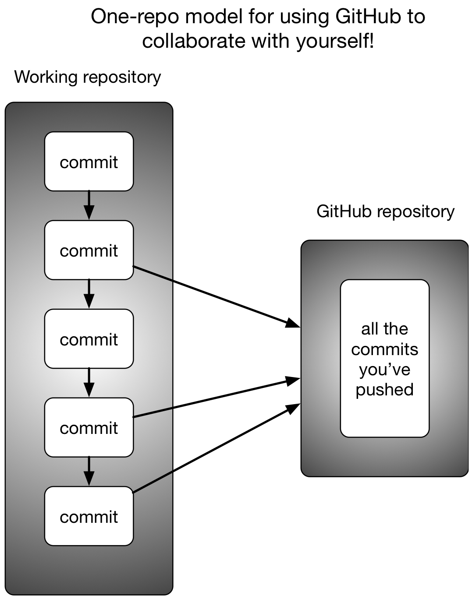

# Keeping Track of Your Files with Version Control

This two hour workshop will show attendees how to use the git version control
system to track changes to files, back up files to GitHub, and sync files
between your laptop/desktop and a remote server. We will also discuss ways to
collaborate with a team.

This lesson was adapted from several UC Davis sources:

* Shannon Joslin's [lesson from GGG 298][ggg298]
* DataLab's workshops [on git][workshop1] and [git for teams][workshop2]
* Nick Ulle's [lesson from STA 141B][141b]

[ggg298]: https://github.com/ngs-docs/2021-GGG298/tree/latest/Week7-Git_and_GitHub_for_file_tracking_and_sharing
[workshop1]: https://ucdavisdatalab.github.io/workshop_introduction_to_version_control/
[workshop2]: https://ucdavisdatalab.github.io/workshop_git_for_teams/
[141b]: https://github.com/2019-winter-ucdavis-sta141b/notes/blob/master/lecture/01.15/notes.ipynb


## Learning Objectives

By the end of this lesson, students will be able to:

* setup git repositories (on GitHub or a local machine)
* add and track changes to files with `git add`
* save changes by committing them with `git commit`
* undo changes with `git revert` and `git restore`
* resolve merge conflicts

## What is git?

git is a **version control system**. A version control system tracks the
changes you make to files, so that you can go back to a previous version at any
time. It's like Microsoft Word's change tracking on steroids. Besides version
control, git can also be used for collaborating with others.

git works in terms of **repositories** and **commits**. A repository is a
directory (including its subdirectories) that's managed by git. A commit is a
checkpoint or savepoint for the files in a repository. git keeps track of every
commit you make, so you can go back to older commits whenever you want.

This diagram shows the overall workflow for git:


All git commands begin with `git` followed by the name of a subcommand. The
arrows on the diagram represent several of the subcommands we'll learn about in
this workshop, and we'll revisit the diagram after learning a few.

In git jargon, the **local** computer is the computer where you're running
`git` commands. The local computer will usually be your laptop or desktop, but
for this workshop, the local computer will be Farm. A **remote** computer (or
just "remote") is any other computer online. The remote computer will usually
be a server like [GitHub][], which we'll learn more about in the next section.

git takes practice to learn, like anything else. This lesson will teach you
everything you need to know to get started with using git to track changes to
your own files. Collaborating with others is harder, and this workshop will
only cover the basics. Keep an eye out for future DataLab workshops to learn
more :)

## What is GitHub?

We're going to introduce you to git through [GitHub][], a website used to
store, share, and collaborate on git repositories. You don't *have* to use
GitHub or its competitors (such as [GitLab][] and [BitBucket][]) in order to
use git, but doing so provides a convenient way to:

* back up your repo
* look at your changesets
* share your software with others (including both future you and your lab/advisor)

[GitHub]: https://www.github.com/
[GitLab]: https://about.gitlab.com/
[BitBucket]: https://bitbucket.org/

### Create a GitHub Account

Please go to [GitHub][] and create a free account. You'll need to choose a
username (this is public, and kind of like a social media handle, so choose
wisely :) and a password (something you can remember and type!).

As of writing this, GitHub's free accounts allow unlimited private repositories
with up to three collaborators, and unlimited public repositories. You can
apply for an academic account or upgrade your account if you want more
collaborators on private repositories.

### Create a New Repository

Let's use GitHub to create a new repository. The steps are:

1. Navigate to [GitHub].
2. Click on the plus sign in the upper right of the screen.
3. Select "New repository" from the drop-down menu.
4. On the "Create a new repository" page, choose a name for your repository.
   For this workshop, name the repository `2021-my-first-repo`. A repository
   can have any valid directory name, but putting the year at the beginning is
   a good practice because it makes it clear when the repo was created.
5. Check the box "Add a README file".
6. Click the green "Create repository" button at the bottom of the page.

Here's a screenshot of the "Create new repository" page:


After a few seconds, you should be redirected to a web page with a URL like
`https://github.com/USERNAME/2021-my-first-repo`, where `USERNAME` is replaced
by your GitHub username. This is your new repository's URL.

Unless you selected "Private" on the "Create a new repository" page, your new
repository is public. That means _anyone_ can see and copy files you put in the
repository (but only you and people you grant permission to can edit the
repository).

## Using git

### Set up git on Farm

Now, log in to Farm, or start up a [Binder][] and go to the terminal.

[Binder]: https://binder.pangeo.io/v2/gh/binder-examples/r-conda/master?urlpath=rstudio

The `git config` command changes git's configuration. The first time you use
git on a computer (such as Farm), it's a good idea to configure git with your
name and email address. Make sure to use the same email address you used to
sign up for GitHub, so that GitHub will recognize your work.

The commands to set your name and email address are:
```
git config --global user.name "Your Name"
git config --global user.email you@example.com
```

If you decide to use git on your laptop or desktop, or get a new Farm account
after this workshop, you'll need to run these commands again.


### Optional: Set up a Password Helper

You'll have to type in your password each time you want to make
changes, unless you do this:

```
git config --global credential.helper 'cache --timeout=7200'
```

By default git will cache your password for 15 minutes. Here, the `timeout` parameter increases this to two hours.

### Clone the Repository 

In order to work with your new repository, you first need to download it to
Farm. The `git clone` command downloads a repository from a remote server for
the first time.

Go to the GitHub repository you created, click the green "Code" button in the
top right corner, and copy the HTTPS URL shown.

Then change to your home directory on Farm (`cd ~`), type `git clone `, and 
paste the URL you copied. The command should look like this:

```
git clone https://github.com/USERNAME/2021-my-first-repo
```

Press enter to run the command. This will create a directory
`2021-my-first-repo` in your home directory.

Change into the new directory and take a look around:
```
cd 2021-my-first-repo
ls -a
```
You'll notice two files:

1. A hidden `.git` subdirectory, which git uses to keep track of changes you
   make to the repo
2. A `README.md` file, which GitHub created when you checked the "Add a README
   file" box. This file is also displayed on the GitHub page for your
   repository.


### Edit a File

Let's edit the `README.md` file. You can use `nano` on Farm or RStudio on
binder:

```
nano README.md
```

Add a new line like `Hello, git!`, then save the file and exit.

Now let's see if git recognizes the changes. The `git status` command checks
the status of a git repo. In the terminal, enter:

```
git status
```

You should see the following message:

```
On branch main
Your branch is up to date with 'origin/main'.

Changes not staged for commit:
 (use "git add <file>..." to update what will be committed)
 (use "git restore <file>..." to discard changes in working directory)

        modified:   README.md

no changes added to commit (use "git add" and/or "git commit -a")
```

This is telling you a few things:

* `README.md` has been modified. This is the most important part!
* Your copy of the repository is up to date with `origin/main`, which is what
  git calls GitHub's copy of the repository. We'll revisit what `origin/main`
  means later.
* Commands to add changes you plan to keep ("commit"), or to undo changes you
  decided don't want to keep. You'll learn more about these commands later.

Before you can make a commit, you have to tell git which changes you want to
include in the commit. You do this by adding changes to git's **staging area**
(or index) with the `git add` command. You can think of the staging area as a
box you're packing up to get ready to store.

Add your changes to `README.md` to the staging area by entering this command:

```
git add README.md
```

Now check the status:

```
git status
```

The status should now say that your changes to `README.md` are "staged for
commit". They are now in the staging area, but haven't been committed yet.

Before making a commit, it's a good habit to review the changes in the staging
area. This is especially important if you're working with multiple files. The
`git diff` command shows differences between your working directory and
previous commits.

You can use `git diff` with the argument `--staged` to compare the staging area
to the most recent commit (GitHub made a commit when you created the repo). Run
this command:
```
git diff --staged
```

You should see something like:

```
diff --git a/README.md b/README.md
index 8d2d4d8..0a92250 100644
--- a/README.md
+++ b/README.md
@@ -1 +1,4 @@
-# 2021-remotecompute-test
\ No newline at end of file
+# 2021-my-first-repo
+
+Hello, git!
+
```

For each file you changed, the `git diff` command shows lines you added
prefixed with `+` (in green) and lines you removed prefixed with `-` (in red).

So the message above is telling you that you changed one file (`README.md`),
and that you changed three lines. Two are blank lines and one is the text you
added to the file. If you edited the file differently, you'll see a different
message, but you should see the changes you made.

### Commit a File

Now let's commit the changes. The `git commit` command creates a commit. When
you create a commit, git will ask you to write a one-sentence **commit
message** to describe your changes. It's a good habit to write a concise,
informative commit message to remind yourself and your collaborators of what
changed.

If you run `git commit` in the terminal without any other arguments, git will
open an editor (usually `vi`) for you to enter and save your commit message.

You can use the `-m` argument to enter your commit message directly into the
terminal (without opening an editor). Make sure to surround the message in
quotes.

Enter this in the terminal:

```
git commit -m "Added a line to README."
```

git should reply with something like this:

```
[main 9bf6695] added info to README
 1 file changed, 3 insertions(+), 1 deletion(-)
```

Here `9bf6695` is the commit's ID. Your commit will have a different ID, and
we'll learn more about how to use the ID later.

What if you run `git status` now?

```
git status
```

You should see:

```
On branch main
Your branch is ahead of 'origin/main' by 1 commit.
 (use "git push" to publish your local commits)

nothing to commit, working tree clean
```

This tells you there are no new, uncommitted changes in your repo (because you
just committed the changes). It also tells you that your repo is now **out of
sync** with GitHub (`origin/main`) by 1 commit. In other words, GitHub does not
yet have the commit you just made.

Let's send the commit to GitHub. The command to send a commit from the local
repo to a remote repo is `git push`. Run the command now:

```
git push
```

git will ask for a username and a password. Enter your GitHub username and
password. You'll see this error message:

```
remote: Support for password authentication was removed on August 13, 2021. Please use a personal access token instead.
fatal: unable to access 'https://github.com/s-canchi/2021-remotecompute-workshop8.git/': The requested URL returned error: 403
```

Most remote git repos accept a username and password, but as of August 13,
2021, GitHub does not.

#### Set up a Personal Access Token

Github disabled passwords in favor of personal access tokens (PAT) and SSH
keys. Follow these steps on GitHub to generate a PAT:

1. Navigate to [GitHub]
2. Click on your user icon in the top right corner 
3. Select "Settings" from the drop-down menu
4. On the left panel of the page that opens, click on "Developer settings"
5. On the left panel of the page that opens, click on "Personal access tokens"
6. Click the "Generate new token" button.
7. On the "New personal access token" page, give your token a name in the
   "Note" field to help you remember when and why you created the token.
8. Click the green "Generate token" button at the bottom of the page.
9. On the "Personal access tokens" page, copy the new token (in the green box).
   The token will no longer be viewable once you navigate away from this page.

Save the token somewhere safe (for example, a password manager). If you want to
learn more about GitHub's PAT authentication, read [our detailed
tutorial][PAT].

[PAT]: https://www.nih-cfde.org/resource/setting-up-github-authentication/

Now let's try pushing the commit again. Run this command in the terminal:

```
git push
```

When prompted, enter your GitHub username and the PAT token as your password.
Pushing commits to a remote repository can take a moment. If the command
finishes running successfully, you should see something like this:

```
To https://github.com/s-canchi/2021-remotecompute-workshop8.git
  ad7e8de..9bf6695  main -> main
```

This tells you that git pushed all of your commits up to and including commit
`9bf6695` to your GitHub repo.

Now if you go to the GitHub page for your repo, you should see your changes to
the `README.md` file.


### View the Repository History on GitHub

On the GitHub page for your repo, click on the "2 commits" link on the right
side of the blue box.

You'll see two commit messages: one "initial commit" from when you created the
repository, and one with the commit message you just wrote. They'll be ordered
from most to least recent.

Click on the commit message you just wrote. You'll see a colored `diff` that
shows what you changed. If you click on the `...` in the right corner, you can
view the version of the file that was saved in this commit. This is one way to
view old versions of files in your repository (you can do this for any commit).


<!--
### The single-repo-to-GitHub model

What we're doing is the simplest way to use git and GitHub to manage your own
repository. There are more complicated options but this is a nice blend of
practicality and features (backups, change tracking, sharing options).


-->

## Challenge Question 1

For this challenge:

1. Go back to the terminal on Farm.
2. Make some more changes to the `README.md` file.
3. Use `git add` to add your changes.
4. Inspect your changes with `git status` and `git diff`.
5. Once you're happy with your changes, commit them with `git commit`.
6. Verify the changes were comitted with `git status` and `git diff`.
7. Push your commit to GitHub with `git push`.
8. Open the GitHub page for your repo and verify that the changes have been
   made. Take a look at the `diff` for the change.

Voila!


## Part 2: Working with multiple files

So far we've only worked with one file, `README.md`.

You can easily work with multiple files, though! Git changesets track simultaneous changes to many files, for example in a situation where you change both a Snakefile _and_ an R script.

### Create some files

Let's make a Snakefile that produces an output file.
Run `nano Snakefile` and paste in the following content:

```
rule hello:
    output: 'hello.txt'
    shell:
        "echo hello, world > hello.txt"
```
use <kbd>ctrl-x</kbd> <kbd>y</kbd> to save it.

and now run it:
```
snakemake -j 1
```
This will create the file `hello.txt` with the words `hello, world` in it.

What should we add to git? In general, add _scripts_ and _metadata_ to
git, but not _generated files_ that can be produced by the scripts. So
in this case, we want to add the Snakefile, but _not_ the output file.

If you run
```
git status
```
you'll see there are now three new files, `Snakefile`, `.snakemake`, and `hello.txt`. The last two are generated by snakemake, so let's ignore them for now and just add `Snakefile` into git's tender embrace:

```
git add Snakefile
```

Now,
```
git status
```

and you should see

>Changes to be committed:
>  (use "git reset HEAD <file>..." to unstage)
>
>        new file:   Snakefile

and now you can commit and push:

```
git commit -am "added Snakefile"
git push
```
You should now see that the git repo contains two files!

In brief,
* `git commit -a` automatically commits changes to every file that git cares about, but you have to tell git to care about the files.
* git can be told to care about *new* files using `git add`
* then you still need to commit them.

### Add more stuff to the Snakefile

Use `nano Snakefile` to add the following lines at the top of the Snakefile (you can just paste them in).

```
rule all:
    input: "hello.txt", "howdy.txt"
    
rule howdy:
    output: "howdy.txt"
    shell:
        "echo yeah texas > howdy.txt"
```

test it:
```
snakemake -j 1
```

and now commit and push:
```
git commit -am "update Snakefile with howdy rule"
git push
```

### Revel in your ability to see the changes you've made over time

Go to the GitHub Web interface, and check out the history!

This is really useful when you combine it with good commit messages.

QUESTION: why didn't we need to do a git add?

## Undoing mistakes or finding older versions

### Unwinding mistakes

Let's make a mistake. Add some random characters to the top of the Snakefile with `nano Snakefile` and then save it with <kbd>CTRL-X</kbd><kbd>y</kbd>.

Now commit and push.
```
git commit -am "added important stuff to Snakefile"
git push
```

Try running snakemake...

...uh oh! You should get something like a NameError.

WE BROKE IT!!! WHAT DO WE DO!?

Never fear! We can unwind it!

First, you should generally test at least the syntax of your files before you commit. `snakemake -j 1 -n` would have told you that this was a problematic change. But we all make mistakes. So! Let's unwind (or "reset") the changes!

First, undo the commit:
```
git reset HEAD^
```
which uncommits the commit.

Verify that this was the bad change:
```
git diff
```
looks like the problem, yah?

Now undo it:
```
git checkout -- Snakefile
```
this says "check out the last committed change", which, after the `reset`, is the last one BEFORE you made the mistake.

Try the snakefile out:
```
snakemake -j 1 -n
```
...ok, should be no syntax error. Are we done?

NO. Unfortunately, we pushed this to GitHub! And we need to do some extra foo to fix that.

```
git push -f origin main
```

This will *force* the update of your GitHub to your current changeset.

`git reset` is a nice way to undo a recent commit. But it's not awesome in some circumstances, because it rolls back the entire repository (since changesets apply to multiple files). Are there alternatives? Yes!

### `git revert` as an alternative

If you catch a bad commit immediately, you can also use `git revert`.

EXERCISE:

Give it try - 

* add a bad commit to Snakefile
* commit it
* run `git revert HEAD`

what does this do?

### 'git show' as a way to retrieve older versions

Suppose you want to retrieve an older version of a particular file, but don't want to roll the rest of the repo back.

First, identify the version string (commit ID) for the version of the file you want. It'll be a long hex-digit number (0-9a-f) that looks something like 9e8008de3599f4. You can do this by looking at diffs, the change history on github, OR by running:
```
git log
```

Once you identify (...or _think_ you've identified) the right version string, run `git show VERSION:filename`. For example, 
```
git show VERSION:Snakefile
```
(replace VERSION with something that's in your own repo!) will show you that version of the Snakefile.

To copy over the _current_ Snakefile with that version, you can run:
```
git show VERSION:Snakefile > Snakefile
```

Generally it's a good idea to document what you've done by including the OLD git commit in the NEW git commit message, e.g.
```
git commit -am "reverted snakefile to version VERSION"
```

## More git

### Using '.gitignore' to ignore files

If you've done all the above, `git status` will show several files that you don't want git to care about:

```
git status
```
> On branch main
Your branch is up to date with 'origin/main'.
>
>Untracked files:
>  (use "git add <file>..." to include in what will be committed)
>
>        .snakemake/
>        hello.txt
>        howdy.txt

Over time, these files will start to clutter up your git status output, which I use to track files that git _should_ care about.

We can ignore these files by creating a new file that lists files to be ignored - it's called '.gitignore'.

Let's create one without using an editor:

```
echo .snakemake > .gitignore
echo hello.txt >> .gitignore
echo howdy.txt >> .gitignore
```

And now run
```
git status
```
again. Looks good, right?

Oops. We _want_ git to track .gitignore, so that we can tell git to _ignore_ the other stuff. Sigh.

```
git add .gitignore
git commit -am "add gitignore"
git push
```
and now:
```
git status
```
should say there's nothing different.

Remember, you can always add stuff to .gitignore as time goes on. It's good practice to keep `git status` clean to show only the stuff that you're interested in tracking.

### Editing on GitHub directly

You can edit on GitHub directly! This is a great way to fix little typos and use a friendly editor, but it's a bit clunky for day to day work - you'll see why at the end of this section :)

To edit a file on GitHub via the Web:

Go to your README.md on GitHub.

Click the little edit button.

Add some text.

Commit changes.

Yay, it's all in the history! But it's not yet on farm!

Now let's pull this to farm...

Go back to your farm account. Run
```
git status
```
It says "up to date!" THIS IS A LIE. Run:
```
git fetch
git status
```
and now you'll see:
>On branch main
>Your branch is behind 'origin/main' by 1 commit, and >can be fast-forwarded.
>  (use "git pull" to update your local branch)

>nothing to commit, working tree clean

Here, `git fetch` is updating its local information by going out and looking at GitHub.

To pull new stuff from GitHub into your repo, do:
```
git pull
```
et voila!

Hopefully this should be easy to remember: *push* sends stuff from your repo to GitHub, *pull* retrieves stuff from GitHub to your repo. Plus, `git status` tells you what to do :).

### Zenodo for publishing your git repo

GitHub is not suitable for publishing scripts for Supplementary Material in papers, because you can rewrite history. Is there a solution? Yes!

You can set up something to connect GitHub and Zenodo so that every time you do a "release" will freeze your repo at that version and give it a DOI. This is super useful for publishing!

To do this:

* go to zenodo.org in a new browser tab
* log in with GitHub
* go to upper right menu, select 'GitHub'
* flip the switch next to your 2021-ggg298-week7 repository

Now, go back to your github.com tab.

Go to 'releases'.

Create a new release. Let's make it 'v0.1', "class test of zenodo", and select "this is a pre-release". Then "Publish release."

Count to 10, slowly.

Now go back to zenodo. You should see that a DOI has been assigned! This is a frozen version of your repository at that point in time.

## Git philosophy

* track files that you edit by hand.
* track small files (like metadata files such as spreadsheets; under ~10 MB) that should remain unchanged and that are convenient to have around.
* big data files should be kept in some other place, read-only.
* do git commit & git push frequently (at end of every session, at least) - remember, you can always unwind, but you can't go back to a specific changeset you never committed!
* commit messages are helpful, diffs are golden.

## Bonus: setting up remote respoitory for local directories

So far you have learnt the git workflow for how to work on single and multiple files within a newly created remote repository. But what if you have an existing directory with files that you now wish to track using git ?

In this section we will show you how to set that up.

### Create directory and files

Let's create a directory on farm to host all the script files we have created thus far.

```
mkdir workshop_scripts
cd workshop_scripts
```

You can either copy the `first_script.sh` from Home directory that you created in [Workshop 7](https://ngs-docs.github.io/2021-august-remote-computing/automating-your-analyses-and-executing-long-running-analyses-on-remote-computers.html#running-scripts-with-bash)
```
cp ../first_script.sh .
```

Alternatively, you can create one using nano
```
nano first_script.sh
```

Add the following 3 lines to the script:
```
#!/bin/bash
echo Hello, this is a script!
echo I am on the next line!
```

### Setup git

First, initialize git

```
git init
```
which converts any existing directory into a git repository. 

Then, add files
```
git add first_script.sh
```

Commit with a message
```
git commit -m "first bash script"
```

### Setup GitHub Repo

Things are now setup on the local repository. Let's shift to the GitHub interface. Follow steps from [Create a git repository on GitHub] section to create `workshop_scripts` repository (You can name it anything you want but helps to keep the local and remote names same).

Copy the GitHub URL in your paste buffer.

### Link local and remote repositories

At the Farm command line, link the GitHub repo to the local repo:
```
git remote add origin https://github.com/USERNAME/workshop_scripts.git
```

Next link your local master branch to the remote master branch
```
git push --set-upstream origin master
```

Note that you have to run the above command only the first time. Subsequent commits to local repo can be updated on the remote repo using `git push`. 

Go to the GitHub repo and select `master` from the branches drop down menu. You should see the script file in the repository!

## Resources

* Check out Daniel Standage's blog post on [using github to collaborate with yourself](https://standage.github.io/developer-pull-request-thyself.html) for inspiration!
* [Handy git cheatsheet](https://education.github.com/git-cheat-sheet-education.pdf) from GitHub
* Mark Lodato's [visual reference on git](https://marklodato.github.io/visual-git-guide/index-en.html)
* Roger Dudler's [simple guide to git](https://rogerdudler.github.io/git-guide/)
* [Git-it](http://jlord.us/git-it/) which provides step by step tutorial with challenge exercises
