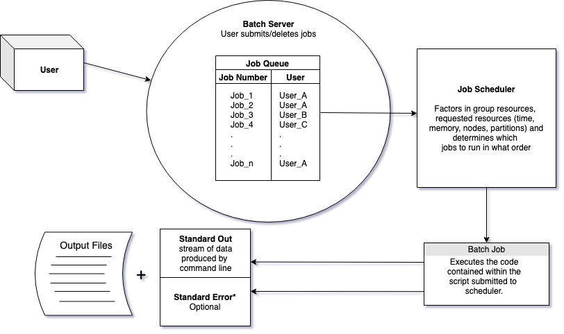

# Executing large analyses on HPC clusters with slurm

This two hour workshop will introduce attendees to the slurm system
for using, queuing and scheduling analyses on high performance compute
clusters. We will also cover cluster computing concepts and talk about
how to estimate the compute resources you need and measure how much
you’ve used.

This lesson was originally written by Shannon Joslin for GGG 298 at UC Davis ([see original lesson](https://github.com/ngs-docs/2021-GGG298/blob/latest/Week9-Slurm_and_Farm_cluster_for_doing_analysis/README.md)).

## What is a cluster?

A cluster can be thought of as a group of computers which work
together to allow you to perform memory intensive functions. Clusters
are accessed by logging onto one computer (**head node**) and
resources (other computers) are acquired by asking for resources from
job schedulers.


Image modified from [vrlab](http://www.vrlab.umu.se/documentation/guides/beginner-guide)

## How do clusters work?

### Job Schedulers

In order to carry out commands that are memory intensive we need to
use auxiliary computers that will not affect the login/head
node, which is usually shared by many people.

**NOTE:** sometimes merely copying large files is memory
intensive enough that we will need to (or should) use computers other
than the head node!

To request resources to run our scripts we use _job
schedulers_. Job schedulers handle how to allocate the compute
cluster's resources to batch job scripts submitted by users.

There are a number of different flavors of job schedulers. The job
scheduler you will be submitting jobs to is specific to the cluster
you are using at your institution but they all have the following
general structure:



The job scheduler evaluates when resources will be dedicated to a job based on the:

* partition & priority (`-p`)
* how much of  the group's resources are already being used
* requested wall time (`-t`)
* requested resources
    * memory (`--mem`)
    * CPUs (`-c`)

The [Slurm workload
manager](https://slurm.schedmd.com/documentation.html) is an open
source workload manager that is commonly used on compute clusters
(both farm and barbera at UC Davis use Slurm). It handles allocating
resources requested by batch scripts.

There are **two** main ways you can request resources using Slurm:

### EITHER: run an interactive session with `srun`

Interactive sessions allow you to work on computers that aren't the
login/head node. Essentially you can do everything you've done at the
command line interface on the compute cluster. This is
really powerful for doing memory intensive commands that you may not
need to keep track of. However, with this power comes a great danger!

*Why is it dangerous?* This is an interactive session, so the commands
you run will not be saved in scripts anywhere. So, if you wanted to go
back and recreate an analysis, you won't know what you've run, how
you've run it or which versions of software you used.

To request and launch a basic interactive session that will last for
10 minutes, use the following:
```
srun --partition high2 --time=00:10:00 --pty /bin/bash
```
If successful, you should see something like:

>~~~
>srun: job 37969118 queued and waiting for resources
>srun: job 37969118 has been allocated resources
>~~~

You'll also see that your prompt changes.

>~~~
>(base) datalab-09@c6-92:~$
>~~~

This is because you're no longer on farm - you're in a shell on one of
the cluster nodes.  (Here, `c6-92` is the hostname of one of the
cluster nodes!)

OK, so what's going on here?

In order to handle jobs, Slurm needs to know **where to run it**, and
the maximum amount of **walltime** your job will run. This is so that
it can properly allocate a computer to handle your job and (try to)
predict when those resources will be available for others.

With the `--partition` flag, you're telling srun to use a particular
*partition*, or subset of nodes, that is for high priority jobs -
we'll talk more about this below!

The `--time` flag specifies the walltime you're asking for. Walltime
is literally "the time shown on the clock on the wall", and can be
measured as the maximum expected amount of time from the start of your
job to the end of the job.

Pay close attention to the time you give to yourself here!  Slurm will
terminate the session immediately at the end of the allotted
time. Sadly, it doesn't care (or know) if you are 99.99% of the way
through your analysis :/

The default resources that you're allocated are:

* 2 GB of RAM
* 1 CPU

and we'll show you how to figure that out for yourself, below, using
`squeue`.

You can request more or different resources by using the following flags:

* `--mem=<number>Gb` = request a certain amount of memory
* `-c <number>` = request a certain number of CPUs

Here, the `-c` flag is the same number you would use for `snakemake
-j` to run many things in parallel; see [Automating your analyses with
the snakemake workflow system] for the snakemake lesson. (We'll show
you how to run snakemake inside of slurm below!)

**If your prompt doesn't have `farm` in it** - that is, if you're logged into
a different computer in an `srun` session - you should type `exit` now
to get back to the head node:

```
exit
```

This will exit the shell. If you _are_ on farm head node already, this
will just log you out of your ssh session and you should log back in
;).

CHALLENGE: on the farm head node, set yourself up for a 5 second session
using srun. What happens when the five seconds are up?

### OR: Submit batch scripts with `sbatch`

The alternative to `srun` is `sbatch`, which is my preferred way (and
the suggested way!) to run batch job scripts, for several reasons.

Batch job scripts (also known as job scripts) are scripts that contain
`#! /bin/bash` at the beginning of each script and are submitted to
the slurm workload manager by using `sbatch`. They are (mostly) just
shell scripts, with a few exceptions. We can use the same commands
that we would use at the command line within our `sbatch` scripts.

(For more info on bash scripts, see [Automating your analyses and
executing long-running analyses on remote computers].)

First, to try out `sbatch` let's create a script called
`HelloWorld.sh`.

```
mkdir -p ~/slurm-lesson
cd ~/slurm-lesson
nano HelloWorld.sh
```

Then copy and paste the following:

```
#! /bin/bash

echo Hello World
sleep 15
date
```

Then exit nano with <kbd>Ctrl+X</kbd>

Try running it:

```
bash HelloWorld.sh
```
what does it do?

---

We can submit this script to **Slurm** with the `sbatch` command.

```
sbatch HelloWorld.sh
```

but we receive an error message...

```
sbatch: error: Batch job submission failed: Invalid account or account/partition combination specified
```

As with `srun`, above, we must tell Slurm how much time to allow our
submitted script by using the `-t/--time` flag, and what queue to run
it on with `-p/--partition`. Let's tell Slurm that our job _shouldn't_
take longer than 5 minutes (note: the format is `dd-hh:mm:ss`, or
`days-hours:minutes:seconds`), and to use the `high2` partition of the
cluster.

```
sbatch -t 00-00:05:00 -p high2 HelloWorld.sh
``` 

You will see your job was successfully submitted and will be given an
associated Job ID number:

>~~~
>Submitted batch job 15219016
>~~~

but with a different number. This is a unique job ID that you can use
to monitor (with `squeue`) and cancel your job (with `scancel`).
See [Monitoring your jobs with `squeue`], below.

### Flags to use when submitting jobs with sbatch or srun

We can use a number of different flags to specify resources we want
from Slurm:

* the **partition** we would like to use for our job –
this will also dictate the _priority_ with which our job is run. This is
heavily cluster and account dependent; on farm, your datalab-XX accounts
have access to `high2`, `med2`, and `low2`, for example, which let you run
on CPU-intensive nodes at high, medium, and low priority.  See [Partitions], below.
* the **memory** required to run our job. We can request a specified amount of memory with the following flag: `--mem=<number>Gb`
* we can have slurm **e-mail** us updates about our job, such as when it starts(`BEGIN`), ends(`END`), if it fails(`FAIL`) or all of the above (`ALL`). There are many other mail-type arguments: REQUEUE, ALL, TIME_LIMIT, TIME_LIMIT_90 (reached 90 percent of time limit), TIME_LIMIT_80 (reached 80 percent of time limit), TIME_LIMIT_50 (reached 50 percent of time limit) and ARRAY_TASKS. We can request slurm emails us with the following flags: `--mail-user=<your_email> --mail-type=<argument>`
* we can also give jobs specific **names**. To name your job use: `-J <job_name>` Be careful, as there is a limit to the number of characters your job name can be.
* slurm automatically records **stdout output** where all of the output from commands run from the script are printed to. These will take the form as `slurm-12345.out` where 12345 is an identifying number (the job ID, by default!) slurm assigns to the file. We can change this to any output file name we want. To specify the name of your output file use `-o <file_name>.out`
* slurm can record **stderr output**, where all of the errors from the script are printed to. We can ask slurm to create err files and name them with `-e <file_name>.err`

If we were being mean to ourselves we would write these out at the
command line each time we submitted a job to slurm with `sbatch`. It
would look something like this:

```
sbatch --time=01-02:03:04 -p high2 --mem=4Gb --mail-user=<your_email> --mail-type=ALL -J <job_name> -o <file_name>.out -e <file_name>.err
```

(We would need to switch out all of the `<text>` with parameters
specific to our preference, but hopefully you get the gist.)

But we can make this much easier on ourselves! Typing all of the
parameters out on the command line every time we want to submit a
batch script is annoying and it also doesn't allow us to record what
parameters we used easily. We can instead put the parameters to run
each job in the script we submit to slurm!

This also has the advantage of supporting repeatability!


### Repeatability through SBATCH variables in shell scripts

One of the most important things in computational science is
repeatability - can I run _exactly_ the same thing today as I did
yesterday? You'd think this would be straightforward, but it is
exceptionally easy to run a series of command on data, leave the data
for a few months (or years) and come back to the data and have no clue
how you went from point A to point Z.

(Just to be clear, this is bad. :)

Let's say we lost everything except our backed up raw data and we
needed to recreate an analysis. In the worst case, where the commands
used to carry out the experiment were not saved, we would have to
figure out all of the commands with only a vague memory of the steps
we took to get results. It is hard, if not impossible to recreate an
analysis with exactly the same string of commands and parameters. So,
we should think about documenting things as we go.

In the best case (of this terrible scenario) we would have a script to
recreate our analysis! So, we can make this easy for our _future_
forgetful-selves and put all of the flags and commands we submit to
Slurm INSIDE our batch scripts!

We can do this by adding **#SBATCH** lines of code after the sha-bang
line (`#! /bin/bash`) in our script.

Let's save the parameters we used to run `HelloWorld.sh` within the
batch script instead of specifying them on the command line.

Modify your HelloWorld.sh script to look like the following:

```
#! /bin/bash
#
#SBATCH --mail-user=<email>@ucdavis.edu         # YOUR EMAIL ADDRESS
#SBATCH --mail-type=ALL                         # NOTIFICATIONS OF SLURM JOB STATUS - ALL, NONE, BEGIN, END, FAIL, REQUEUE
#SBATCH -J HelloWorld                           # JOB ID
#SBATCH -e HelloWorld.j%j.err                   # STANDARD ERROR FILE TO WRITE TO
#SBATCH -o HelloWorld.j%j.out                   # STANDARD OUTPUT FILE TO WRITE TO
#SBATCH -c 1                                    # NUMBER OF PROCESSORS PER TASK
#SBATCH --mem=1Gb                               # MEMORY POOL TO ALL CORES
#SBATCH --time=00-00:05:00                      # REQUESTED WALL TIME
#SBATCH -p high2                                # PARTITION TO SUBMIT TO

echo Hello World
sleep 15
date
```

(**Make sure to replace your `<email>` with your UC Davis email address.**)

Then submit your script:
```
sbatch HelloWorld.sh
```

Once our scripts start running, we should see the following files in
our current directory: `HelloWorld.j#######.err` and
`HelloWorld.j#######.out`. These are the recorded outputs from running
your batch job with slurm!

### Reprise: running `HelloWorld.sh` via srun

Of course, even with all the SBATCH stuff in the script, it's still just
a shell script that you can run at the command line; the only command that
pays attention to the `#SBATCH` lines is `sbatch` itself!

This is useful for debugging. Sometimes you'll have to debug a script
that isn't working the way you want it to, and you'll want to do this
interactively. If you can use the head node for this, great - but sometimes
the problem is that the script uses resources that aren't available for the
head node, OR (even worse) that the script runs fine on the head node, but
NOT via sbatch.

In this case, you can use `srun` to allocate yourself a node, and then
go run the script yourself.

CHALLENGE: Use `srun` to allocate a node, and then run `HelloWorld.sh`.

Question: do you get the e-mails and the output files as with sbatch?

(No, because when you're running the script via bash inside an `srun`,
slurm doesn't know it's a special script.)

### Choosing between `srun` and `sbatch`

I use `srun` when I want to explore or debug something, or need an
interactive prompt. Sometimes I'll use it when I want to run something
at a high priority and don't want to have to write a batch script, but
I _almost always_ regret it when I do this. (Be better than me!)

I almost always prefer `sbatch`. There are a bunch of reasons -

* the script is a text file, so I can correct it if I get something wrong!
* the script specifies the resources at the top, so I can edit those easily!
* I can comment the script so I can understand it later.
* I can use version control to track changes to my sbatch scripts (see [Keeping Track of Your Files with Version Control])
* I can run one (or a dozen) sbatch scripts at various priorities, and can be notified by e-mail when they're done. This lets me walk away from the computer :)

### A stock sbatch script that includes activating a conda environment

Here's the sbatch script I usually start with. It has a few nice
features:

* it lists the parameters that I usually end up modifying (`-c`, `-t`, `--mem`)
* it supports conda environment activation (see [Installing software on remote computers with conda])
* it prints out the resources I actually used at the end! (See [Measuring your resource usage] below)

```
#!/bin/bash -login
#SBATCH -p med2                # use 'med2' partition for medium priority
#SBATCH -J myjob               # name for job
#SBATCH -c 1                   # 1 core
#SBATCH -t 1:00:00             # ask for an hour, max
#SBATCH --mem=2000             # memory (2000 mb = 2gb)
#SBATCH --mail-type=ALL
#SBATCH --mail-user=<email>@ucdavis.edu

# initialize conda
. ~/miniconda3/etc/profile.d/conda.sh

# activate your desired conda environment
conda activate base

# fail on weird errors
set -e
set -x

### YOUR COMMANDS GO HERE ###
# for example,
sleep 15
### YOUR COMMANDS GO HERE ###

# Print out values of the current jobs SLURM environment variables
env | grep SLURM

# Print out final statistics about resource use before job exits
scontrol show job ${SLURM_JOB_ID}

sstat --format 'JobID,MaxRSS,AveCPU' -P ${SLURM_JOB_ID}.batch
```

We'll talk a bit more about the choices made in this script,
below, when we talk about choosing your CPU and memory.
See [Measuring your resource usage], below.

But first, let's cover...

## Some useful tips and tricks for happy slurm-ing

### Trick 1: running `srun` inside of a screen.

Back in [Automating your analyses and executing long-running analyses on remote computers], we introduced you to [Persistent sessions with screen and tmux].

If you are using srun to run commands, it is just like any other interactive
shell - if you close your laptop, or your network is disconnected, you'll
terminate the shell.

So I often use `screen` to make my `srun` sessions resilient to laptop closure
and shell termination.

There's one key trick here: run `screen` _first_, then run `srun`.

(I'll show a demo, you don't need to follow along - just know that this
is a possibility.)

### Trick 2: running snakemake inside of an sbatch script.

In our previous workshop, we introduced you to [Automating your
analyses with the snakemake workflow system]. You can use snakemake
inside of an srun or sbatch script!

CHALLENGE: Try using srun to run the following commands:

```
conda activate snakemake
cd ~/snakemake_lesson
rm *.zip *.html
snakemake -j 1
```

How would you run this with more CPUs? Hint: you need to modify BOTH
your srun command AND your snakemake command.

How would you modify the sbatch script in [A stock sbatch script that includes activating a conda environment] to run this in an sbatch environment?

### Monitoring your jobs with `squeue`

Oftentimes we submit jobs and would like to know certain things about
them -- if they've started, how long they've been running, if they are
_still_ running, etc, etc... We can look at the status of any job
Slurm is handling by using `squeue`

If we type

```
squeue
```

then we see _many_ rows of jobs...

```
         JOBID PARTITION     NAME     USER ST        TIME  NODES CPU MIN_ME NODELIST(REASON)
      15218450       bmh this_is_ keyu1996 CG       31:10      1 2   100G   bm3
      15219413       bmh     pigz   aminio CG        0:01      1 8   4G     bm2
15108157_[34-4   bigmemm  mapping gfburgue PD        0:00      1 8   200G   (Resources)
14204771_[1182       med freebaye eoziolor PD        0:00      1 4   2000M  (AssocGrpCpuLimit)
15217722_[7-23       bmm     trim hansvgdu PD        0:00      1 2   10G    (JobArrayTaskLimit)
      15113687   bigmemm AA_ophiu jgillung PD        0:00      1 24  200G   (Priority)
      15144078   bigmemm NT_ophiu jgillung PD        0:00      1 24  200G   (Priority)
      15144205   bigmemm AA_plant jgillung PD        0:00      1 24  200G   (Priority)
      15144210   bigmemm NT_plant jgillung PD        0:00      1 24  200G   (Priority)
```

This is a list of **ALL** the jobs currently submitted to Slurm --
which usually quite a few! And often we won't be able to scroll
through the list to find our job(s). So, in order to only see your own
job(s) we can specify a **username**:

If you don't know your username, you can find it in a couple of ways:
1. the `whoami` command:
```
whoami
```
2. with `$USER`
```
echo $USER
```

(Note: there are subtle differences between the two. The `whoami`
command displays the effective user id at the time the command is
entered. The `$USER` is an environment variable that is set by the
shell--it won't work on all operating systems but it works great here!)

We can use the output of this to see the status of the jobs associated
with a particular username:

```
squeue -u $USER
```

```
         JOBID PARTITION     NAME     USER ST        TIME  NODES CPU MIN_ME NODELIST(REASON)
      15219530       bmh ggg298-a ggg298-4  R        0:28      1 8   10G  bm14
```
Much better!! 

Not only can you check on your own job's status but you can also check
on the status of your slurm group; here, our slurm group is `ctbrowngrp`:

```
squeue -A ctbrowngrp
```

You can also check on the status of particular partitions:
```
squeue -p high2
```

These will show you what resources are being used so you can figure
out which are free, sort of.

**Note:** `squeue -u username` is how I figured out what my NODES and CPU
specs were for the srun, above.

### Canceling your jobs with `scancel`

To cancel a single job you can specify the `JOBID`
```
scancel <job_ID>
```

To cancel all of the jobs that belong to you, use the `-u`flag.
```
scancel -u <username>
```

CHALLENGE: Use `srun` to set yourself up with a 10 minute session on high2; then, in the session, use `squeue -u` to find the job ID of your session; then, `scancel` it. Alternatively, you can cancel ALL your jobs with `scancel -u`.

## More on resources and queues and sharing

### Measuring your resource usage

There's an old joke that you can tell to your kids if you want to teach
them to distrust you.

>Do you know how they figure out what the weight limits are on bridges?

>They build the bridge, and then they run bigger and bigger trucks
 over it until the bridge fails. Then they record the weight of the
 last truck that succeeded in crossing the bridge, and use that as the
 weight limit for the bridge.

It's funny because it's not true...

...unless you're doing big compute, in which case it's basically exactly
that.

For Reasons, there is no one-size-fits-all 100% reliable way to estimate
the resources needed. But you can measure the resources used when a job
completes successfully!

(For this reason, I suggest that the first time you run a job, you
request more resources than you think you'll need - more time, more
memory - and then trim it back after measuring it.)

There are two ways to estimate your resources.

First, you can use `/usr/bin/time -v` to measure the time and memory needed
to run a command.

You're looking for the following output:

>~~~
>...
>Elapsed (wall clock) time (h:mm:ss or m:ss): 0:00.03
>...
>Maximum resident set size (kbytes): 2516
>...
>~~~

The first is how much time it took, the second is the max amount of memory
(in kb) needed.

You can use this to measure the amount of time it takes to run a script.

CHALLENGE: Use `/usr/bin/time -v` to run the HelloWorld.sh
script. What resources does it need?

The other way is to add the following command to the bottom of your HelloWorld.sh script:

>sstat --format 'JobID,MaxRSS,AveCPU' -P ${SLURM_JOB_ID}.batch

which will put the following output in your .out file:

>~~~
>JobID|MaxRSS|AveCPU
>37971877.batch|952K|00:00.000
>~~~

OPTIONAL CHALLENGE: Let's do this to look at the snakemake workflow!

Steps:
* create the sbatch script to run snakemake - see [A stock sbatch script that includes activating a conda environment]
* remove *.zip and *.html
* submit the script with `sbatch`
* ...wait...
* inspect the output file.

### Nodes vs CPUs vs tasks

You will at some point see slurm docs making distinctions between nodes,
tasks, and CPUs per task.

My advice for people just beginning to work with slurm is to ignore all
of this until you need it, and just use `-c` or `--cpus-per-task`, and
leave `-N` and `-n` set at 1 (which is the default).

That having been said...

* **Node**: A physical box that connects memory systems with extension cards and _CPU cores_. 
* **CPU Core**: An independent computing unit that can access a certain number of _CPU threads_ with all the threads having independent input streams but sharing the core's total memory.
* **tasks**: A way to organize tasks that may have multiple CPUs per each task.

The `-c` flag will adjust the number of CPUs per process. Alter this
if the job is multithreaded and requires more than one CPU per task to
perform optimally. If this option is specified without the -n flag,
then as many tasks will be allocated to per node as possible.  The
`-n` flag will determine the number of tasks to run. The default Slurm
setting is one CPU per task per node but is adjusted when using -c.


### Partitions

Partitions are the subsets of the cluster (or "partitions of the whole
cluster") that you have access to. I am not an expert on the details,
but basically they specify (1) a set of computers and (2) a priority
for running things on 

When you get your account on an HPC, you'll get a listing of what you have
partitions you have access to. Here's what my group gets on farm.

We have access to:

* low2 - low priority compute nodes
* med2 - medium priority compute nodes
* high2 - high priority compute nodes

as well as

* bml - low priority big mem node (up to a TB)
* bmm - medium priority big mem node
* bmh - high priority big mem node

The way priorities work on farm is as follows:

* bmh = get a dedicated computer that you purchased, within 1 minute
* bmm = get more than what you paid for, if there's any free resources (which is usually), but your job might be suspended if another user asks for nodes on their computer in bmh.
* bml = get (way) more than you paid for (just like bmm) but your job might be killed and rescheduled.

On bmh/bmm/bml, we have one bigmem node, so:

- 1TB of memory max
- 96 CPU

On high2/med2/low2, we have two parallel nodes, so:

- 512 GB RAM total, 256 GB max per job
- 32 cores on one machine, 64 cores on the other machine

These will all be different for your account and your compute node.
See "What are HPC clusters' access models?" at [the HPC FAQ](https://hpc.ucdavis.edu/faq) for how this works at UC Davis.

### How to share within your group

Here's the guidance I give my group:

Users in `ctbrowngrp` collectively share resources.  Currently, this
group has priority access to 1 TB of ram and 96 CPUs on one machine,
and 256 GB RAM and up to 64 CPUs on another two machines.  The big mem
machine is accessed using the big mem partition, `bm*`, while the
smaller-memory machines are accessed on `high2`/`med2`/`low2`.

As of February 2020, there are 31 researches who share these
resources.  To manage and share these resources equitably, we have
created a set of rules for resource usage.  When submitting jobs, if
you submit to a `bm*` partition, please follow these rules:

+ `bmh`/`high2`: use for 1. small-ish interactive testing 2. single-core snakemake jobs that submit other jobs. 3. only if really needed: one job that uses a reasonable amount of resources of “things that I really need to not get bumped.” Things that fall into group 3 might be very long running jobs that would otherwise always be interrupted on `bmm`/`med2` or `bml`/`low2` (e.g. > 5 days), or single jobs that need to be completed in time for a grant or presentation. If your single job on `bmh`/`high2` will exceed 1/3 of the groups resources for either RAM or CPU, please notify the group prior to submitting this job. 
+ `bmm`/`med2`: don’t submit more than 1/3 of resources at once. This counts for cpu (96 total, so max 32) and ram (1TB total, so max 333 GB).
+ `bml`/`low2`: free for all! Go hog wild! Submit to your hearts content!

Note that the `bmm`/`bml` and `med2`/`low2` queues have access to the
full cluster, not just our machines; so if farm is not being highly
utilized you may be able to run *more* jobs _faster_ on those nodes
than on `bmh`/`high2`.

### How can you get an account on your HPC?

To figure out what you have access to at UC Davis, see [the HPC
FAQ](https://hpc.ucdavis.edu/faq), "How do I request access to HPC
clusters?"

## What we've shown you today.

We've discussed how a computer cluster differs from a single remote computer:
you have far more resources at your fingertips, but you need to deal
with the added complexity of slurm (or another scheduler).

We've shown you how to reserve a node interactively (with srun) or
for a script (with sbatch).

We've given you _some_ tips and tricks for using clusters effectively.

We've shown you how to track and examine running jobs.

And, finally, we've given you a few different ways to measure resource
use, along with some suggestions on how to be a good person and share
nicely.

You may never need to use a really big compute cluster to run
things. But if you do, you're at least ready to get started :)

## Some final thoughts before departing farm and moving into the cloud.

This is the last time we'll use farm. &lt;waves goodbye&gt;

For our last and final workshop in this series, [Making use of
on-demand “cloud” computers from Amazon Web Services], we'll show you
how to rent computers from Amazon. In our view, this is a great
fallback when you have a burst computing need, or don't have access to
specific resources that you need (like GPUs).

Importantly, most of the stuff we've learned for remote computing will
work just fine no matter what system we use. Shell, text editing,
ssh, conda, project organization, shell scripting, version control,
and snakemake will all work on any modern UNIX system.

...and that's why we taught them to you :).
