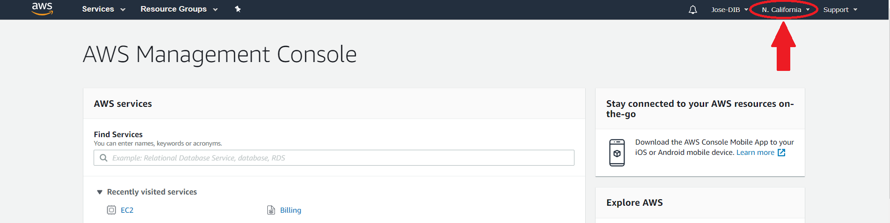
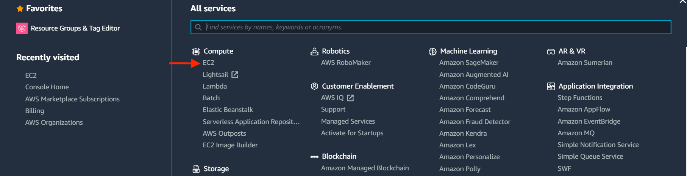
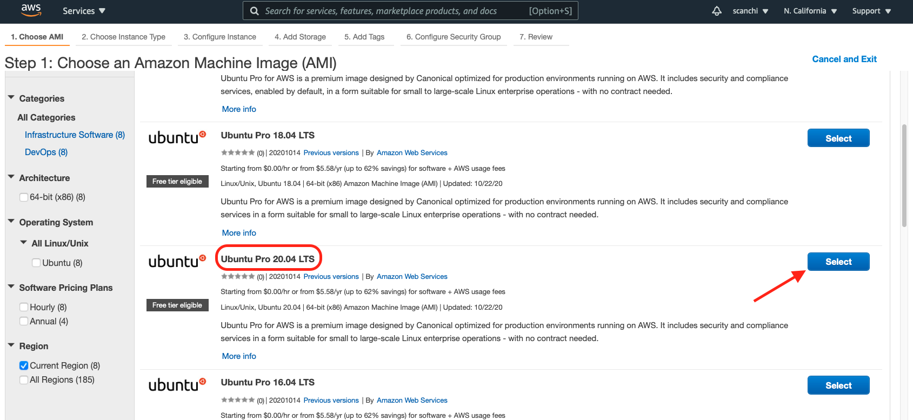

# Making use of on-demand “cloud” computers from Amazon Web Services

TODO:

* imgur links

This two hour workshop will introduce attendees to AWS computer
“instances” that let you rent compute time on large or specialized
computers.  We'll create a small general-purpose Linux computer,
connect to it, install some software, and explore the computiung
environment.

This lesson is based on [materials](https://github.com/nih-cfde/training-and-engagement/wiki/A-Hands-On-Introduction-to-AWS:-June-30,-2021#lets-get-started) originally developed by Abhijna Parigi,
Marisa Lim, and Saranya Canchi for the CFDE training site.

@CTB

We have the following goals for this workshop:

* Help you think about if and how to use cloud computers for your work!
* Gather questions, feedback and refine the tutorial materials!

## Workshop structure and plan

* Brief introduction to AWS and the cloud
* Set up an instance and connect to it
* Install and run things in the cloud computer
* @CTB
* Learn how to download output files to local machine
* Take your questions

## Some background

What is cloud computing? 
- Renting and use of IT services over the internet.
- No direct, active management by the user.
- Avoid or minimize up-front IT infrastructure costs.
- Amazon and Google, among others, rent compute resources over the internet for money.

Why might you want to use a cloud computer?

There are lots of reasons, but basically "you need a kind of compute or network access that you don't have."

- More memory than you have available otherwise
- An operating system you don't have access to (Windows? Mac?)
- Installation privileges for software
- May not want to install brand new software on your local computer

### Costs and payment

Today, everything you do will be paid for by us. In the future, if you
create your own AWS account, you'll have to put your own credit card
on it. We'd be happy to answer questions about how to pay for AWS.

:smiley_cat: Your free login credentials will work for the next 8 hours

## Amazon, terminology, and logging in!

- Amazon web services is one of the most broadly adopted cloud platforms
- It is a hosting provider that gives you a lot of services including cloud storage and cloud compute. 

Terminology:
* Instance - a computer that is running ...somewhere in "the cloud". The important thing is that someone else is worrying about the hardware etc, so you're just renting what you need!
* Cloud computer - same as an "instance".
* Image - the basic computer install from which an instance is constructed. The configuration of your instance at launch is a copy of the Amazon Machine Image (AMI)
* [EC2](https://en.wikipedia.org/wiki/Elasticity_(cloud_computing)#:~:text=In%20cloud%20computing%2C%20elasticity%20is,demand%20as%20closely%20as%20possible%22.) - elastic compute cloud.


**Amazon's main compute rental service is called Elastic Compute Cloud
(or EC2) and that's what we'll be showing you today.**

### EC2

- Amazon Elastic Compute Cloud (Amazon EC2) is a web service that provides secure, resizable compute capacity in the cloud.
- Basically, you rent virtual computers that are configured according to your needs and run applications and analyses on that computer. 
- Best suited for analyses that could crash your local computer. E.g. those that generate or use large output files or take too long

### Advantages of using AWS

- Sign up process is relatively easy (you need a credit card and some patience to deal with delays in two-factor authentication)
- Simple billing
- Stable services with only 3-4 major outages that only lasted 2-3 hours and did not affect all customers (region-specific). A large team of employees who are on top of any problems that arise!
- Lots of people use it, so there are a ton of resources
- Spot instances (unused EC2 instances) - you can bid for a price. It is cheap, but your services might be terminated if someone outbids you. 

---

## Let's get started!

We will create a cloud computer - an "instance" - and then log in to it.

@CTB
**Log in at**: https://cfde-training-workshop.signin.aws.amazon.com/console


Use your registration e-mail and password `CFDErocks!` @CTB

Put up a :hand: on Zoom when you've successfully logged in with the workshop user credentials.


### "Spinning up" instances

Checklist for hands-on walk-through

- [ ] Select a region: geographic area where AWS has data centers
- [ ] Pick the AMI (OS)
- [ ] Pick an instance (T2 micro free tier!) 
- [ ] Edit security groups
- [ ] Launch

@CTB

#### Step 2: Select region

* Select the AWS region of your remote machine that is closest to your current geographic location. It is displayed on the top right corner.
* Click on it and choose the location that best describes the region you are currently located. In this tutorial, we have selected **N.California**.



!!! note "AWS Region"

    The default region is automatically displayed in the AWS Dashboard. The [choice of region](https://docs.aws.amazon.com/emr/latest/ManagementGuide/emr-plan-region.html) has implications on fees, speed, and performance.

#### Step 3: Choose virtual machine

* Click on <span class="highlight_txt">Services</span> (upper left corner):


* Click on <span class="highlight_txt">EC2</span>:



!!! Note "Amazon EC2"

         [Amazon Elastic Cloud Computing (Amazon EC2)](https://aws.amazon.com/ec2/?ec2-whats-new.sort-by=item.additionalFields.postDateTime&ec2-whats-new.sort-order=desc) features virtual computing environments called instances. They have varying combinations of CPU, memory, storage, and networking capacity, and give you the flexibility to choose the appropriate mix of resources for your applications.  

* Click on <span class="highlight_txt">Launch Instance</span>:


#### Step 4: Choose an Amazon Machine Image (AMI)

An Amazon Machine Image provides the template for the root volume of an instance (operating system, application server, and applications). It is akin to the Operating Sytem (OS) on a computer.

* Select <span class="highlight_txt">AWS Marketplace</span> on the left hand side tab:


* Type `Ubuntu Pro` in the search bar. Choose `Ubuntu Pro 20.04 LTS` by clicking <span class="highlight_txt">Select</span>:



!!! info "Ubuntu 20.04 AMI"

     `Ubuntu 20.04` was released in 2020 and is the latest version. This is a **Long Term Support (LTS)** release which means it will be equipped with software updates and security fixes. Since it is a `Pro` version the support will last for ten years until 2030.   


* Click <span class="highlight_txt">Continue</span> on the popup window:


#### Step 5: Choose an instance type

Amazon EC2 provides a wide selection of instance types optimized to fit different use cases. You can consider instances to be similar to the hardware that will run your OS and applications. [Learn more about instance types and how they can meet your computing needs](https://aws.amazon.com/ec2/instance-types/).

* For this tutorial we will select the row with `t2.micro` which is free tier eligible:


!!! Note "Free Tier Eligible"

    The Free tier eligible tag lets us know that this particular operating system is covered by the [Free Tier program](https://aws.amazon.com/free/?all-free-tier.sort-by=item.additionalFields.SortRank&all-free-tier.sort-order=asc) where you use (limited) services without being charged. Limits could be based on how much storage you have access to and/or how many hours of compute you can perform in a one month.

* You can proceed to launch the instance with default configurations by clicking on <span class="highlight_txt">Review and Launch</span>.

#### Step 6: Optional configurations

There are several optional set up configurations.

* Start the first option by clicking <span class="highlight_txt">Next: Configure Instance Details</span> on the AWS page.

=== "Configure Instance"

    [Configure the instance to suit your requirements](https://docs.aws.amazon.com/AWSEC2/latest/UserGuide/Configure_Instance.html). You can:

    * change number of instances to launch
    * select the subnet to use
    * modify Stop or Terminate behaviors
    * control if you would like the instance to update with any patches when in use
    * request Spot Instances

    !!! info "Spot Instance"

        A [Spot Instance](https://aws.amazon.com/ec2/spot/?cards.sort-by=item.additionalFields.startDateTime&cards.sort-order=asc) is an unused EC2 instance that is available for less than the On-Demand price. Because Spot Instances enable you to request unused EC2 instances at steep discounts, you can lower your Amazon EC2 costs significantly.

=== "Add Storage"

    * Your instance comes with a in built storage called **instance store** and is useful for temporary data storage. The default root volume on a `t2.micro` is 8 GB.
    * For data you might want to retain longer or use across multiple instances or encrypt it is best to use the [**Amazon Elastic Block Store volumes (Amazon EBS)**](https://docs.aws.amazon.com/AWSEC2/latest/UserGuide/AmazonEBS.html).
    * Attaching EBS volumes to an instance are similar to using external hard drives connected to a computer.
    * Click on <span class="highlight_txt">Add New Volume</span> for additional storage.

    !!! info "Free Storage"

        You can get upto 30 GB of EBS general purpose (SSD) or Magnetic storage when using Free tier instances.

=== "Add Tags"

    * Tags are useful to categorize your AWS resources: instances and volumes.
    * A tag consists of a case-sensitive key-value pair. Some examples: GTEx-RNAseq, General-GWAS, KF-GWAS.
    * [Learn more about tagging your Amazon EC2 resources](https://docs.aws.amazon.com/AWSEC2/latest/UserGuide/Using_Tags.html).

=== "Configure Security Group"

    * Similar to setting up a firewall through which we would modify connection of external world and the EC2 instance.
    * Blocks/allow connections based on port number and IP.
    * You can create a new security group or select from an existing one.
    * [Learn more about Security groups for EC2 instances](https://docs.aws.amazon.com/AWSEC2/latest/UserGuide/ec2-security-groups.html).   

#### Step 7: Review and launch instance

The last tab in setup is **Review** which summarizes all the selected configurations for the instance.

* Click <span class="highlight_txt">Launch</span> after review.


#### Step 7a: Key pair
If you are launching an AWS instance for the first time, you will need to generate a key pair.

* Choose the <span class="highlight_txt">Create a new key pair</span> option from the drop down menu.
* Type any name under **Key pair name**. In this tutorial we are naming it `amazon.pem`.
* Click <span class="highlight_txt">Download Key Pair</span> to obtain the `.pem` file to your local machine. You can access the `.pem` file from the `Downloads` folder which is typically the default location for saving files. Next time you launch an instance, you can reuse the key pair you just generated.
* If you have a previously generated key pair, you can reuse it to launch an instance using <span class="highlight_txt">Choose an existing key pair</span> option.

!!! warning

    Do not select **Proceed without a key pair** option since you will not be able to connect to the instance.

* Check the acknowledgement box, and click <span class="highlight_txt">Launch Instances</span>.


!!! Note "Why do I need a key pair?"

    For security purposes, the SSH (Secure Shell) protocol uses encryption to secure the connection between a client and a server. All user authentication, commands, output, and file transfers are encrypted to protect against attacks in the network. With SSH protocol (secure Shell) public key authentication improves security as it frees users from remembering complicated passwords.

#### Step 7b: Launch status

You will be directed to the **Launch Status** page where the green colored box on top indicates a successful launch!

* Click on this first hyperlink, which is the instance ID. Your hyperlink may be different.


#### Step 7c: Public DNS

The instance console page shows you a list of all your active instances. Users may launch as many instances as they wish. Just remember that every instance costs money if you don't qualify for the Free Tier.

* Obtain the **Public DNS** address with the format `ec2-XX-XX-X-XXX.us-yyyy-y.compute-1.amazon.aws.com` located under the <span class="highlight_txt">Details</span> tab.


You have now successfully launched your AWS instance! You will need the Public DNS address from this amazon webpage to access your AWS instance, so do not close the page yet.

If you happen to close the webpage on accident, [click on this link](https://us-west-1.console.aws.amazon.com/ec2/v2/home?region=us-west-1#Instances:sort=instanceId).

Continue on to the next lesson to learn how to connect to your AWS instance!

### Connecting to instances

@CTB

Other ways to connect to the instance:

We have tutorials on connecting to an instance for **Windows** Users using MobaXterm and for **Mac Users** using MacOS Terminal. Please visit our ["Connect to an Instance"](https://training.nih-cfde.org/en/latest/Cloud-Platforms/Introduction_to_Amazon_Web_Services/introtoaws4.html) webpage and select your OS using the tabs on the top of the page.

## Installing programs and running them in the cloud

@CTB


## Downloading data from AWS instance onto local computer

@CTB

#### Connecting to instance
1. Go back to your [instance page](https://us-west-1.console.aws.amazon.com/ec2/v2/home?region=us-west-1#Instances:), select it and click on "Connect". The Public DNS information you need to connect to your instance via ssh can be found in the "SSH client" tab:


2. In MobaXterm, click on "Session"
3. Click on "SSH"
4. Enter the Public DNS as the "Remote host" (the part that looks like ec2-[..].us-west-1.compute.amazonaws.com)
5. Check box next to "Specify username" and enter "ubuntu" as the username
6. Click the "Advanced SSH settings" tab
7. Check box by "Use private key"
8. Use the document icon to navigate to where you saved the private key (e.g., "amazon.pem") from AWS on your computer. It is likely on your Desktop or Downloads folder
9. Click "OK"
10. A terminal session should open up with a left-side panel showing the file system of our AWS instance! You can click on the FastQC html file and view in browser to open. There are also options in the panel to download files.
</details>

<details> 
<summary>MacOS/Linux</summary>

#### MacOS

- Start Terminal 
- Change the permissions on the .pem file for security purposes (removes read, write, and execute permissions for all users except the owner (you)
```
chmod og-rwx ~/Desktop/amzon.pem
```

- Change directory to Desktop. Your `.pem` file is on your Desktop

```
cd ~/Desktop
```
Go back to your [instance page](https://us-west-1.console.aws.amazon.com/ec2/v2/home?region=us-west-1#Instances:), select it and click on "Connect". The information you need to connect to your instance via ssh can be found in the "SSH client" tab:


- Use the `scp` command on your local terminal to copy your `.html` file!

```
scp -i <your-.pem> ubuntu@???-??-??-???-??.us-west-1.compute.amazonaws.com:/home/ubuntu/fastq/ERR458494_fastqc.html ./
```
`-i` flag points to identity file. Don't forget to change the stuff after `ubuntu@` to match your instance!
</details>

## Shutting down instances

When you shut down your instance, any data that is on a non-persistent disk goes away permanently. But you also stop being charged for any compute and data, too!

:bulb: **Stopping vs hibernation vs termination**

- Stopping: 
    - saves data to EBS root volume 
    - only EBS data storage charges apply 
    - No data transfer charges or instance usage charges 
    - RAM contents not stored

- Hibernation: 
    - charged for storage of any EBS volumes 
    - stores the RAM contents 
    - it's like closing the lid of your laptop

- Termination: 
    - complete shutdown 
    - EBS volume is detached 
    - data stored in EBS root volume is lost forever
    - instance cannot be relaunched

To enable Hibernation, click the box in the Configure Instance step of the setup.


## Exercise

Launch a t2.nano, Ubuntu 20.04 LTS - Focal instance in the the **East US (Ohio) region**. Change the root storage volume to 16 GiB and add an additional EBS volume (8 GiB). 

Bonus points: Your added volume will persist after you have terminated your instance. Where can you find it?

<details>
<summary>Hint</summary>

- Go to Amazon Market place and search for the "Ubuntu 20.04 LTS - Focal". Should be the first result.
- Look in tab 4 called "Add Storage" to add additional storage volumes.

</details>

## Checklist of things you learned today!

- [x] A little bit about AWS and cloud computing
- [x] How to launch an instance 
- [x] How to connect to the instance
- [x] How to install and run a software program on the instance 
- [x] How to terminate your instance 

### Additional Resources

- Understanding data transfer costs in AWS: https://github.com/open-guides/og-aws#aws-data-transfer-costs
- Useful tips: https://wblinks.com/notes/aws-tips-i-wish-id-known-before-i-started/
- Consolidated billing: https://docs.aws.amazon.com/awsaccountbilling/latest/aboutv2/consolidated-billing.html

## FAQs

**A note on data transfer costs**

Data transfer between AWS and the Internet:
Data transfer costs from AWS to the internet are highly dependent on the region. For example, for S3 buckets located in the US West (Oregon) region, the first GB/month is free and the next 9.999 TB/month cost $0.09 per GB. However, if the S3 buckets are located in the South America (São Paolo) region, the first GB/month is still free, but the next 9.999 TB/month cost $0.25 per GB.

More info here: https://www.apptio.com/blog/aws-data-transfer-costs/

**Data storage**
https://aws.amazon.com/ebs/pricing/

**What are the advantages of using AWS over an academic HPC?**
- Most universities don't have a HPC
- No queues!
- Can set up as many instances as you want (as long as you are willing to pay for it)
- Can install anything without needing admin permissions
- Almost no scheduled or unscheduled outages
- Easier to set up 
- Easier to learn and get help on the internet
- Costs more over time, but someone is paying for the HPC too! 

*But if you have a good HPC, please use it!*

**Can you set up multiple instances at once**
- Yes!
- There is a limit per account but it is a very large number and doesn't apply to most people

**Can you launch more than one instance with the same configurations?**
- Yes, there is an option to do this on the instance set up page.
- Look in the second tab!

**Can you copy an instance or share an instance with collaborators?** 
- Yes, but this is not as straightforward as it seems.
- The way to clone an instance is via [snapshots](https://docs.aws.amazon.com/AWSEC2/latest/UserGuide/ebs-creating-snapshot.html)

Check out our [AWS discussion board](https://github.com/nih-cfde/training-and-engagement/discussions/categories/aws) for FAQs and discussion. We encourage you to post a question here !

## Concluding thoughts

Laptop vs farm head node vs farm compute node vs cloud computing
@CTB
