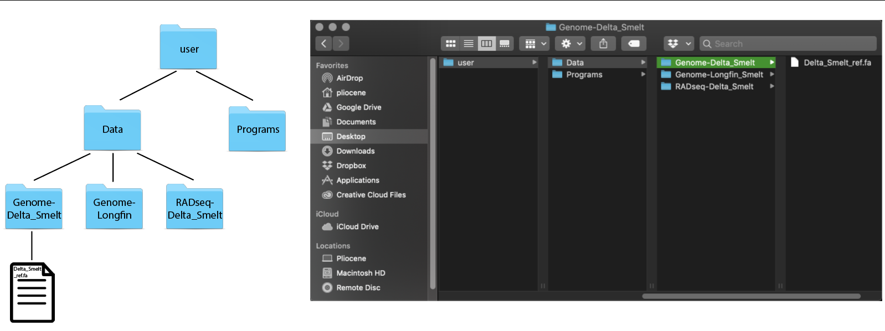
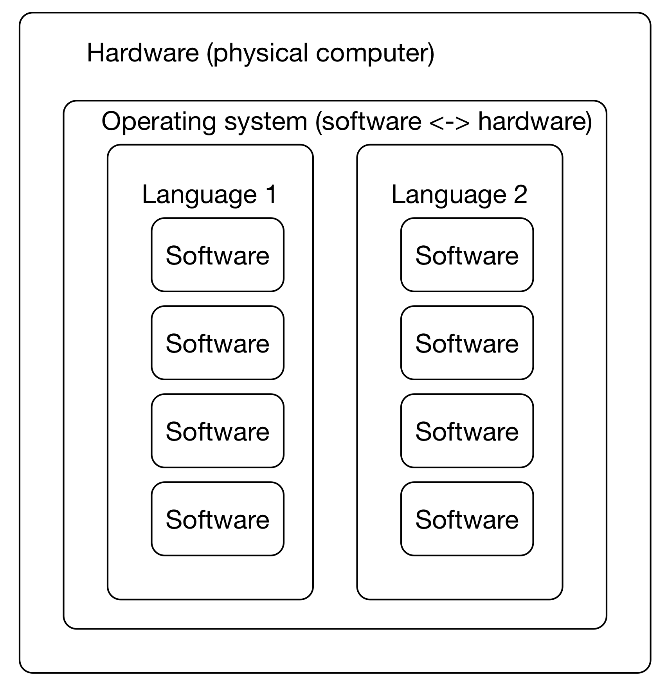

# Overview {-}

## Introductory skills {-}

Workshop 1: [Introduction to the UNIX Command Line](introduction-to-the-unix-command-line.html) - Tues Aug 3

Workshop 2: [Creating and modifying text files on remote computers](creating-and-modifying-text-files-on-remote-computers.html) - Wed Aug 4

## Intermediate skills {-}

Workshop 3: [Connecting to remote computers with ssh](connecting-to-remote-computers-with-ssh.html) - Tues Aug 10

Workshop 4: [Running programs on remote computers and retrieving the results](running-programs-on-remote-computers-and-retrieving-the-results.html) - Th Aug 12

Workshop 5: [Installing software on remote computers with conda](installing-software-on-remote-computers-with-conda.html) - Fri Aug 13

Workshop 6: [Structuring your projects for current and future you](structuring-your-projects-for-current-and-future-you.html) - Tues Aug 17

Workshop 7: [Automating your analyses and executing long-running analyses on remote computers](automating-your-analyses-and-executing-long-running-analyses-on-remote-computers.html) - Th Aug 19

Workshop 8: [Keeping track of your files with version control](keeping-track-of-your-files-with-version-control.html) - Tues Aug 24

## Advanced skills {-}

Workshop 9: [Automating your analyses with the snakemake workflow system](automating-your-analyses-with-the-snakemake-workflow-system.html) - Wed Aug 25

Workshop 10: [Executing large analyses on HPC clusters with slurm](executing-large-analyses-on-hpc-clusters-with-slurm.html) - Th Aug 26

Workshop 11: [Making use of on-demand "cloud" computers from Amazon Web Services](making-use-of-on-demand-cloud-computers-from-amazon-web-services.html) - Tues Aug 31

<!--chapter:end:index.Rmd-->

# Introduction to the UNIX Command Line

This two hour workshop will introduce attendees to the UNIX command
line, which is the main way to interact with remote computers. We will
cover computing concepts, file systems and directory structure, and
some of the most important commands for working with remote computers.

Today and tomorrow we'll be using an interactive Web site running on
a [binder](https://mybinder.org/). To start your binder, please click on
the "launch" button below; it will take up to a minute to start.

[](https://binder.pangeo.io/v2/gh/ngs-docs/2021-remote-computing-binder/stable?urlpath=rstudio)

NOTE: This lesson was adapted from Data Carpentry's [Introduction to the Command Line for Genomics](https://datacarpentry.org/shell-genomics/) lesson and the Lab for Data Intensive Biology's [Advanced Beginner/Intermediate Shell](https://dib-training.readthedocs.io/en/pub/2016-01-13-adv-beg-shell.html) workshop.

----

## Introduction to UNIX

### Learning Goals
* visualize file/directory structures
* understand basic shell vocabulary
* gain exposure to the syntax of shell & shell scripting
* look at the contents of a directory 
* find features of commands with `man`
* commands: `pwd`, `ls`, `cd`, `man`

------------------------------------

#### What is the shell and what is the terminal?
The **shell** is a computer program that uses a command line interface (CLI) to give commands made by your keyboard to your operating system. Most people are used to interacting with a graphic user interface (GUI), where you can use a combination of your mouse and keyboard to carry out commands on your computer. We can use the shell through a **terminal** program. 

Everything we can do using our computer GUI, we can do in the shell. We can open programs, run analyses, create documents, delete files and create folders. We should note that _folders_ are called **directories** at the command line. For all intents and purposes they can be used interchangeably but if you'd like more information please see "The folder metaphor" section of [Wikipedia](https://en.wikipedia.org/wiki/Directory_%28computing%29#Folder_metaphor).

The ease of getting things done via the shell will increase with your exposure to the program.  

**Go ahead and open a new terminal window in binder by clicking on "Terminal".**

When we open up terminal in binder we will see a a line of text. This is a **prompt statement**. It can tell us useful things such as the name of the directory we are currently in, our username, or what computer we are currently running terminal on.

Let's take a look around. First, we can use the **print working directory** command see what directory we are currently located in.

```
pwd
```

This gives us the **absolute path** to the directory where we are located. An absolute path shows the complete series of directories you need to locate either a directory or a file starting from the root directory of your computer.

What is the root?
A useful way to start thinking about directories and files is through levels. At the highest level of your computer, you have the **root directory**. Everything that is contained in your computer is located in directories below your root directory. 



We can also look at the contents of the directory by using the `ls`
("list") command:

```
ls
```

This command prints out a list of files and directories that are located in our current working directory. We've preloaded [some data](https://s3-us-west-1.amazonaws.com/dib-training.ucdavis.edu/shell-data.zip) into the binder, so we have a subdirectory `data/` that we can look at.

To change the working directory, we need to use the `cd` ("change
directory") command. Let's move into the data directory.

```
cd data
```

Let's have a look around.

```
ls
```

We can see the following files:

> > ~~~
> > MiSeq		Slide1.jpg	hello.sh	nano1.png
> > README.md	gvng.jpg		nano2.png
> > ~~~

However, this directory contains more than the eye can see! To show hidden files we can use the `-a` option.

```
ls -a
```

We will see the following:

> > ~~~
> > .		MiSeq		Slide1.jpg	hello.sh	nano1.png
> > ..		README.md	gvng.jpg	.hidden		nano2.png
> > ~~~

Three new items pop up `.`, `..` and `.hidden`. 

Using options with our commands allows us to do a lot! But how did we know to add `-a` after ls? Most commands offer a `--help`. Let's look at the available options that `ls` has:

```
ls --help
```

Here we see a long list of options. Each option will allow us to do something different.

**CHALLENGE** Try to find the option that allows you to differentiate between directories and executable files when using `ls`. Hint: look for the word classify. (You can also look at the [`ls` man page if you prefer!](https://man7.org/linux/man-pages/man1/ls.1.html)


We can also combine commands:

```
ls -aFl
```

This combination of options will _list_ _all_ the contents of the directory and _differentiate_ between file types.

----

## Navigation

### Learning Goals
* paths
* look at the contents of files
* perform functions outside of the directory you are in
* intro to the wildcard expression: `*`
* copy, move and remove files
* create and remove directories
* understand the structure of commands
* commands: `cat`, `cp`, `mv`, `rm`, `mkdir`

--------------------------------------------

Now we have seen how to navigate around our computers and seeing what is located in the directory we are. But some of the beauty of the shell is that we can execute activities in locations that we are not currently in. To do this we can either use an absolute path or a relative path. A **relative path** is the path to another directory from the the one you are currently in. 

Navigate into the `tmp1` directory located in the `.hidden` directory.

```
cd .hidden/tmp1
```

Here we see two files `notit.txt` and `thisinnotit.txt`. We can see what is in the directories using the `cat` command which concatenates and prints the content of the file we list. 

```
cat thisinnotit.txt
```

> > ~~~
> > This is not the text file you're looking for
> > ~~~

NOTE - you can use TAB to do filename completion, so if you type `cat this` and then press your Tab key once, it will autocomplete if there is a unique match. If there is more than one match, the first Tab will do nothing, and the second will show all the possible matches.

Let's see what else is in the other tmp directories:

```
ls ../tmp2
```

and we can see the contents of tmp3

```
ls ../tmp3
```

So, even though we are in the `tmp1/` directory, we can see what is in other directories by using the relative path to the directory of interest. Note we can also use absolute paths too. You may have noticed the `../` this is how to get to the directory above the one you are currently located in. 

Note: in this case, we have access to the RStudio file browser, too, which is really nice. But in the future we won't. So we can use the file browser today, but on Farm we'll have to get by with just the command line interface and no other interface!

**CHALLENGE:** Use the absolute path to list the files in the tmp2 directory.

Wouldn't it be nice to see the contents of all the tmp directories at once? We can use a regular expression to capture a sequence of characters (like the numbers 1, 2 and 3 at the end of the tmp directories). We can use the wild card character `*`, which expands to match any amount of characters.

```
ls ../tmp*
```

> > ~~~
> > ../tmp1:
> > notit.txt	thisinnotit.txt
> > 
> > ../tmp2:
> > anotherfile.txt
> > 
> > ../tmp3:
> > closebutnotit.txt	youfoundit.txt
> > ~~~

So, even though we are in the `tmp1` directory we can use a relative path.

We are quite used to moving, copying and deleting files using a GUI. All of these functions can be carried out at the command line with the following commands: 

Copy files with the `cp` command by specifying a file to copy and the location of the copied file. Here we will copy the `thisinnotit.txt` into the file `thisisacopy.txt`. 

```
cp thisinnotit.txt thisisacopy.txt
```

The syntax for the copy command is `cp <source_file> <destination_file>`. Using this syntax we can copy files to other directories as well:

```
cp thisinnotit.txt ../tmp2
```

If we navigate to the tmp2 directory and list the files that are in it we will see the `thisinnotit.txt` file has been copied to the tmp2 directory.

```
cd ../tmp2
ls -l
```

**CHALLENGE:** Use the `mv` command to move the `thisinnotit.txt` file from tmp2 to tmp3.

Once we know how to copy and move files, we can also copy and move directories. We can create new directories with the command `mkdir`. Let's make a new directory called `tmp4`

```
cd ../
mkdir tmp4
ls -l
```

The shell is quite powerful and can create multiple directories at once. It can create multiple directories in the current working directory:

```
mkdir tmp5 tmp6
ls -l
```

or it can create a series of directories on top of one another:

```
mkdir -p how/deep/does/the/rabbit/hole/go
```

We can use tab complete to get to the `go` directory. Type `cd h` then hit <kbd>tab</kbd>. If you hit tab enough times your command will eventually read:

```
cd how/deep/does/the/rabbit/hole/go/
```

You can see that we've created a bit of a monster directory structure...

**CHALLENGE:** Navigate to the data directory and use the `rm` command to remove the `how` directory and all its contents. 

----

This nicely hints at the power of the shell - you can do certain things (in this case, create a nested hierarchy of directories) much more easily in the shell. But that power cuts both ways - you can also mess things up more easily in the shell!


----

## Viewing & Searching

### Learning Goals
* looking inside files
* search for keywords within files
* commands: `less`, `head`, `tail`, `grep`

------------------------------------------

A big part of data science is making sure what you _expect_ in a particular file is what you _have_ in that file. There are a few ways to look at the contents of a file. We've already seen how to print the entirety of a file to the stdout of our `cat` command. We can also look at files using the `less` command. Less is a safe way of looking at the contents of a file without the ability to change it. (We'll talk more about text files and editing them in the second workshop!)

Starting from the `data/` directory in our home directory

```
cd ~/data/
```

let's look at some sequence data in a [fastq file](https://en.wikipedia.org/wiki/FASTQ_format) format.

```
cd MiSeq
less F3D0_S188_L001_R1_001.fastq
```

We can see a bunch of sequence data! Use the up, down, left and right arrows to look through the folder a bit. Then press `q` to quit less. 

A lot of the time we want to know if a file contains what we expect. Many of the sequence files in this directory have the file ending `.fastq`. We expect these files to contain information in a particular format throughout the file with four  lines of information for each sequence string. Looking through a million line file using less will take a long time. Rather than manually looking through the file we can print only a portion of the files contents to the terminal:

```
head F3D0_S188_L001_R1_001.fastq
```

> > ~~~
> > @M00967:43:000000000-A3JHG:1:1101:18327:1699 1:N:0:188
> > NACGGAGGATGCGAGCGTTATCCGGATTTATTGGGTTTAAAGGGTGCGTAGGCGGCCTGCCAAGTCAGCGGTAAAATTGCGGGGCTCAACCCCGTACAGCCGTTGAAACTGCCGGGCTCGAGTGGGCGAGAAGTATGCGGAATGCGTGGTGTAGCGGTGAAATGCATAGATATCACGCAGAACCCCGATTGCGAAGGCAGCATACCGGCGCCCTACTGACGCTGAGGCACGAAAGTGCGGGGATCAAACAG
> > +
> > #>>AABABBFFFGGGGGGGGGGGGGGGGHHHHHHHGGGHHHHHGHGGGGGGGHGGGGGGHHHHHHHHHHGGGGGHHHHGHGGGGGGHHBGHGDGGGGGHHHGGGGHHHHHHHHGGGGGHG@DHHGHEGGGGGGBFGGEGGGGGGGG.DFEFFFFFFFDCFFFFFFFFFFFFFFFFFFFFFFFFFFDFDFFFEFFCFF?FDFFFFFFFFAFFFFFFFFFFFBDDFFFFFEFADFFFFFBAFFFA?EFFFBFF
> > @M00967:43:000000000-A3JHG:1:1101:14069:1827 1:N:0:188
> > TACGGAGGATGCGAGCGTTATCCGGATTTATTGGGTTTAAAGGGTGCGTAGGCGGCCTGCCAAGTCAGCGGTAAAATTGCGGGGCTCAACCCCGTACAGCCGTTGAAACTGCCGGGCTCGAGTGGGCGAGAAGTATGCGGAATGCGTGGTGTAGCGGTGAAATGCATAGATATCACGCAGAACCCCGATTGCGAAGGCAGCATACCGGCGCCCTACTGACGCTGAGGCACGAAAGTGCGGGGATCAAACAG
> > +
> > 3AA?ABBDBFFBEGGEGGGGAFFGGGGGHHHCGGGGGGHFGHGGCFDEFGGGHGGGEGF1GGFGHHHHHGGEGGHHHHHFGGGGGGHHHHHGGGGCDDGHHGGGFHHHHHHHHCD@CCHGGGGHEHGGG@GFGGGGGGG@BGGGEGCEBFFFBFFB;9@EFFFEFFFFFFFFFFFFAFBBBFFFFFBBBFFFFBBBFFFFFFFFFFFBBBBBBBFFFFFFFFFDDFAFFFFF.AF9/FBBBBB.EAFFE?F
> > @M00967:43:000000000-A3JHG:1:1101:18044:1900 1:N:0:188
> > TACGGAGGATGCGAGCGTTGTCCGGAATCACTGGGCGTAAAGGGCGCGTAGGCGGTTTAATAAGTCAGTGGTGAAAACTGAGGGCTCAACCCTCAGCCTGCCACTGATACTGTTAGACTTGAGTATGGAAGAGGAGAATGGAATTCCTAGTGTAGCGGTGAAATGCGTAGATATTAGGAGGAACACCAGTGGCGAAGGCGATTCTCTGGGCCAAGACTGACGCTGAGGCGCGAAAGCGTGGGGAGCAAACA
> > ~~~

`head` prints the first ten lines of a file out onto your screen.

We can look at the last ten lines of a file using the `tail` command:

```
tail F3D0_S188_L001_R1_001.fastq
```

We can see that our **fastq** files look a lot different than the **fasta** files:

```
head HMP_MOCK.v35.fasta
```

> > ~~~
> > >A.baumannii.1
> > TGGGGAATATTGGACAATGGGGGGAACCCTGATCCAGCCATGCCGCGTGTGTGAAGAAGGCCTTATGGTTGTAAAGCACTTTAAGCGAGGAGGAGGCTACTTTAGTTAATACCTAGAGATAGTGGACGTTACTCGCAGAATAAGCACCGGCTAACTCTGTGCCAGCAGCCGCGGTAATACAGAGGGTGCGAGCGTTAATCGGATTTACTGGGCGTAAAGCGTGCGTAGGCGGCTTATTAAGTCGGATGTGAAATCCCCGAGCTTAACTTGGGAATTGCATTCGATACTGGTGAGCTAGAGTATGGGAGAGGATGGTAGAATTCCAGGTGTAGCGGTGAAATGCGTAGAGATCTGGAGGAATACCGATGGCGAAGGCAGCCATCTGGCCTAATACTGACGCTGAGGTACGAAAGCATGGGGAGCAAACAGGATTAGATACCCTGGTAGTCCATGCCGTAAACGATGTCTACTAGCCGTTGGGGCCTTTGAGGCTTTAGTGGCGCAGCTAACGCGATAAGTAGACCGCCTGGGGAGTACGGTC
> > >A.odontolyticus.1
> > TGGGGAATATTGCACAATGGGCGAAAGCCTGATGCAGCGACGCCGCGTGAGGGATGGAGGCCTTCGGGTTGTAAACCTCTTTCGCTCATGGTCAAGCCGCAACTCAAGGTTGTGGTGAGGGTAGTGGGTAAAGAAGCGCCGGCTAACTACGTGCCAGCAGCCGCGGTAATACGTAGGGCGCGAGCGTTGTCCGGAATTATTGGGCGTAAAGGGCTTGTAGGCGGTTGGTCGCGTCTGCCGTGAAATCCTCTGGCTTAACTGGGGGCGTGCGGTGGGTACGGGCTGACTTGAGTGCGGTAGGGGAGACTGGAACTCCTGGTGTAGCGGTGGAATGCGCAGATATCAGGAAGAACACCGGTGGCGAAGGCGGGTCTCTGGGCCGTTACTGACGCTGAGGAGCGAAAGCGTGGGGAGCGAACAGGATTAGATACCCTGGTAGTCCACGCTGTAAACGTTGGGCACTAGGTGTGGGGGCCACCCGTGGTTTCTGCGCCGTAGCTAACGCTTTAAGTGCCCCGCCTGGGGAGTACGGCC
> > >B.cereus.1
> > TAGGGAATCTTCCGCAATGGACGAAAGTCTGACGGAGCAACGCCGCGTGAGTGATGAAGGCTTTCGGGTCGTAAAACTCTGTTGTTAGGGAAGAACAAGTGCTAGTTGAATAAGCTGGCACCTTGACGGTACCTAACCAGAAAGCCACGGCTAACTACGTGCCAGCAGCCGCGGTAATACGTAGGTGGCAAGCGTTATCCGGAATTATTGGGCGTAAAGCGCGCGCAGGTGGTTTCTTAAGTCTGATGTGAAAGCCCACGGCTCAACCGTGGAGGGTCATTGGAAACTGGGAGACTTGAGTGCAGAAGAGGAAAGTGGAATTCCATGTGTAGCGGTGAAATGCGTAGAGATATGGAGGAACACCAGTGGCGAAGGCGACTTTCTGGTCTGTAACTGACACTGAGGCGCGAAAGCGTGGGGAGCAAACAGGATTAGATACCCTGGTAGTCCACGCCGTAAACGATGAGTGCTAAGTGTTAGAGGGTTTCCGCCCTTTAGTGCTGAAGTTAACGCATTAAGCACTCCGCCTGGGGAGTACGGCC
> > >B.vulgatus.1
> > TGAGGAATATTGGTCAATGGGCGCAGGCCTGAACCAGCCAAGTAGCGTGAAGGATGACTGCCCTATGGGTTGTAAACTTCTTTTATAAAGGAATAAAGTCGGGTATGGATACCCGTTTGCATGTACTTTATGAATAAGGATCGGCTAACTCCGTGCCAGCAGCCGCGGTAATACGGAGGATCCGAGCGTTATCCGGATTTATTGGGTTTAAAGGGAGCGTAGATGGATGTTTAAGTCAGTTGTGAAAGTTTGCGGCTCAACCGTAAAATTGCAGTTGATACTGGATATCTTGAGTGCAGTTGAGGCAGGCGGAATTCGTGGTGTAGCGGTGAAATGCTTAGATATCACGAAGAACTCCGATTGCGAAGGCAGCCTGCTAAGCTGCAACTGACATTGAGGCTCGAAAGTGTGGGTATCAAACAGGATTAGATACCCTGGTAGTCCACACGGTAAACGATGAATACTCGCTGTTTGCGATATACGGCAAGCGGCCAAGCGAAAGCGTTAAGTATTCCACCTGGGGAGTACGCCG
> > >B.vulgatus.2
> > TGAGGAATATTGGTCAATGGGCGAGAGCCTGAACCAGCCAAGTAGCGTGAAGGATGACTGCCCTATGGGTTGTAAACTTCTTTTATAAAGGAATAAAGTCGGGTATGGATACCCGTTTGCATGTACTTTATGAATAAGGATCGGCTAACTCCGTGCCAGCAGCCGCGGTAATACGGAGGATCCGAGCGTTATCCGGATTTATTGGGTTTAAAGGGAGCGTAGATGGATGTTTAAGTCAGTTGTGAAAGTTTGCGGCTCAACCGTAAAATTGCAGTTGATACTGGATATCTTGAGTGCAGTTGAGGCAGGCGGAATTCGTGGTGTAGCGGTGAAATGCTTAGATATCACGAAGAACTCCGATTGCGAAGGCAGCCTGCTAAGCTGCAACTGACATTGAGGCTCGAAAGTGTGGGTATCAAACAGGATTAGATACCCTGGTAGTCCACACGGTAAACGATGAATACTCGCTGTTTGCGATATACGGCAAGCGGCCAAGCGAAAGCGTTAAGTATTCCACCTGGGGAGTACGCCG
> > ~~~

Each sequence entry for a [fasta](https://en.wikipedia.org/wiki/FASTA_format) formatted file contains only two lines of information for each sequence string.

Another useful thing to do is to be able to **search the contents of files** for a particular string of characters you would like to find. Let's say you'd like to find the sequence `CATTAG` in your files. We can use the file pattern searcher `grep` to look for our favorite sequence:

```
grep CATTAG F3D0_S188_L001_R2_001.fastq
```

We can also use the **wildcard** regular expression to search `CATTAG` in all of the fastq files located in our current working directory:

```
grep CATTAG *.fastq
```

**CHALLENGE:** What line does `CATTAG` occur on in `F3D141_S207_L001_R1_001.fastq`? (HINT: Use `grep --help` to search for `grep` options related to line number)


----

## File Manipulation

### Learning Goals
* commands `for`, `basename`, `echo`

------------------------------------------

### Renaming a bunch of files

Let's make sure we're in the right directory-  the one that contains
all of our data files.

```
cd ~/data/MiSeq
```

For our first task, let's pretend that we want to rename all of the fastq files to be `.fq` files instead (this is a surprisingly useful specific skill, even if you can't immediately think of why you would want to do that!).  Here, we get to use two of my favorite commands - 'for' and 'basename'.

`for` lets you do something to every file in a list.  To see it in action:

```
for i in *.fastq
do
   echo $i
done
```

This is running the command `echo` for every value of the variable 'i', which is set (one by one) to all the values in the expression `*.fastq`.

If we want to get rid of the extension '.fastq', we can use the `basename` command:

```
for i in *.fastq
do
   basename $i .fastq
done
```

Now, this doesn't actually rename the files - it just prints out the name, with the suffix '.fastq' removed.  To rename the files, we need to capture the new name in a variable:

```
for i in *.fastq
do
   newname=$(basename $i .fastq).fq
   echo $newname
done
```

What `$( ... )` does is run the command in the middle, and then replace the `$( )` with the output of running the command.

Now we have the old name (`$i`) and the new name (`$newname`) and we're ready to write the rename command --

```
for i in *.fastq
do
   newname=$(basename $i .fastq).fq
   echo mv $i $newname
done
```

***Question:*** why did I put `echo` here?

Now that we're pretty sure it all looks good, let's run it for realz:

```
for i in *.fastq
do
   newname=$(basename $i .fastq).fq
   mv $i $newname
done
```

and voila, we have renamed all the files!

_Side note:_ you may see backquotes used instead of `$(...)`. It does the same thing but is trickier to get right, so we teach `$(...)` instead of `` ` ``.

----

## Some final notes

This lesson focused on file and directory exploration because that's
something everyone needs to know, and all these commands will work on
pretty much any computer that is running a UNIX compatible shell (including
Mac OS X and Windows Subsystem for Linux). We'll get into a broader range
of tasks soon, promise!

The binder and this documentation page will stay working for the foreseeable
future, so please feel free to come back and revisit some of these commands!

We will explore more UNIX commands over the next few workshops!

Google (and especially stackoverflow) is your friend! Use Internet
search whenever you have questions about what a command does, or what
commands to use to achieve a particular tasks.

<!--chapter:end:01-command-line.Rmd-->

# Creating and modifying text files on remote computers

This two hour workshop will introduce attendees to the concepts and skills needed to create, modify, and search text files on remote computers. We will discuss files and content types, and cover the most common ways to work with remote text files.

As with
[the first workshop introducing the UNIX command line](introduction-to-the-unix-command-line.html),
we'll be using an interactive Web site running on a
[binder](https://mybinder.org/). To start your binder, please click on
the "launch" button below; it will take up to a minute to start.

[](https://binder.pangeo.io/v2/gh/ngs-docs/2021-remote-computing-binder/stable?urlpath=rstudio)

Once it's launched, go to the "Terminal" tab.

## Text files vs other files

Text files are a fairly narrow but very important subset of the kinds
of files that we will work with in data science. Text files are,
loosely defined, files that are human-readable without any special
machine interpretation needed - such as text-only e-mails, CSV files,
configuration files, and Python and R scripts.

The list above is interesting, because it makes the point that just
because a human can "read" the files doesn't mean that they are
_intended_ for humans, necessarily. For example, CSV files can be more
or less strictly defined in terms of formatting, and Python and R
scripts still need to be valid Python or R code. DNA sequence data
files like we saw yesterday are another case in point - it's pretty
rare (and a bad idea) to edit them manually, but you _could_ if you
really wanted to.

The operational distinction really comes down to this: text files can
be created, edited, changed, and otherwise manipulated with
text-format based tools, like text editors, grep (which we saw
yesterday), and other programs.  Text files are a common and standard
format that _many_ tools can interact with.

In comparison, binary files are files that need special programs to
interact with them. Some of them are more standard than others - for
example, Word files can be read or written by many programs. Images
(JPG and PNG and...) can be manipulated by many programs as well. Zip
files are another semi-standard format that can be manipulated by several
different programs. The main thing is that you can't just look at them
with standard text-focused tools - and typically this is because binary
files are meant to be used for different kinds of data than text.

As a side note, one of the most important aspects of text files is that
there are some really powerful tools for tracking changes to them,
and collaboratively editing them - we'll cover that in workshop 8,
version control!

<!-- @CTB link in workshop materials here -->

### OK, OK, what does this all mean in practice?

Let's look at a simple text file - `2cities/README.md`:

```
cat 2cities/README.md
```

As you may remember, 'cat' (short for 'catenate') displays the content
of the file.

This is a file in a format called Markdown, that is a lightly
decorated text file with a title and so on. While it can be nicely
formatted by an interpreting program (see [the way github renders this
file!](https://github.com/ngs-docs/2021-remote-computing-binder/blob/latest/2cities/README.md),
it can also just be viewed and read with cat.

This is different from the other file in `2cities/`; take a look at
what's there by running,
```
ls 2cities/
```
and you should see

> > ~~~
> > README.md       book.txt.gz
> > ~~~

In this directory, there is one text file and one binary file.

If you want to see if it's a file type that UNIX recognizes you can run
the `file` command, e.g.
```
file 2cities/README.md
```
will report that it's ASCII text, while
```
file 2cities/book.txt.gz
```
will report that it's "gzip compressed data", which is a compressed data
type. What do we do with that?

### Working with gzipped files

gzip is a common type of file, and all that it means is that it's been
compressed (made smaller) with the `gzip` program.

Look at it's file size first --

```
ls -lh 2cities/book.txt.gz
```
and you'll see that it's about 300k.

You can uncompress a gzip file with `gunzip`; in this case,
```
gunzip 2cities/book.txt.gz
```
will produce `2cities/book.txt`

CHALLENGE: what two commands will tell you the file type and size of `2cities/book.txt`?

---

Yep, it's almost 3 times bigger when it's uncompressed!

And it's file type is "UTF-8 Unicode (with BOM) text, with CRLF line
terminators" which is a fancy way of saying "text, supporting extended
characters (unicode), and with both a carriage return (CR) and a line
feed (LF) at the end of each line." The important thing is that pretty
much any text editor should be able to edit this kind of file.

Let's take a quick look at the beginning of the file with `head`:

```
head 2cities/book.txt
```

yep, looks like text!

### Digression: file extensions are often meaningful (but don't have to be)

Couldn't we have guessed at what these files were based on their
names? Yes, the .md extension usually means it's a text file with
Markdown formatting, and the .gz extension typically means it's a
compressed file, and the .txt extension typically means it's a text
file. So you can read `book.txt.gz` to mean that it's a text file that's
been compressed.

But this isn't guaranteed - it's a convention, rather than a requirement.
Many programs will actively "sniff" the file type by looking at the content
(which is what `file` does), and you should never blindly trust the file type
indicated by the extension.

### Let's edit this file!

Let's start with the `nano` editor. `nano` and its sibling `pico` are
simple text editors that let you get started, but are ultimately limited
in their functionality.

Note: If you've ever used the 'pine' e-mailer, you've used these
editors!

nano (and all of the editors we'll use below in the terminal) are
"text graphics" editors that give you a visual interface that is not
the command line (which is good, trust us) but that also exist only
within the terminal program and **do not support mouse movements**.
This is important - you can't use the mouse to move the cursor or make
changes (although you can select things).

### Running the editor and exiting/saving

To get started, let's open the file:

```
nano 2cities/book.txt
```

this will put you in an editor window.

First things first: you can immediately exit by typing CTRL-X (that's
holding down the CTRL key, and then typing X, lowercase or uppercase -
no shift key is needed. If you haven't changed anything, it will
simply exit.

Now edit the file with nano again (use the up arrow on the command line
to find and rerun the previous command!) --

```
nano 2cities/book.txt
```

Now change something - just type. You should see the new characters added.

Use CTRL-X again, and it will ask "Save modified buffer?" If you say "No",
it will not save; if you type 'y', it will ask you for the name of the file.
Just hit ENTER to overwrite the file you edited here.

Now, you should be back at the command line. Run:
```
head 2cities/book.txt
```
and you should see your changes!

Note, there's no 'undo' possible once you've saved.

### Navigating in nano

Let's go back into nano and learn how to move around.

Run:
```
nano 2cities/book.txt
```

and use the arrow keys to move up and down and left and right.

For big files, this can be tedious! If you look down on the bottom,
you can see a bunch of help text telling you what control+keys to use
- use CTRL-V to page down, and CTRL-Y to page back up.

### Long lines - note!

One of my least favorite features of nano is the way it handles long lines (lines that extend off the right of the screen).

Try making one - go to the end of a line, and add a bunch of text.

What it does is shift the whole line left while you're typing, and then when you scroll back over to the left, it puts a $ at the last column on the screen to tell you that it's a long line. Very confusing. But there you are.

### Slightly more advanced features

^K will delete the current line, and ^U will put the last deleted line into
the current location. (It's a slightly janky version of cut and paste that
many editors use in UNIX, for some reason.)

### Getting help!

In nano, CTRL-G will put you in "help" mode, and you can now navigate
around (CTRL-V and CTRL-Y to read), and then CTRL-X to exit.

Note again that ^ in front of a key means control, so e.g. ^K means
"type CTRL+K" (which will delete the current line).

Note also that M- means "hit Escape _and then_ the key after", so
pressing the "escape" key, letting go of it, and then hitting "g" will
go to a line and column number. Try it out - type Escape, then g, then
type 500,10 and hit enter.

Why do CTRL and Escape work differently? You hold down CTRL and another
key, but you press Escape and then type something. Why!?

The answer is that CTRL and ALT are "modifier keys", like SHIFT - they
modify the character sent when you hold them down. Escape is its own
character, however, so you're first saying "here's an escape character!"
and then "here's another character!" (We don't make the rules, we just
explain them - sorry!)

### Challenges:

Use the help screen to answer (and experiment with) the following challenges -
remember, CTRL-G gets you into help, CTRL-V pages down, and CTRL-X exits help.

**CHALLENGE:** How do you delete the character at the current cursor position?

**CHALLENGE 2:** How do you move to the end of the file?

You can do a lot in these but as soon as you're dealing with really large
files, or many files, we suggest other editors. That having been said,
we teach nano because it's a good "basic" editor that is usually available
and can almost always be used if you don't have access to your favorite
editor.

## Big Powerful Editors

There are two fairly dominant editors that work at the command line.
They've been around for decades, and they have many advocates who
care for them with a near-religious fervor.  We will demo them for you,
and point you at learning resources for them, and then leave it up to
you to pick one. (We'll probably use nano for most of the work we do in these
workshops.)

### Big Powerful Editor 1: vi

'vi' stands for "visual editor" and it's available on most systems.
It's incredibly powerful, and incredibly robust, and is correspondingly
cryptic and hard to use. It involves a lot of remembering specific character
commands, in particular.

(We're actually using 'vim', but never mind that - it's compatible with vi.
[Read more here](https://www.shell-tips.com/linux/vi-vs-vim/).)

To run vi, type:
```
vi 2cities/book.txt
```
(You should see all your changes from before, right?)

vi starts in "normal mode", which allows you to navigate around the file.
In normal mode, what you type does not change the file - instead, it lets
you issue commands to vi.

The first and most important (?) command - to exit, type:
```
:q
```
and if there are no changes, it will simply exit.

Run vi again, and let's edit --
```
vi 2cities/book.txt
```
and then type 'i' to go to "insert" mode, and type something.

Then hit the escape key to go back to "normal" mode.

Now try to exit with `:q`. It won't work! You have to either save, or quit.

To force-quit without saving, run `:q!`.

Now let's learn to save! Go back and edit (`i`, then type something,
then escape).

To save, type `:wq`. (You can also (mystifyingly) type `ZZ` to do the same
thing. shrug.)

The main thing that vi does is give you a "normal" mode (where you can navigate
around - use CTRL-F and CTRL-V to page down and up, for example) and an
edit mode (use 'i' for insert or 'a' for append) where what you type goes
directly into the file. You use Escape to get out of edit mode.

In normal mode, 'x' will delete the character you're on, and 'dd' will delete
the line you're on (and put it in the cut buffer), and `P` will pull the
line out of the cut buffer into the file at the current location.

And that's what you really need to know :).

A few tips for normal mode -

* to get help, type `:help`
* to go to a specific line, type the line number followed by G. `500G`

As a side note, we've just taught you the single most asked question on the
Internet about UNIX: [how to exit vi](https://stackoverflow.blog/2017/05/23/stack-overflow-helping-one-million-developers-exit-vim/)!!

### Big Powerful Editor 2: emacs

The _other_ editor to know about is emacs. (This is what Titus uses the
most.)

To run emacs,
```
emacs 2cities/book.txt
```

This is automatically in edit mode (there's no normal mode) so it behaves
kind of like nano.

To exit emacs, type CTRL-X and then CTRL-C.

If you've modified things (by typing something), it will ask you if you
want to save.

To page down, type CTRL-V.

To page up, type Escape V.

To go to the beginning of a line, type CTRL-A. End of line, CTRL-E.

(I'm telling you these specific keys because they _also_ work at the
command line.)

There's a pretty nice interactive tutorial for via that you can access
with CTRL-H t (CTRL-H, followed by a 't').

Emacs shines when editing _multiple_ files, but it can do a lot more, too.
Some people spend their entire computing lives in emacs... see, for example,
[org-mode](https://orgmode.org/).

### An opinion

You only need to learn nano, and be basically familiar with vi and emacs.
Read on for why!

## Remote vs local, and why editors?

So we've just shown you a bunch of editors that work on the command
line/in the Terminal window, but don't support mouse and copy paste
and multiple windows and other nice things. Why can't you just always
use a **nice** editor that supports mouse commands etc etc??

Well.

There are a few reasons!

First is that it's always nice to have backup options. Even if you
resolutely stick with something that runs on your laptop, every now
and then you may find yourself in a situation where you're using someone
else's computer to debug or demonstrate something.

Second is that these are platform independent options, in some sense -
if you are connected to a UNIX system, you can pretty much always use
nano or vi or emacs, no matter how you are connecting or from what
type of computer.

Third, sometimes it's just faster to fix something locally in the shell.
And it's nice to have the option.

Fourth, and related, is that remote file editing from your laptop or
desktop requires that certain things be available on the remote
computer - ssh and authentication (see next two workshops, Workshops 3
and 4!). Unfortunately, these *aren't* always available - for example,
we can't actually *use* the nice editors on this binder, for technical
reasons; we'd have to use the RStudio editor (which is also nice, but
is also not always available).

Last and probably least, if you're in the Matrix and you're Trinity and
you're trying to hack through the machine firewall after breaking into
a heavily guarded compound, you're unlikely to want to take the time to
install an editor on a laptop you bring with you. Better to be able to
use what's already on the system, eh? ([Yes, this is a Matrix reference.](https://www.reddit.com/r/todayilearned/comments/28nanl/til_that_the_scene_in_matrix_reloaded_when/))

## Editors that run locally on your laptop/desktop

That all having been said, there is no reason you can't use nice friendly
editors most of the time! I asked [on twitter](https://twitter.com/ctitusbrown/status/1421102631557025796) about what editors people liked, and
several popped up -

* [Visual Studio Code](https://code.visualstudio.com/) was a hands-down winner. It works on Windows, Mac OS X, and Linux, and is free.
* [BBEdit](https://www.barebones.com/products/bbedit/) was beloved by many. Runs on Mac OS X. Free, with pay option.
* [NotePad++](https://notepad-plus-plus.org/downloads/) is a nice free Windows editor that I've used in the distant past.
* Some people really liked [Atom](https://atom.io/) too, which is free and runs on Windows, Mac OS X, and Linux.

Any or all of these will work for editing remote files, support
a wide variety of languages nicely, and otherwise are excellent choices.
Pick one! Thrive!

(We can't use these yet because we need to configure remote access in a
particular way - that will come next week :).)

## Thinking about editors as a means to an end

At the end of the day, whatever editor you choose needs to be one that
lets you achieve your end goal - which is to quickly and reliably edit
text files.

I personally switch between vi and emacs on a regular basis. Emacs is
where I do long-form writing and editing (because I've got mine configured
nicely for that), while vi is what I use for
quick edits (because it's fast to start, and I don't need to configure it
at all for it to be useful - so I can use it more places).

Again, most people will probably end up using something like VScode,
which got many rave reviews online and supports robust syntax
highlighting and many different languages, as well as remote editing.

But it **really doesn't matter**.  I think of an editor like a kitchen -
you may customize your kitchen layout and tools differently from someone
else, but at the end of the day, your goal is to cook something, and
you (in this analogy) only really need to worry about another editor if you're
using an unfamiliar system, just like if you're cooking in a strange kitchen.
And then it will be maddening and infuriating but that's ok :).

## Other ways to create, edit, filter, and modify files

So editing is pretty cool, but if you're in a hurry, or want to make a
small change without switching windows, or need to work with some
pretty big files, there are other approaches you can use. Read on!

### Redirection, appending, and piping.

By default, many UNIX commands like `cat` send output to something called
standard out, or "stdout". This is a catch-all phrase for "the basic
place we send regular output." (There's also standard error, or "stderr",
which is where errors are printed; and standard input, or "stdin", which
is where input comes from.)

Much of the power of the UNIX command line comes from working with
stdout output, and if you work with UNIX a lot, you'll see characters
like `>` (redirect), `>>` (append) and `|` (pipe) thrown around. These
are redirection commands that say, respectively, "send stdout to a new
file", "append stdout to an existing file", and "send stdout from one
program to another program's stdin."

Let's start by going to our home directory:
```
cd ~/
```

### The simplest possible "editor" - echo

You can create a file with `echo` and redirection, like so:

```
echo this is some content > file.txt
```

which will put the words `this is some content` in the file named
`file.txt`.

CHALLENGE: how do you view the contents of `file.txt`?

---

If you then run
```
echo this is other content > file.txt
```
it will overwrite file.txt.

(Note: if you don't like this overwriting behavior, you can run `set
-o noclobber` so that bash will complain.)

Instead of overwriting, you can  _append_ by specifying `>>`, like so --

```
echo more content >> file.txt
```

This doesn't just work with echo - you can do this with many UNIX commands,
e.g.
```
cat file.txt file.txt > newfile.txt
```

will create `newfile.txt` with two copies of file.txt in it, and you can
add a third with
```
cat file.txt >> newfile.txt
```

You can also e.g. search for words with grep and then save the results --
for example, this will search for the word "worst" in the Tale of Two
Cities, and save the results to `worst-lines.txt`.

```
grep worst 2cities/book.txt > worst-lines.txt
```

### Piping and filtering

What if you wanted to count the number of lines in which the word
`worst` shows up in the Tale of Two Cities?

You _could_ use the "wc" (wordcount) program -

```
grep worst 2cities/book.txt > worst-lines.txt
wc -l worst-lines.txt
```
(the answer is 18 :)

but this creates an unnecessary intermediate file, `worst-lines.txt`.
You can avoid creating this file by using **piping**:
```
grep worst 2cities/book.txt | wc -l
```
which says "send the output of grep to the input of wordcount".

You'll see this a lot in UNIX, and below we'll explore this on a new
file type - CSV files!

## Working with CSV files

CSV files - Comma Separated Value files - are another very common type
of text files, especially in data science. Let's explore working with them!

We've put a list of South Park TV show quotes under `SouthParkData/All-seasons.csv.gz`. Let's change into that directory to work with the CSV file.
```
cd ~/SouthParkData
```

Let's now uncompress the file -- remember, you can use Tab completion here by
typing `gunzip A<TAB>` -- 
```
gunzip All-seasons.csv.gz
```
and look at the first few rows of the result `All-seasons.csv` file --
```
head All-seasons.csv
```

It looks like there are four columns, and the quotes are multi-line quotes.
(I've never seen this before, but it seems to work!)

Suppose you want to see if the word 'computer' is in there anywhere. You
can use `grep` to do that --

```
grep computer All-seasons.csv
```
-- and you get a lot of results!

First, let's count them:
```
grep computer All-seasons.csv | wc -l
```
-- this will count the number of _lines_ the word 'computer' shows up on.
(It's 78.)

If you browse through the file, you might release that 'Computer' is a
character on the show, but it turns out that grep is really literal
and doesn't match 'Computer' when you search for 'computer' - you need
to provide 'grep' with '-i' to do case-insensitive search! Let's
try that --

```
grep -i computer All-seasons.csv | wc -l
```
-- and now it's 101.

How would we get at *just* the lines spoken by the computer? Well, if you look
at the header of the file,
```
head All-seasons.csv
```
you'll see that the third column is the one with the character in it. You
can use the `cut` command to pick out just the third column by specifying
comma as a separator with `-d` and `-f3` as the field number --
```
cut -d, -f3 All-seasons.csv | grep Computer
```
which will give you a manageable number of results - about 16.

You might note that there is an inconsistency in the way the character
is named - Computer vs Computer Voice (maybe these are different characters?
I don't watch enough South Park to know...) Let's do some counting --

```
cut -d, -f3 All-seasons.csv | grep Computer | sort | uniq -c
```

This is hard to pull apart but let's do so -

* first, cut out column 3
* then, search for Computer
* then, sort them alphabetically
* then, count the number of times each character shows up

There are lots of ways this can come in handy for digging into csv files
and figuring out where values are wonky.

### Use csvtk when working with CSV files, maybe.

This section was mostly to show you other ways of interacting with generic
text files with CSV as an example, but if you work a lot with CSV or TSV
files, I wanted to suggest looking into [the csvtk program](https://bioinf.shenwei.me/csvtk/usage/) -- we'll show you how to install it with conda in workshop 5, but we pre-installed it for you on this binder.

With `csvtk`, you can run commands that make use of column headers - for
example,
```
csvtk cut -f Character All-seasons.csv | grep Computer | sort | uniq -c
```
gives you the same output, but it uses the header name.

csvtk is a really nice piece of software that I am starting to use heavily.
Highly recommended when doing a lot of CSV/TSV work - definitely [check out the manual](https://bioinf.shenwei.me/csvtk/usage/).

## A quick primer on compression.

Make sure you're in the `SouthParkData` directory and have uncompressed
`All-seasons.csv` --

```
cd ~/SouthParkData
gunzip All-seasons.csv
```
(it's ok if you've already run these and they fail, just want to make sure!)

Text files can be large, so often they are distributed in compressed version.

### Gzip and `.gz` files.

gzip is a common compression format that works with .gz files. It works
with one file at a time, so `gzip` compresses that one file and makes a new
.gz file.

To compress `All-seasons.csv` with gzip, you can use:

```
gzip All-seasons.csv
```

If you try to run it again, you'll get an error message; try it!
```
gzip All-seasons.csv
```
...because the file no longer exists - it's been compressed into a new file, `All-seasons.csv.gz`!

If you run `gunzip`, it will uncompress the file and delete the old
one.  Sometimes this isn't what you want -- you can use output
redirection to uncompress it and make a new copy:
```
gunzip -c All-seasons.csv.gz > All-seasons.csv
```

but, then, if you try to run `gzip All-seasons.csv` it will tell you that
the .gz file already exists. Say 'n' or use CTRL-C to exit.

### zip and compressing _multiple_ files.

The big downside to `gzip` is that it works one file at a time. What if
you wanted to bundle up multiple files AND compress them?

Our recommended approach is to use `zip` to build a zip bundle or archive.
This will both compress files, and store multiple files (even a directory
hierarchy!)

First, create the archive -
```
cd ~/
zip -r south-park.zip SouthParkData/
```
(the `-r` is needed on some versions of zip to package up directories.)

Then make a copy in a new place (just to demonstrate that it all works :) -
```
mkdir new-place/
cd new-place/
unzip ../south-park.zip
ls -R
```

and you will see a complete new copy under
`~/new-place/south-park/SouthParkData`. This is handy for making quick
backup copies of things and downloading them (see Workshop 4!) as well
as sending people collections of files. We'll show you a different
way, using version control, in Workshop 8.

Note, you can use `unzip -v` to see what's _in_ a zip archive,
```
unzip -v ../south-park.zip
```
and selectively unzip specific files by specifying them on the command line like so:
```
unzip ../south-park.zip SouthParkData/README.md
```

## Concluding thoughts

What we've shown you is a whole plethora of hopefully
not-too-confusing options for editing and working with text files.

In terms of editing, the only thing you really need to do is (1)
bookmark this page when you need to figure out how to exit vi, and (2)
remember to use nano!

The redirection and compression stuff is really useful, but again,
you just need to know it exists and that there's this tutorial on it.

Taking a step back, these first two workshops have been about
introductory skills that you will use every day when you use a UNIX
computer.

These skills may seem confusing, but they will become second nature if
you use them regularly. And we'll be doing that through the next 9
workshops!

<!--chapter:end:02-text-files.Rmd-->

# Connecting to remote computers with ssh

This two hour workshop will show attendees how to connect to remote
computers using ssh software, which is the most common way to do
so. We will discuss usernames and passwords, introduce ssh software
clients, and work through the most common challenges attendees will
face in connecting to remote computers.

## SSH and Clients

We're going to be using [SSH, the Secure Shell
protocol](https://en.wikipedia.org/wiki/Secure_Shell), to connect to a
remote computer - in this case, the 'farm' computer at UC Davis.  We'll use it for the next 7 workshops, and then in [workshop 11](making-use-of-on-demand-cloud-computers-from-amazon-web-services.html), we'll use ssh to connect to a computer that we rent from Amazon instead.

ssh is a standard way to connect to remote computers, both to run
commands and to retrieve files. It uses an encrypted connection so
nothing you type can be seen by anyone else, which protects your
passwords as well as any other data you send.

### Some security thoughts

A few points on the security front -

* you still need to use a secure authentication method (password, or
  private key - we'll show you that in workshop 4!)
* people can still look over your shoulder, and if they have access to your
  computer they can do things like install keyloggers.
* ssh doesn't hide the fact that you're communicating with a
  particular remote computer, which is sometimes what snoopers care
  about (e.g. nation-states)

But, by and large, security for researchers is _not_ about stealing your
data, it's about breaking into the remote computers for other reasons.

ssh is a pretty good protection against network eavesdroppers and so on.

### ssh as a protocol - many clients!

ssh operates as a network "protocol", which means that the sender
(your local computer, in this case) and the receiver (the farm computer)
can be running any software that "speaks" ssh, and they can communicate
just fine. In particular, this means you can use many different software
packages that speak ssh - known as ssh "clients" - and we link to some
below.

For our lessons, we're going to use two specific ssh clients, one for
Mac OS X that's just called "ssh", and one for Windows that's called
MobaXterm.  We've chosen these because ssh comes with Mac OS X, so we
don't need to install it, and we have a lot of experience with
MobaXterm.  Unfortunately they're (mostly) quite different in
appearance, so we're going to run through them separately the first
time through.

There are _many_ alternatives - for example, for Mac OS X there are
[many different free SSH
clients](https://www.geckoandfly.com/31890/putty-ssh-alternatives/),
and here is [a list of 10 ssh clients for
Windows](https://www.smarthomebeginner.com/best-ssh-clients-windows-putty-alternatives/). They
will all look and feel somewhat different, but they will all get you the
same place!

**Windows users:** While we're working through the Mac OS X ssh
connection, please [go to the Windows instructions and start
downloading MobaXterm -
thanks!](#windows-connecting-to-remote-computers-with-mobaxterm).

## Mac OS X: Using the Terminal program

Find and open the Terminal program using Spotlight - it's under
Applications. It will look and feel a lot like the things you saw in
Workshops 1 and 2 :).

(Congratulations! You have unlocked a secret of Mac OS X - it's got a
command line underneath, because it's actually a UNIX operating system!)

Now type
```
ssh datalab-XX@farm.cse.ucdavis.edu
```
where you replace XX with your user number (between 10 and 60). (You
should received an e-mail from "Titus Brown" with the subject "Farm
account name (remote computing 2021 workshop series)". Ask a TA for
help if you can't find this e-mail.)

You will be confronted with a "password:" prompt. Copy and paste in the
password from your farm account e-mail. Ask a TA for help if you need it!
**Note that the password does not display, so it will look like nothing
is being entered when you paste.**)

And voila, you are now logged into farm! You should be at a prompt
that looks like this:

> ~~~
> datalab-09@farm:~$ 
> ~~~

## Windows: Connecting to remote computers with MobaXterm

Steps:

1. Go to the [MobaXterm download page](https://mobaxterm.mobatek.net/download.html).

2. Select "Home Edition".

3. Select "Portable edition". It's 25 MB and will take about a minute to download.

4. Find the downloaded Zip file in your Downloads folder (should be named "MobaXterm_Personal_21.2"), and double click on it.

5. In the `MobaXterm_Personal_21.2` folder, run the MobaXterm 21.2 Application.


Note: You may need to "allow access on all networks for this
application" if Windows asks.

6. Click on Session... (upper left).

7. In the new window, click on SSH (upper left).


8. Under "Basic SSH settings", set "Remote host" to "farm.cse.ucdavis.edu".

This is the computer name you are connecting to.

9. Click on "specify username", and enter the username you received in the e-mail from "Titus Brown" with the subject "Farm account name (remote computing 2021 workshop series)". (Ask a TA for help if you can't find this e-mail.)

   Then select OK.


10. It will now open up a terminal-looking window that will ask for your password. Select your password from your e-mail and copy it (ask a TA for help if you can't find your password). Then use right-click to paste it. (It may open a pop-up window asking what you want right-click to do. Select the default.)

11. Hit enter, and it should log you in!


Congratulations!

It will probably ask you if you want to store the password in your
password store, and then ask you for a master password. You can then
use this master password to "unlock" _all_ your ssh passwords for
MobaXterm to use. You can pick something short and simple to remember
since (at least for now) you'll only be using it to log into the
temporary account at farm, but if you end up using MobaXterm a lot you
may want to change it.


## Logging out and logging back in.

OK. Now that you're in, ...log out and log back in!

To log out, type 'logout'.

Then go back through the above to make sure you've got it all right.

A few notes -

* for Mac OS X, you can use the up arrow to go to the previous command and run it. You'll need to type your password in again, though.
* for MobaXterm, you'll be able to do use the saved password so you won't need to type your password in again; see the screenshot below.


## You're logged on to a remote computer. Now what?

The magic of UNIX and the command line is that once you're logged onto a
remote computer, ...everything works the same.

Yes, you will have access to different files, and maybe different software,
and different compute resources (more disk space, maybe more CPUs or more
memory) but the command line basically works the same whether you're logged
in to your laptop, a workstation next door, or an HPC across the world.

Let's start by reprising some of the basics from [workshop 1 (the command line)](introduction-to-the-unix-command-line.html) and [workshop 2 (editing text files)](creating-and-modifying-text-files-on-remote-computers.html).

### Welcome to your account!

Start by running:
```
pwd
```
and you will see something like `/home/ctbrown`, although it will vary
with the account name you used. This is because we're all using different
accounts with different default home directories.

### Loading some files into your account

Before we go any further, we need some files!

You'll note that if you do an `ls`, there's nothing in your home directory.
That's because most UNIX accounts start out empty. (Sometimes there will be
generic files like "Desktop" and so on in there - it depends on the
system.)

Well, actually, it's not *quite* empty. Try:
```
ls -la
```
and you'll see a few configuration files and directories. All of these
are created automatically for you and you don't need to worry about them
for now.

So, basically, your account is empty of user files.

So let's get some files!

There are actually many ways to download files, and we'll show you a few
over the next few workshops.

We'll start by mimicking the setup of the binders on days 1 and 2 by
copying a bunch of files from GitHub into your account.

The following command will take the set of files [here](https://github.com/ngs-docs/2021-remote-computing-binder/) and make them appear in your account:
```
git clone https://github.com/ngs-docs/2021-remote-computing-binder/
```
-- note that git and GitHub are something we'll cover more thoroughly
in week 8. For now, just accept it as one way to go out and get files :).

Now if you do
```
ls
```
you'll see a directory `2021-remote-computing-binder/`. Let's cd into it -
```
cd 2021-re<TAB>
```
if you hit the TAB key where it says &lt;TAB&gt;, you'll get command-line completion to work.

If you type
```
ls -F
```
you should see some familiar sights (at least if you attended workshops 1 and 2) -

> > ~~~
> > 2cities/  binder/  data/  README.md  SouthParkData/
> > ~~~

-- yep, these are the files we worked with on those two days!

### Revisiting file and path manipulation

If you
```
cd data/
```
and do
```
ls
```
you'll see the following files:

> > ~~~
> > MiSeq		Slide1.jpg	hello.sh	nano1.png
> > README.md	gvng.jpg		nano2.png
> > ~~~

and with
```
ls -a
```
we will see the following:

> > ~~~
> > .		MiSeq		Slide1.jpg	hello.sh	nano1.png
> > ..		README.md	gvng.jpg	.hidden		nano2.png
> > ~~~

Now, if you navigate into the `tmp1` directory located in the
`.hidden` directory,
```
cd .hidden/tmp1
```
you will be in a different _absolute_
directory than you were on in the binder - now it'll be something like
`/home/ctbrown/2021-remote-computing-binder/data/.hidden/tmp1`, rather
than `/home/jovyan/data/.hidden/tmp1`.

That's because we're on a different system, with a different user
account than before, and (unlike with the binder) we are going to be
doing more things than just exploring the contents of the binder, so
we've put things in the folder _underneath_ `2021-remote-computing/`
to contain data for today and [workshop 4](running-programs-on-remote-computers-and-retrieving-the-results.html).

This is an example of home directory organization and project management,
which we'll be talking about in [workshop 6 (project organization)](structuring-your-projects-for-current-and-future-you.html) - how to organize your account
so that you can figure out what the files in it probably mean.

At this point, you could do the rest of [workshop 1's
lesson](introduction-to-the-unix-command-line.html), but rather than
do that, let's just note that all of the _relative_ path navigation
you did will continue to work, even though you're on a _different_
computer in a _different_ account than you were using for workshops 1 and 2.

For example, you can copy files between directories using the same
relative path as before,
```
cp thisinnotit.txt ../tmp2
```
and we navigate to the tmp2 directory and list the files that are in it we will see the `thisinnotit.txt` file has been copied to the tmp2 directory.

```
cd ../tmp2
ls -l
```
-- but the difference is that this directory is now under
`/home/ACCOUNT/2021-remote-computing-binder/data/` rather than
`/home/jovyan/data/`. Try running `pwd` and you'll see that:
```
pwd
```

### Revisiting file editing

Now go back to the 2021-remote-computing binder directory --
```
cd ~/2021-re<TAB>
```
Here, the `~/` refers to the _absolute_ path to your home directory,
whatever your username is - it's different for everyone in the class! -
and then the `2021-remote-computing-binder/` is a directory underneath it.

We can use the `file` command as in [workshop 2](creating-and-modifying-text-files-on-remote-computers.html#ok-ok-what-does-this-all-mean-in-practice) to look at the file type of
`2cities/book.txt.gz` --
```
file 2cities/book.txt.gz
```
-- and then uncompress it,
```
gunzip 2cities/book.txt.gz
```
which will produce the uncompressed file `2cities/book.txt` from the compressed file `2cities/book.txt.gz`. If we run `head` on the .txt file, we'll see the
first 10 lines of the file:
```
head 2cities/book.txt
```

Conveniently, all three editors that we showed you in [workshop 2](creating-and-modifying-text-files-on-remote-computers.html#lets-edit-this-file) are
available here - let's use nano (or an editor of your choice) to edit
the book.txt file.  If you're using nano, run
```
nano 2cities/book.txt
```
and use the arrow key to go down 9 lines to a blank line, and type
`kilroy was here!` or something else silly and identifiable.

Now save, using CTRL-X, then 'y', then ENTER.

Now, if you run
```
head 2cities/book.txt
```
you should see that your edits are there.

A difference from what we did in workshops 1 and 2 is that these changes
are now _persistent_. Unlike binder, the files on farm don't go away
when you log out!

## Copying files to and from your local computer.

So, we've just edited files on the 'farm' computer, which is a remote
computer system (located on the UC Davis campus). Suppose that we want
to get a copy of that file locally. How do we do that?

The method varies depending on which ssh client you're using.

### Mac OS X: Copying files using ssh.

If you're on Mac OS X, log out of farm by typing
```
logout
```
and now you will be still in the Terminal program, but your shell
prompt will be running on your local computer instead of farm.

**Note: it's important that you're no longer at the farm prompt! You should
_not_ see 'farm' in the command-line prompt!**

Now run the following command, replacing '-XX' with your datalab
account number:
```
scp datalab-XX@farm.cse.ucdavis.edu:2021-remote-computing-binder/2cities/book.txt /tmp
```
and you should see output that looks something like this:

> ~~~
> book.txt                                      100%  788KB   2.6MB/s   00:00
> ~~~

The `scp` command stands for "secure copy" and it mimics the syntax of the
`cp` command: `scp <from> <to>`, where either `<from>` or `<to>` can be a remote location of the form `login@computer:path/to/location`.

Now open your `/tmp` folder - you can do that with `open /tmp` - and you should
see 'book.txt' there!

### Windows: Copying files using MobaXterm.

This is actually pretty easy :). Go to the file pane in your MobaXterm
window, and select 2021-remote-computing-binder. Then select the 2cities
folder. Then select 'book.txt', and click the 'download' button. (See
screenshot below.)


It will ask you where to put it; just put it somewhere you can find it,
like your Desktop.

### View and change the file you just downloaded

Go ahead and open the file you just downloaded on your local
system. You should see the changes you made with the `nano` editor on
the remote system. Congratulations!!

Now, edit it using whatever editor you like and change something recognizable.

Be sure to save it!

### Copy the file back to farm.

On Windows with MobaXterm, you can use the "upload" button (next to the
download button :) to upload `book.txt` from your Desktop back to farm.

On Mac OS X, you need to run the command:

```
scp /tmp/book.txt datalab-XX@farm.cse.ucdavis.edu:2021-remote-computing-binder/2cities/
```

CHALLENGE: Now verify that your `book.txt` file on farm contains the
changes you made on your local computer, by:

* if you're on Mac OS X, logging into farm
* changing to the `2021-remote-computing-binder/2cities/` directory
* using `head`, `less`, or an editor to look at the `book.txt` file.

### Digression: why do you need to log into/log out of farm on Mac OS X?

You may have noticed that, on Mac OS X, we're logging out of farm to
run commands on the local machine. That's because `scp` is a shell command
that's running on your local computer.

That brings up two questions. First, why aren't we running it on farm?
And second, is there any way that we can avoid logging out, the way the
Windows folk can avoid logging out?

The answer to the first question is that 

## Some commands are available! Others are not.

You may remember looking at the South Park CSV data set in [lesson 2](creating-and-modifying-text-files-on-remote-computers.html#working-with-csv-files) -
```
cd ~/2021-remote-computing-binder/SouthParkData/
gunzip All-seasons.csv.gz
head All-seasons.csv
```
and those commands are all standard UNIX commands. You can also use cut, grep,
sort, and uniq just fine - for example, let's calculate how many
times a character in South Park (in column 3) has "computer" in its name --
```
cut -d, -f3 All-seasons.csv | grep Computer | sort | uniq -c
```

So those commands all work. But `csvtk` doesn't -- this command fails,
```
csvtk cut -f Character All-seasons.csv | grep Computer | sort | uniq -c
```
because csvtk isn't installed. And that's what we'll be showing you how to
do in workshop 5 - [install software like csvtk using conda](installing-software-on-remote-computers-with-conda.html).

## Summing up file transfer - a challenge!

Let's all do the following:

* Download the file `All-seasons.csv` from the directory `2021-remote-computing-binder/SouthParkData/` on farm to your local computer.
* Open it in a spreadsheet program and edit the first line.
* Export it to a CSV file with the name `All-seasons-changed.csv`
* Upload the file back to farm, to the directory `2021-remote-computing-binder/SouthParkData/`
* Log into farm and confirm it's there and that the changes are present, using `head All-seasons-changed.csv`.

## Summing things up

Today, you learned how to log into remote systems, execute commands, and
transfer files to and from your local computer.

In our [next workshop](running-programs-on-remote-computers-and-retrieving-the-results.html) we will talk more about using shared systems to do work.

<!--chapter:end:03-ssh-farm.Rmd-->

# Running programs on remote computers and retrieving the results

This two hour workshop will show attendees how to use remote computers
to run their analyses, work with the output files, and copy the
results back to their laptop and desktop computers. We will discuss
input and output formats, where files are usually read from and
written to, and how to use the ssh software to copy files to and from
remote computers.

In workshop 4, we will do more with running remote commands, getting
files onto your remote system, file permissions, and actually working
effectively on remote systems. We will also talk a bit about processes
and other aspects of multiuser systems.

## Using SSH private/public key pairs

Today we're going to start by using a different way to log in - ssh key pairs.

Key pairs are a different way to provide access, and they rely on some
mathematical magic called asymmetric cryptography or public-key cryptography
(see [wikipedia](https://en.wikipedia.org/wiki/Public-key_cryptography)).
(The details are far beyond the scope of this lesson, but it's a fascinating
read!)

There are two parts to key pairs - the private part, which you keep
private; and the public part, which you can post publicly. Anyone with
the public key can challenge you to verify that you have the private
key, and only the person with the private key can verify, so it's a
way to "prove" your identity and access. (The same idea can be used to
sign e-mails!)

Key pairs solve some of the problems with passwords. In brief,

- they are (much!) harder to guess than passwords.
- key pairs enable programs to do things without you having to type in your password.
- the private part of a key pair is NEVER shared, unlike with passwords where you have to type the password in.
- but the public part of pair can be shared widely.

Because of these features, some systems demand that you use them. Farm
is (usually) one of them; we have a special exception for the datalab-XX
accounts, because key pairs are a confusing concept to teach right off
the bat.

## Mac OS X and Linux: Using ssh private keys to log in

Your private key for your datalab-XX account is kept in `.ssh/id_rsa`.
We need to copy it locally to make use of it.

Run the following command in your Terminal window:
```
cd ~/
scp datalab-XX@farm.cse.ucdavis.edu:.ssh/id_rsa datalab.pem
```
and then
```
chmod og-rwx datalab.pem
```
(we'll explain the second command below!)

`datalab.pem` is your private key pair!

Now, to log into farm using the key pair, run

```
ssh -i datalab.pem datalab-XX@farm.cse.ucdavis.edu
```
and voila, you are in!

(VICTORY!)

You'll need to keep track of your datalab.pem file. I recommend
keeping it in your home directory for now, which is where we
downloaded it.

## Windows/MobaXterm: Using ssh private keys to log in

For MobaXterm, connect as you did [in workshop 3](connecting-to-remote-computers-with-ssh.html) and download `.ssh/id_rsa` to some location on your
computer, named `datalab.pem`.

Now, create a new session and go to "Advanced SSH options" and select it the
private key pair (see screenshot).


Now connect.

Voila! No password needed!

VICTORY!!

Note that if you change the location of your private key file, you'll need
to go find it again :).

## Some tips on your private key

NEVER SHARE YOUR PRIVATE KEY.

We'll talk more about private key management in the future, but the
basic idea is that you should create a new private key for each computer
you are using, and only share the public key from that computer.

## Working on farm

So farm is a shared computer with persistent storage (which is typical
of a remote workstation or campus compute cluster (HPC). This means a few
different things!

Let's start by logging back into farm. (You got this!)

### First, download some files:

Let's make sure you have the right set of files from the last workshop --
this will take the set of files [here](https://github.com/ngs-docs/2021-remote-computing-binder/) and make them appear in your farm account:
```
cd ~/
git clone https://github.com/ngs-docs/2021-remote-computing-binder/
```
(If you've already done this, you can run this again and it will just fail, and that's fine.)

### Configuring your account on login

One thing you can do is configure your account on login the way you want.
This typically involves configuring your login shell.

Edit the file `~/.bashrc`, e.g. with nano:
```
nano ~/.bashrc
```
and type `echo Hello and welcome to farm` at the top of the file.
If using nano, save with `CTRL-X`, say "yes" to save, hit ENTER.

Now log out and log back in.

You should now see 'Hello and welcome to farm' every time you log in!
(You can easily delete it too, if you find it annoying :)

The commands in .bashrc are run every time you run bash, which is the
default login shell on farm. (There are other command-line shells,
too, and they would be configured using different files.) There's also
a file called `.profile` that is run for every _login_ and we may
touch on that difference later - [here's a help article on it if
you're
interested](https://unix.stackexchange.com/questions/38175/difference-between-login-shell-and-non-login-shell).

Perhaps more usefully than 'echo', you can add commands like
```
alias lf='ls -FC'
```
in your .bashrc if you want to configure your account that way; we'll
cover more configuration commands in [workshop
6](structuring-your-projects-for-current-and-future-you.html) and
beyond.

To see the changes without having to log out and log back in, run
```
source ~/.bashrc
```
and now `lf` will automatically run `ls` with your favorite options.

For another example, here you could make `rm` ask you for confirmation
when deleting files:
```
alias rm='rm -i'
```

**CHALLENGE QUESTION:** Create an alias of `hellow` that prints out
`hello, world` and add it to your .bashrc; verify that it works on login!

## Using multiple terminals

You don't have to be logged in just once.

On Mac OS X, you can use Command-N to open a new Terminal window, and then
ssh into farm from that window too.

On Windows, you can open a new connection from MobaXterm simply by double
clicking your current session under "User sessions."

What you'll end up with are different command-line prompts on the same
underlying system.

They share:

* directory and file access (filesystem)
* access to run the same programs, potentially at the same time

They do not have the same:

* current working directory (`pwd`)
* running programs, and stdin and stdout (e.g. `ls` in one will not go to the other)

These are essentially different _sessions_ on the same computer, much like
you might have multiple folders or applications open on your Mac or Windows
machine.

You can log out of one independently of the other, as well.

And you can have as many terminal connections as you want! You just have
to figure out how to manage them :).

**CHALLENGE:** Open two terminals logged into farm simultaneously - let's call them A and B.

In A, create a file named `~/hello.txt`, and add some text to it. (You
can use an editor like `nano`, or you can use `echo` with a redirect,
for example. If you use an editor, remember to save and exit!)

In B, view the contents of `~/hello.txt`. (You can use `cat` or `less`
or an editor to do so.)

---

A tricky thing here is that B does not necessarily have a way to know that
you're editing a file in A. So you have to be sure to save what you're
doing in one window, before trying to work with it in the other.

We'll cover more of how to work in multiple shell sessions in
[workshop
7](automating-your-analyses-and-executing-long-running-analyses-on-remote-computers.html)
and later.

### Who am I and where am I running!?

If you start using remote computers frequently, you may end up logging
into several different computers and have several different sessions
open at the same time. This can get ...confusing! (We'll show you a
particularly neat way to confuse yourself in [workshop
7](automating-your-analyses-and-executing-long-running-analyses-on-remote-computers.html)!)

There are several ways to help track where you are and what you're doing.

One is via the command prompt. You'll notice that on farm, the command
prompt contains three pieces of information by default: your username,
the machine name ('farm'), and your current working directory!  This is
precisely so that you can look at a terminal window and have some idea
of where you're running.

You might also find the following commands useful:

This command will give you your current username:
```
whoami
```

and this command will give you the name of the machine you're logged
into:
```
hostname
```

These can be useful when you get confused about where you are and who
you're logged in as :)

### Looking at what's running

You can use the `ps` command to see what your account, and other accounts,
are running:
```
ps -u datalab-09
```

This lists all of the different programs being run by that user, across
all their shell sessions.

The key column here is the last one, which tells you what program is
running under that process.

You can also get a sort of "leaderboard" for what's going on on the shared
computer by running
```
top
```
(use 'q' to exit).

This gives a lot of information about running processes, sorted by who is
using the most CPU time. If the system is really slow, it may be because
one or more people are running a lot of things, and `top` will help you
figure out if that's the problem. (Another problem could be if a lot of
people are downloading things simultaneously, like we did in
[workshop 3](connecting-to-remote-computers-with-ssh.html); and yet another
problem that is much harder to diagnose could be that one or more people
are writing a lot to the disk.)

---

This is one of the consequences of having a shared system. You have
access to extra compute, disk, and software that's managed by
professionals (yay!), but you also have to deal with other users
(boo!)  who may be competing with you for resources. We'll talk more
about this when we come to [workshop
10](executing-large-analyses-on-hpc-clusters-with-slurm.html), where
we talk about bigger analyses and the SLURM system for making use of
compute clusters by reserving or scheduling compute.

---

If performance problems persist for more than a few minutes, it can be
a good idea to e-mail the systems administrators, so that they are
alerted to the problem.  How to do so is individual on each computer
system.

On that note --

### E-mailing the systems administrators

When sending an e-mail to support about problems you're having with a
system, it's really helpful if you include:

* your username and the system you're working on
* the program or command you're trying to use, together with as much information about it as possible (version, command line, etc.)
* what you're trying to do and what's going wrong ("I'm trying to log in from my laptop to farm on the account datalab-06, and it's saying 'connection closed'.")
* a screenshot or copy/paste of the confusing behavior
* a thank you

This information is all useful because they deal with dozens of users
a day, and may be managing many systems, and may not be directly familiar
with the software you're using. So the more information you can provide
the better!

## File systems, directories, and shared systems

One of the other consequences of working on a shared system is that you're
often sharing _file systems_ with other people. That means you need to
make sure they don't have access to things they shouldn't have access to.

### Read and write permissions into other directories

Try running this:
```
ls ~datalab-09/
```
what do you see?

That's right, that's _my_ account, and _my_ files.

Now run it again:
```
ls ~datalab-09/
```

By default, home directories on many systems are
readable by everyone.  However, they're never _writable_ unless you
enable that intentionally for a directory.

To see that, try creating a file in my home directory:
```
echo hi > ~datalab-09/test.txt
```
and you will see `Permission denied`.

### Listing directory and file permissions

Let's look at your home directory:

```
ls -lad ~/
```
you should see something like:

> ~~~
> drwx------ 3 datalab-08 datalab-08 3 Aug  5 18:32 /home/datalab-08
> ~~~

and compare that to what you get if you look at my home directory:

```
ls -lad ~datalab-09/
```
where you will see:

> ~~~
> drwxr-xr-x 8 datalab-09 datalab-09 10 Aug 11 17:59 /home/datalab-09
> ~~~

what does this all mean?

In order, you have:

* 'd' means directory
* the first 'rwx' means 'readable, writable, executable by owner'
* the second 'r-x' means 'readable, not writable, executable by group'
* the third 'r-x' means 'readable, not writable, executable by others'
* the first 'datalab-09' is the owner of the directory
* the second 'datalab

In the context of directories, the "x" means "can change into it." If a
directory is not +x for a particular user, that means they cannot change
into it or into any directory _underneath_ it.

(We'll talk more about what "executable" means in [workshop
7](automating-your-analyses-and-executing-long-running-analyses-on-remote-computers.html),
when we talk about scripting.)

If you go back and look at your own home directory, you can see that 
by default (the way these accounts were set up), only you have

> ~~~
> drwx------ 3 datalab-08 datalab-08 3 Aug  5 18:32 /home/datalab-08
> ~~~

Now let's modify it so that other members of group `datalab-08` can access it --
```
chmod g+rx ~/
ls -lad ~/
```
and you should see:

> ~~~
> drwxr-x--- 3 datalab-08 datalab-08 3 Aug  5 18:32 /home/datalab-08
> ~~~

Likewise, you could make it group _writable_ with `g+w`, and you
could make it world readable with `o+rx` - for example, `~ctbrown` is
world readable.

You can set user, group, and 'other' permissions all at once with 'a' -
so, for example, `chmod a+rx ~/` would make your home directory
readable/executable by the user, the group, and everyone else.

One particularly useful thing you can do is make files _read only_ for
yourself! This prevents you from changing or deleting them by accident.
For example,
```
echo do not change me > important-file.txt
chmod a-w important-file.txt
echo new information > important-file.txt
```
and you should see 'permission denied.'

### Files have the same permission options

So far we've been talking about directories, but files have the same
permission settings. Try running
```
ls -la ~/
```
and you'll see the same kind of output for files. Here you can set
`+r` or `-r` for read, `+w` or `-w` for write, etc.

### How do groups work?

You might be puzzled to note that your files belong to a group with the
same name as your username. What's up with that?

On many systems (farm included) users are set up with a default group
that only they belong to. Then users are added to additional groups as
needed. This gives them the option of using groups for sharing files
via group permissions, but decreases the likelihood that files get
shared by accident.

For this reason, all of the datalab-XX users belong to multiple groups:
one group that is uniquely yours, and one group that is shared by all
of the datalab-XX users.

You can see what groups you (and other users) are members of like so:
```
groups datalab-09
```
where you will see that I am a member of two groups, `datalab-09` and
`datalab`.

If you are a member of a group, you can use the `chgrp` command to
change the owning group of a file to that group:

```
echo test > test-file.txt
chgrp datalab test-file.txt
ls -lad test-file.txt
```

**CHALLENGE:** What commands would you run to change the permissions on
`test-file.txt` so that all the datalab-XX users have read and execute
(but not write!) access to it? Note that all datalab-XX users belong
to the `datalab` group.

(You may not want to run these commands, but it won't hurt if you do.
Plus you can always change them back.)

### How can you use this?

I rarely use group permissions in my home directory, because I usually
default to having my files be `a+r`

But sometimes on farm there are large files that people in my research
group want to share with each other but not with others, and you can
use group permissions to manage access to things like that.

Good practice (or at least practice that I recommend) is to do the
following:

* put research-private files under directories that are `g+rx` and `o-rwx`.
* if you have a directory where you want people to be able to add new files but not change old ones, you can make the directory itself `g+rwx` but keep the files `g+r` and `g-w` (which is usually the default).

That having been said, when setting something like this up for the
first time, it's worth writing down what you want the access
permissions to be, then setting them up with chmod, and then checking
with someone experienced (like the systems administrators) that you've
got the right permissions for the policies you want to enforce.

Note also that UNIX file permissions are kind of a blunt instrument,
so I recommend keeping it as simple as possible. Generally you want to
be using a separate system for tracking raw data and making sure that
it's backed up, etc. - there are various archival systems that we can
recommend, depending on your file sizes and your research needs.

### Things that regular users cannot do

There are basically no exceptions to the permissions rules above for
regular users. Linux has (by default) only two "tiers" of users - a
regular user, and a "superuser", usually referred to as "root".  Only
root can do things like change the ownership of files, access files
with restrictive permissions, etc.

One situation where this can be important is when someone leaves a
research group and you need access to their files but they no longer
have access to the system themselves because their account is disabled.

In this case, you might have to have a supervisor or the researcher
themselves e-mail the farm systems administrators to fix the access
problem, because they are the only people besides the owner of the
file(s) who can change the permissions.

It's also a good reminder that on shared systems, other people _will_
have access to your files - that's completely legal and
correct (because they're the people running the system!) But this is why
you need to be careful about what systems you use to store sensitive
information, and why words like "HIPAA compliant" become important -
it ensures that certain security and access policies are in place to
protect sensitive data.

## Disk space, file size, and temporary files

You can see how much free disk space you have in the current directory
with this command:

```
df -h .
```

You can see how much disk space a directory is using with `du`:
```
du -sh ~/
```

I highly recommend using `/tmp` for small temporary files. For bigger
files that you might want to persist but only need on one particular
system, there is often a location called `/scratch` where you can make
a directory for yourself and store things. We'll talk more about that
in [workshop
10](executing-large-analyses-on-hpc-clusters-with-slurm.html).

Finally, the command
```
free
```
will show you how much system memory is available and being used.

This command:
```
cat /proc/cpuinfo
```
will give you far too much information about what processors are available.

Again, we'll talk more about this in workshop 10 :).

## Summing things up

In this workshop, we talked a fair bit about working on shared systems,
setting permissions on files, transferring files around, and otherwise
being effective with using remote computers to do things.

In [workshop
5](installing-software-on-remote-computers-with-conda.html), we'll
show you how to customize your _software_ environment so you can do
the specific work you want to do. We'll use CSV files, R, and some
bioinformatics tools as examples.

<!--chapter:end:04-ssh-file-transfer.Rmd-->

# Installing software on remote computers with conda

This two hour workshop will show attendees how to install and manage
software using the conda installation system. We will give examples of
installing Python and R software, and managing conda environments on
remote systems.

This lesson was adopted from [a lesson](https://github.com/ngs-docs/2021-GGG298/tree/latest/Week3-conda_for_software_installation) co-authored by Shannon Joslin for GGG 298 at UC Davis. There is also a really nice binder-based tutorial [on the NIH CFDE training Web site](https://training.nih-cfde.org/en/latest/General-Tools/Introduction-to-Conda/)!

Learning objectives:

* learn the basics of software installation, software dependencies, and isolation environments
* learn about conda and how to use it
* learn about conda-forge and bioconda and how to install software from them
* learn to use conda to manage R and Python installations

Other references:

* [ANGUS 2019 lesson](https://angus.readthedocs.io/en/2019/conda_tutorial.html)
* [Why you need Python Environments and How to Manage Them with Conda](https://www.freecodecamp.org/news/why-you-need-python-environments-and-how-to-manage-them-with-conda-85f155f4353c/)

## Why is software installation hard?

It's a confusing ecosystem of operating systems (Mac OS X, many versions of Linux, Windows)

Many software has many dependencies (e.g. just consider base language -- C++, Java, Python, R, and their different versions)




This leads to confusing situations where different versions of underlying software are need to run two different programs -- what if you wanted to run Macs14 and sourmash both, but one wanted 'python' to mean python2 and the other wanted 'python' to mean python3?


Decoupling user-focused software from underlying operating systems is a Big Deal - imagine, otherwise you'd have to rebuild software for every OS! (This is kind of what conda does for you, actually - it's just centralized!)

Also, lot of software installation currently requires (or at least is much easier with) sysadmin privileges, which is inherently dangerous.

**Why do you need isolated software install environments? Some specific reasons:**

* your work relies on a bunch of specific versions (perhaps old versions?)
* working with a collaborator who really likes a particular feature!
* experiment with new packages without messing up current workflow (reproducibility!)
* publication ("here's what I used for software", repeatability!)
* sometimes workflows rely on incompatible software packages! see [my twitter question](https://twitter.com/ctitusbrown/status/1218252506335080449)

Conda tries to solve all of these problems, and (in my experience) largely succeeds. That's what we'll explore today.

Conda is a solution that seems to work pretty well, and can be used by any user. Downsides are that it can get big to have everyone install their own software system, but it's not that big... (The farm admins like it, too!)


Note that conda emerged from the Python world but is now much broader and works for many more software packages, including R!

## Getting started with conda

### Installing conda

We installed conda in your account already for you. In case you want to
install it on another computer, or in another account, [the miniconda
installation instructions are pretty good!](https://conda.io/projects/conda/en/latest/user-guide/install/index.html#regular-installation)

Note that we also added the following software sources to your installation,
```
conda config --add channels defaults
conda config --add channels bioconda
conda config --add channels conda-forge
```
and we'll talk about this later. But if you install miniconda on your own,
you'll need to run these commands in your new installation to set up the
software sources correctly.

### Log into farm

As per the instructions in [workshop
3](connecting-to-remote-computers-with-ssh.html) and [workshop
4](running-programs-on-remote-computers-and-retrieving-the-results.html),
log into farm.cse.ucdavis.edu using your datalab-XX account.

When you log in, your prompt should look like this:

> ~~~
> (base) datalab-09@farm:~$
> ~~~

If it doesn't, please alert a TA and we will help you out!

The 'base' part of the prompt is new and it indicates that conda has
been activated in your account and that you are in the base
environment. Read on!

### Creating your first environment & installing csvtk!

#### What is a conda environment?

A conda environment is a specific collection of packages/tools that
you have installed. For example, you may have one environment with
Python 2.7 and its dependencies, and another environment with Python
3.4, both for legacy testing. And then you might have a Python 3.9
environment for the latest version of Python. Environments are
isolated from each other: if you change one environment, your other
environments are not affected. You can easily `activate` new
environments, which is how you switch between them.

### Installation!

Let's install some software! We'll start with csvtk, which we introduced in [workshop 2, working with text files](creating-and-modifying-text-files-on-remote-computers.html#use-csvtk-when-working-with-csv-files-maybe.).

Here's the command to `create` a new conda environment, named 'csv', with csvtk installed.

```
conda create --name csv -y csvtk
```

Here, we are installing the csvtk package into an environment named `csv`.
The -y indicates that we don't want conda to ask us for confirmation - it
should just go ahead and create the environment.

Now, activate the new environment:

```
conda activate csv
```

Your prompt should change to have `(csv)` at the beginning.

Let's run csvtk on some real data now! We'll use the files from workshop 2
(see [these instructions for getting them](running-programs-on-remote-computers-and-retrieving-the-results.html#first-download-some-files)) -- make sure
this works:

```
cd ~/2021-remote-computing-binder/SouthParkData
gunzip All-seasons.csv.gz
ls -l All-seasons.csv
```
(FYI, you may get an error in the gunzip command if you've already run that -
it's fine!)

You should now be able to run:
```
csvtk cut -f Character All-seasons.csv | grep Computer | sort | uniq -c
```
and you should see:

> ~~~
>    13 Computer
>     3 Computer Voice
> ~~~

### csvtk in a bit more detail

Let's explore csvtk a bit - what's going on here?

csvtk is [a cross-platform library for working with CSV and TSV
files](https://bioinf.shenwei.me/csvtk/). It's written and maintained
by Wei Shen, and it's free and open source.

It's relatively new - I found out about it only a year or two ago - and
while it doesn't do anything I couldn't do with other commands, it packages
a bunch of really nice functionality together into one tool.

For example, I can find the headers in a csv file like so,
```
csvtk headers All-seasons.csv
```

and I can then cut out one particular column and summarize things -- e.g.
```
csvtk cut -f Character All-seasons.csv | sort | uniq -c | sort -n | tail
```
(which tells me that Cartman is by far the most quoted character in this file).

What I'm doing here is using [piping and filtering (from workshop 2)](creating-and-modifying-text-files-on-remote-computers.html#piping-and-filtering) to:

* take the contents of the Character column, produced by csvtk
* sorting the contents (`sort`)
* counting the number of distinct elements (`uniq -c`)
* sorting the counts from least to most by number (`sort -n`)
* and then showing only the last 10 (`tail`)

(It looks complicated, but as you start using these commands more and more,
it will become second nature!)

**CHALLENGE:** How would I find the _least_ quoted characters in this file?

---

The key thing about csvtk for _this_ lesson is that it's new software, and
it's mostly useful for data scientists, so it's not "built into" UNIX
operating systems yet (and may never be).

So when you try running it in the _base_ environment,
```
conda activate base
csvtk
```
you'll get "command not found" because it's not installed.

But conda lets us install it from bioconda, a community repository of
software! And then we can use it! Yay!

If you go back to your csv environment, you'll see that you can run it
again:

```
conda activate csv
csvtk
```

### Where is the software coming from!?

When we run `conda create` to install csvtk, where is conda looking for
and finding the software?

The short answer is "the Internet", and more specifically,
pre-prepared conda software repositories, or "channels". Bioconda is
one such channel, as is conda-forge. We'll talk more about channels
below.

### Digression: there are many ways to install software!

If you're at all familiar with UNIX, you might be saying "wait! but I already
use homebrew! or apt! or yum! or containers! or ...!"

Or you may point your sysadmins at this tutorial and they'll say "well
you should just use the modules system on your HPC."

Yes, there are many ways to install and use software! Why conda?

We like conda, because it's straightforward, flexible, cross-platform,
supports version pinning, and does not require systems administrator
access. In the past 12 years of teaching bioinformatics and data
science, conda has come closest to being the thing that works for
everyone, on every platform. As they say, "your mileage may vary"
(YMMV). But we like conda :).

## Installing more software in your current environment

Once you're in an environment, you can install new software with `conda install -y <software_name>` like so:

```
conda install -y fastqc
```
and that should work too! You'll be able to run the `fastqc` command now.

Here, FastQC is a completely separate application that we use in
bioinformatics for looking at FASTQ files. We talk about that more in
some other workshops we run, but: the main point is that it's just
some more "non-standard" software that you can install!

Generally you want to avoid installing too many packages in one
environment, as it starts to get slow to figure out whether or not
something can be installed. We'll talk more about this below.

You can list software with `conda list`:
```
conda list
```

which is less useful than you might think, given how many packages
we've installed... in the future you will be able to list only the
user-requested packages and *not* the dependencies needed for them,
but for now, there's no good way to do that.

(Why are there so many? Because most software is built on top of
_lots_ of other software... and so you need to install all of that other
software, too!)

### Finding and specifying versions

To see what version of a particular piece of software you have installed, run:
```
conda list csvtk
```
and look at the second column. (Note that `conda list` doesn't need an exact match, so e.g. you can find all packages with 'csv' in the name by doing `conda list csv`).

As of Aug 2021, conda installs csvtk version 0.23.0. You can force conda to install _exactly_ this version in the future like so,
```
conda install csvtk==0.23.0
```

Unfortunately there's no good way to know if a new version of a
software package is "significant" or not, unless they use [semantic
versioning](https://semver.org/)... Generally if there's a big number
update (1.0 -> 2.0) the software will work quite differently, but
there's no guarantee on that.

For example, our software sourmash 1.0 was very different from 2.0,
while sourmash 3.0 was virtually identical to 2.0 in usage (but not in
implementation). The next version, sourmash 4.0, broke things.

(The lesson is, don't trust software projects to be consistent in
their versioning!)

**CHALLENGE:** Use the `conda create` command to create a new environment
and install the latest version of sourmash in it. Then activate that
environment and verify that you can run 'sourmash'.

---

Make sure to switch back to your csv environment when you're all done:
```
conda activate csv
```

### Making and using environment files

What if you want to specify collections of software that you use together?
And/or send collaborators or colleagues the set of software they need,
all in one nice file?

conda has a nice human-readable format for that, called an
**'environment file'**. These are supposed to be reasonably portable
files that you can ship around to different computers and have them
automatically install the right stuff. You can see the one for the
binder for workshops 1 and 2
[here](https://github.com/ngs-docs/2021-remote-computing-binder/blob/latest/binder/environment.yml),
for example.

(These are [YAML files](https://en.wikipedia.org/wiki/YAML), which are
in a format that's structured for computers to read but not super
difficult for humans to write. You'll see these used occasionally in
configuration files for bioinformatics software, too.)

If you have a complicated environment that you want to save, you can make an environment file from your current environment like so:

```
conda env export > export.yml
```

To look at the environment files we've just created, do:
```
cat export.yml
```

and you can create a new environment from this file like so:
```
conda env create -n csv2 -f export.yml
```
This would create a new environment called `csv2` that has all the same things installed in it as `csv` does (because that's where we ran `conda env export`!)

### Updating, removing, etc software

You can update software with `conda update`, and remove software with
`conda remove`. Generally there's not too much need for these commands
tho, as we recommend just creating new environments with a pinned
version, OR the latest version. Then, when you want to update your software,
you create a new, clean environment.

### Creating multiple environments

As you can probably infer from the above, you can have multiple
environments with different (potentially incompatible) things
installed in each one.

The default is `base`. Other environments will have their own set of
packages. Environments do not include packages from other environments;
you'll need to install each package in every environment that needs it.

You can list environments with `conda env list`:

```
conda env list
```

It will list all of the available environments as well as denote the environment you are currently in with an \*.

Switch environments with `conda activate <environment_name>`, and remove environments with `conda env remove -n <environment_name>`.

Note that switching environments *doesn't switch your directory*, it just switches *the software you're running.*. Whoa...

### Tech interlude: what is conda doing?

What conda does when it switches environments is change the location
where it searches for software -- the PATH (and other environment
variables) -- so that the software packages are searched for in
different places.

Try changing environments and each time doing `echo $PATH`. You should
see that the first element in the PATH changes each time you switch
environments!

(You can also use `type <program>` or `which <program>` to see where a
program is located, and which program you are running when you type
`<program>`.

### Challenges with using one big environment

We generally recommend using a task-specific environments for each
task (e.g. one environment for your R work, and another for your
bioinformatics work), because this can dramatically simplify
installation and speed up new conda installs. This is because conda
needs to make sure that any new package (and all of its dependencies)
you would like to install doesn't conflict with all the existing
packages.

### How Titus uses conda

That having been said, my experience is that I rely on a core set of
packages for my daily work, and so I usually have my "daily work"
environment where I have a bunch of stuff installed, and then when I'm
working on data analysis, I don't want to constantly install new
things or switch environments.

So I usually have a default environment that I work in, and when I use
non-standard software (stuff I use infrequently or for specific tasks)
I create software-specific environments to work in.

snakemake (which we'll be talking about [in workshop
9](automating-your-analyses-with-the-snakemake-workflow-system.html))
helps with this by letting you use analysis-specific environments.

### Finding packages within conda

To search for all available versions of a particular package from the
command line, do:

```
conda search <software>
```

## Using the 'bioconda' and 'conda-forge' channels

[Conda-forge](https://conda-forge.org/) and
[Bioconda](https://bioconda.github.io/) are "software channels" for
conda, that provide collections of conda-packaged software.

In particular, conda-forge contains an awful lot of general community
packages as well as many Python and R libraries, while bioconda is more
focused on biology/bioinformatics tools specifically.

You can install stuff directly from these channels by specifying the
bioconda channel explicitly: `conda install -c bioconda ...`. Or, you
can add it to your "default" set of channels to search, as we did
above:

(You don't need to run these, but you can:)
```
conda config --add channels defaults
conda config --add channels bioconda
conda config --add channels conda-forge
```

this sets up your .condarc file -- take a look,
```
cat ~/.condarc
```
This will automatically make conda install search for packages in bioconda.

Note: if you get the error

>~~~
>PackagesNotFoundError: The following packages are not available from current channels:
>~~~

but you're pretty sure the package exists, you probably need to configure
your channels properly :)

### Mac OS X and Linux, but not Windows

Note conda itself works on Windows, OS X and Linux!

But unfortunately many conda-forge and bioconda packages are only
available for OS X and Linux, and not Windows :(. This is because
they are built for Linux or a UNIX-like OS.

### How to engage with conda-forge and bioconda

Both conda-forge and bioconda are community-driven libraries of
software. They rely upon people (like you!) to package software; this
involves writing a recipe, like [the sourmash
recipe](https://github.com/bioconda/bioconda-recipes/blob/master/recipes/sourmash/meta.yaml).

Some tips and tricks for using conda-forge and bioconda:

* Both are community maintained, please be respectful and friendly - no one is working _for_ you, and no one is making money doing this.
* Help advocate for your favorite software to be added, and/or do it yourself! (e.g. [gtdbtk](https://github.com/Ecogenomics/GTDBTk/issues/30#issuecomment-431707687)) - we can help!
* File bug reports, but be respectful and helpful. See [a sterling example :)](https://github.com/GATB/bcalm/issues/44).

## Conda and data science: R and Python

Conda emerged from the Python community initially, but it now has some pretty
good support for R as well, through the conda-forge channel.

Why use Conda for R and Python? What does it give you? A few things -

* with conda, you can manage multiple R and Python installations, each containing different (and incompatible!) versions of packages.
* where libraries are available via conda, you can install them without compiling them. This can be (much) faster than using the standard `install.packages` or `pip install` supported by R and Python.
* where libraries are _not_ available via conda, you can still install them, and you don't need to do anything special or tricky - just run the standard installation commands.

### Conda and R

conda-forge now has some pretty good support for R - see [this
environment
file](https://github.com/ngs-docs/2020-ggg-201b-rnaseq/blob/latest/binder/environment.yml)
for RNAseq, for example. It installs both tidyverse packages and
bioconductor packages!

Let's install R with RMarkdown support.

First, let's figure out what the right package name is. We _could_ go to
[the conda-forge page](https://conda-forge.org/feedstock-outputs/) and search
for rmarkdown, but it turns out that google is often your best bet :).

Google 'install rmarkdown with conda' and you'll see that the first hit is
`r-rmarkdown`. Let's try it!

Side note: we're going to switch to using the mamba command, because
it's faster. More on that below.
```
mamba create -n rmd -y r-rmarkdown
```

This will go ahead and install R itself, as well as all of the packages needed
to compile RMarkdown documents (like this Web site, in fact).

Activate the environment:
```
conda activate rmd
```

Now, try `type R` to see where R is installed - under your own account. Yay!
If you want, you can run `R` and then `library(rmarkdown)` to verify that
it's installed.

I've found that the majority of R packages I use in bioinformatics are readily
available via conda-forge, which is nice. Again, your mileage may vary...

**CHALLENGE:** What would be the command to install the dplyr library for
R in either the existing rmd environment, or in a new environment? (You can run it if you like, but it might take a few minutes.)

### Conda and Python

Python is heavily used in data science as well, and it is also well supported
by conda. Conveniently, you can install different versions quite easily:

```
mamba create -n py39 -y python==3.9
```
will install Python v3.9.

Then
```
conda activate py39
type python
python -V
```
will show you that Python is v3.9 in this environment.

Conveniently, as with R, you have full installation privileges - so you could
run the python package installer, pip, to install stuff. For example, run:
```
pip install screed
```
to install the screed library in your very own Python environment.
(screed is another library my lab built for reading sequence data files;
here we're just using it as an example of something that you can install
with conda :).

### Supporting interactive packages (RStudio and JupyterLab)

Many (most?) people now use R and Python packages via RStudio and
JupyterLab, and it's totally possible to use conda installs with that.

Unfortunately, showing you how to run RStudio Server and JupyterLab on
farm is a bit out of scope for this workshop series, but please drop
us a note at datalab-training@ucdavis.edu if you're interested.

## Tricky things to think about with conda

### It can take a long time to install lots of software

This is because conda needs to make sure to resolve version incompatibilities before proceeding.

Solution: use isolated environments to install single packages, instead.

Another solution: use the mamba command, a drop-in replacement for
conda. All of the commands above will work with `mamba` instead of
`conda`, except only `conda activate` which _must_ be done using
`conda`.

### Explicit package listing

You can grab an explicit list of version pinned software that is OS specific like so -
```
conda list --explicit > package-files.txt
conda create --name myenv --file spec-file.txt
conda install --name myenv --file spec-file.txt
```
this will guarantee _identical_ environments.

See [the conda docs](https://docs.conda.io/projects/conda/en/latest/user-guide/tasks/manage-environments.html#building-identical-conda-environments) for more information.


## Reference list of Conda Commands

| Conda commands | action |
| -------- | -------- |
| `conda install <package_name>`     | install a package     |
| `conda list`     | list installed packages     |
| `conda search <package_name>`     |  search for a packagethis can be the full or partial name of a package   |
| `conda info`     | list of information about the currently active environment     |
| `conda list`     | list out all the installed packages in the currently active environment    |
| `conda remove <package_name>`     | remove a conda package     |
| `conda config --get channels`     | list out the active channels and their priorities     |
| `conda update`     | update all the installed packages     |
| `conda config --remove channels <channel>` | remove unwanted channel |
| `conda env list` | list the different environments you have set up | 
| `conda activate <new_environment_name>` | activate the a new conda environment conda (this also works for activating our `base` environment |
| `conda info --envs` | list the locations of conda directories |

## More Reading on Conda

+ Conda [Documentation](https://conda.io/en/latest/)
+ Drawing credit: Gergely Szerovay. Read original article [here](https://www.freecodecamp.org/news/why-you-need-python-environments-and-how-to-manage-them-with-conda-85f155f4353c/)

## Discussion items:

* What happens if something isn't conda installable?
  * You can install it as normal, and it will be usable as normal.
  * However, it won't be "managed" via conda (or snakemake)
* Disk, vs environment, vs login shell
  * especially note that multiple terminals all look at the same disk

## In summary

Conda is one way you can install software on computers, including most
especially HPC and cloud computers.

Conda lets you create separate "environments" containing collections of
software that are isolated from other collections.

Conda supports a pretty normal data science set of tools, and also
provides tools to support computational reproducibility via environment
files and version pinning.

Go conda!!

<!--chapter:end:05-conda.Rmd-->

# Structuring your projects for current and future you

In this two hour workshop, we will discuss folder structures for
organizing your projects so that you can track inputs, outputs, and
processing scripts over time, and keep yourself organized as your
projects evolve.

This lesson was adopted from [a lesson](https://github.com/ngs-docs/2021-GGG298/blob/latest/Week8-project_organization_and_UNIX_shell/README.md) co-authored by Shannon Joslin for GGG 298 at UC Davis.

## Learning Objectives

By the end of this lesson, students will:

* know how to transfer files around efficiently
* understand how to set up a data-driven project for tracking and proper iteration
* know how to store and work with mass quantities of data
* understand _why_ to setup projects in a specific manner
* begin to plan file and directory names for their own workflows

### Lesson requirements

This lesson builds on [workshop 3](connecting-to-remote-computers-with-ssh.html) and [workshop 4](running-programs-on-remote-computers-and-retrieving-the-results.html).

Before continuing, please:

* be sure that you can log into farm.cse.ucdavis.edu with your datalab-XX account
* do [pre-load some files into your account](connecting-to-remote-computers-with-ssh.html#loading-some-files-into-your-account)

## Transferring files around efficiently

We've spent some time transferring single files around with 'scp', and
hopefully you feel comfortable with that now.  But many people (myself
included) find 'scp' kind of annoying because you have to already know
the path to the filename, and it's kind of inconvenient for transferring
multiple files around.

For this, we're going to make the MobaXterm folk use a shell window:


OK, so what options are there when using 'scp'?

### recursive `scp` with `-r`

First, you can copy entire directories with `scp` by using `-r` --
from your laptop, try doing
```
scp -r datalab-XX@farm.cse.ucdavis.edu:2021-remote-computing-binder/2cities 2cities
```
this will transfer the entire directory to your local computer.

### `sftp`

You can use a command line _within_ a command line with sftp.

Briefly,
```
sftp datalab-XX@farm.cse.ucdavis.edu
```
will open up a "secure file transfer" shell, that has its own set of
commands. Try typing:
```
cd 2021-remote-computing-binder
cd 2cities
ls
get README.md
```
-- I use this quite a bit when I want to be able to use 'cd' and 'ls'
to find the right file to download.

Use `quit` to exit out of SFTP.

### `zip -r` to create collections of files

Zip files work on pretty much all systems, and are handy ways to transport
collections of files.

To create a zip file:

```
cd ~/2021-remote-computing-binder
zip -r 2cities.zip 2cities
```

The file `~/2021-remote-computing-binder/2cities.zip` is now a file
you could copy or transfer around, and it will unpack to the entire
contents of the directory `2cities/`.

To view the contents of a zip file:
```
unzip -v 2cities.zip
```
and to unpack it:
```
cd ~/
unzip 2021-remote-computing-binder/2cities.zip
```
which will create a new directory `~/2cities/`.

### Working with `.tar.gz` files

While I strongly recommend using zip files, you will inevitably run into
.tar.gz files on UNIX. You can think of these as "collections of files that have been glommed into one file and then gzipped", and here are the two commands you need to know:

```
tar tzvf ~ctbrown/2cities.tar.gz
```
will show you the contents of a .tar.gz file, and
```
tar xzvf ~ctbrown/2cities.tar.gz
```
will unpack it into your current directory.

I don't recommend creating .tar.gz files in general so I'm not going
to show you how to create them :).

tar stands for 'tape archive' and is notoriously confusing to use, so I'm
not going to say any more about it.

([Obligatory xkcd on using the tar command.](https://www.explainxkcd.com/wiki/index.php/1168:_tar))

### Probably the most useful advice: use a transfer directory

To me, it's really annoying to find and remember directory paths and
filenames when transferring files around, and I've been doing it for
30 years and am really practiced at it.

So what I sometimes do is use a 'transfer' directory.

On farm,
```
mkdir ~/transfer
cp ~/2021-remote-computing/2cities/README.md ~/transfer/
```
and now (on your laptop) you can just do things like
```
scp datalab-XX@farm.cse.ucdavis.edu:transfer/README.md .
```
and you don't have to remember the full path.

This is handy because you can use your current working directory and things
like tab completion on the remote system to copy files into your transfer
directory, and then remember only a short path to actually transferring files
around.

I use this when I'm working in complicated or annoying directory structures.

## Retrieving remote files from Web sites

Often you want to grab files from Web sites - CSV data sets, text files,
or what have you.

This involves finding the URL, and then using a program like `wget` or
`curl` to get them. We're going to use `curl` today, but `wget` does pretty
much the same thing.

Let's find a URL for the Tale of Two Cities book that we've been using,
over on Project Gutenberg.

Go to this Web site in a browser: https://www.gutenberg.org/ebooks/98

and find the link that says "Plain text". Right click on it, and "copy
link".

Now go back to your terminal window where you're logged into farm, and
run
```
cd ~/
curl -L -O https://www.gutenberg.org/files/98/98-0.txt
```
and this will create a file `98-0.txt` in your current directory.

You can run `head` on this file:
```
head 98-0.txt
```
and see that it contains the right text.

The trick is often to find the right URL to get the raw text link.
For example, if you go to a GitHub link, like

>https://github.com/ngs-docs/2021-remote-computing-binder/blob/latest/2cities/README.md

and you run curl on this you will get the formatted Web file, which isn't
generally what you want.

What you want for GitHub files is the 'Raw' link - try clicking on that.
This is now the text file, and you can use curl on it --
```
curl -L -O https://github.com/ngs-docs/2021-remote-computing-binder/blob/latest/2cities/README.md
```

Note here that the `-L` tells curl to follow Web redirects, which can be important; and `-O` says save the file under the name at the end of the URL. You can omit `-O` and it will send the file to stdout:
```
curl -L https://github.com/ngs-docs/2021-remote-computing-binder/blob/latest/2cities/README.md > new-file.txt
cat new-file.txt
```

**The really nice thing about this is that for _big_ files, the file will
transfer directly between the hosting site and the remote computer.**
This is really handy for e.g. large sequencing data files that are located at
sequencing facility Websites - you don't have to download 100 GB files
to your laptop and then transfer them from there to farm, or into the
cloud, for example! (This is a big reason why cloud computing is really
interesting for the NIH - less data transfer between distant computers for really big data sets!)

Other than finding and copying the right URL, the other tricky thing
that doesn't generalize is permission-restricted files. Briefly, since
you're copying the URL from your browser (where you may be logged in)
over to farm (where you may not be logged in), farm may not have access
to download it. There is no one-size-fits-all solution to this,
unfortunately.

And, again, we'll be covering retrieving files from github in other
ways during [workshop
8](https://ngs-docs.github.io/2021-august-remote-computing/keeping-track-of-your-files-with-version-control.html).

**CHALLENGE:**

- Pick any book from https://www.gutenberg.org/
- Find the URL for the plain text
- Copy the URL
- Use `curl` to download it to farm
- Look at it with `head`

## Dealing with files: some recommendations

Some short-hand rules I recommend for working with files on remote systems.

- download big files directly to remote computer system if possible, so that they don't go via your home/work Internet connection or laptop (which is often more limited than the remote computer's connection!);
- get used to transferring files to/from your laptop (see below); consider using a `transfer/` directory for simplicity;
- for managing small files that you create on a remote system, use version control ([workshop 8](keeping-track-of-your-files-with-version-control.html))
- you can also configure Dropbox on Linux systems, but it burdens the system and it's also not a great idea to copy files that are probably private over to a shared system. I've also had some bad experiences with deleting my entire Dropbox by mistake... UNIX makes it a little too easy to operate on lots of files!

## Farm vs cloud

One of the main differences that you'll see over time is that there
are "remote, shared" systems like farm, and "remove, private" systems
like binder and Amazon/Google cloud computers. The cloud computers
often _guarantee_ you resources and some level of privacy along with
superuser privileges, but also charge you for it (and it's often
inefficient use of compute!) By contrast, "remote, shared" systems
like HPCs and shared workstations can provide larger resources at the
cost of sometimes having to worry about what other users are doing.

The "ride share" vs "personal car" analogy is fairly apt here,
actually :).  In shared cars, you have to worry about where other
people want to go and accomodate them at least sometimes, but you can
share purchase and maintenance costs. With personal cars, you bear
the entire cost burden, but you don't have to coordinate with other
people much.

There are no simple answers as to what system to use, but I feel
confident in asserting that if you have access to a shared compute
cluster, you should start there and only consider expanding into the
cloud once you know your needs.

## Thinking about data science projects!

The next sections all talk about configuring your data and directories
so that you can track your work.

This is because, fundamentally, we use computers to first _explore_ data
sets, before refining and producing.


So we need to organize our projects for iteration, dead-ends, and
tracking processes over time - potentially months, or years. And that's
what the next few sections will be about.

For more discussion and details, I highly recommend
[Principles for data analysis workflows, Stoudt et al., 2021](https://journals.plos.org/ploscompbiol/article?id=10.1371/journal.pcbi.1008770), which is the best exploration of real data science practice I've yet seen. (Conflict alert: I was a reviewer :)

## One example: a rough bioinformatics workflow


## Sending and Receiving Data

Here at UC Davis most researchers sequence at the UC Davis [DNA Technologies Core](https://dnatech.genomecenter.ucdavis.edu/). You can find their sample submission form [here](https://dnatech.genomecenter.ucdavis.edu/sample-submission-scheduling/).

When they've sequenced your samples they will hold your sequencing data on either [SLIMS lab information management system](https://slims.bioinformatics.ucdavis.edu/) for three months after the sequencing run finishes or [bioshare](https://bioshare.bioinformatics.ucdavis.edu/) for an undetermined amount of time. Do yourself a favor and download & back your new sequencing data up to a hard disk IMMEDIATELY.


### Downloading data - is it correct?

We'll be grabbing some from [OSF](https://osf.io/), an open science framework that can host small amounts of data (5Gb limit).

Let's setup a directory to work from and download some data:

```
mkdir -p ~/seqdata
cd ~/seqdata
curl -L https://osf.io/srdhb/download -o mini_Alca-torda.tar.gz
tar -xvf mini_Alca-torda.tar.gz
cd mini_A-torda
ls -alh
```

And we should see a list of _Alca torda_ chromosomes.

We got some data! However, the data could have been changed or corrupted in the process of downloading it from the Internet. (This CAN happen, and WILL happen if you do this for long enough!)

We can address this problem by using the `md5sum` command. [md5sum](https://en.wikipedia.org/wiki/Md5sum), in short, is a command that spits out a string of characters to represent a file's fingerprint. If a file with the same name has characters that are different the md5sum will show the difference, so we don't have to find the difference. This is exceptionally valuable when we have files that contain gigabytes of data.

Let's see what an md5sum looks like:
```
md5sum mini-chr1.fna.gz
```

you should see something exactly like:

> d34e2c570ef79195dfb56b8c258490f8  mini-chr1.fna.gz

Here you can see a string of characters that represent the `mini-chr1.fna.gz` md5sum. The first string of characters is the file's "fingerprint". The second is the name of the file--this is  useful when we md5sum multiple files.

If you change even a single byte of the file, the md5sum fingerprint will change _completely_.

So, We can check to make sure the data downloaded successfully by seeing if the string of characters generated by md5sum matches the ones in the `@mini_A-torda.md5` file.

First, take a look at the file:

```
less \@mini_A-torda.md5
```
(press <kbd>Q</kbd> to exit)

We can _check_ a list of md5sums contained in a file with the `-c` flag. The command will automatically look for files contained in the list and check the md5sum against the ones printed in the file.

```
md5sum -c \@mini_A-torda.md5
```

But if we navigate into the `data/` directory we can see there is a `mini-chr1.fna.gz` file there too. Are they the same?

**CHALLENGE:** Determine if the two `mini-chr1.fna.gz` files are the same.

---

Anytime you download large data files you should check to make sure it
has downloaded successfully. In bioinformatics, this includes raw
sequence data from a sequencing center, data from collaborators host
on a shared space, sequence files from NCBI, transferring data between
devices, downloading data from clusters and so on and so forth. (Most
sequencing centers will automatically provide md5sums with your
data. If they do not, email to request them!)

This holds true for other files as well - always be alert to the
possibility of data corruption! Sometimes this can be as innocuous as
"all the line endings in my CSV file are changed because someone
opened and saved it in a different text editor"; sometimes it can be
much worse, as when [Excel started automagically changing gene names
like "Oct-8" into
dates](https://www.theverge.com/2020/8/6/21355674/human-genes-rename-microsoft-excel-misreading-dates)...

We can also make a list of md5sums for a group of files:

```
cd ~/seqdata/mini_A-torda
md5sum mini-chr[1-9]*.fna.gz  >> autosomes.md5
```

Here, we've redirected the output of the `md5sum` command to the `autosomes.md5` file. We can then host/send our data with the md5 file for others to ensure the recipients know they've received the same data.

## Storing data

In any data analysis, we're going to end up producing a lot of intermediate
files. Which ones do we need to save? And how big are they?

The answers will vary depending on workflows. For bioinformatics (and
potentially a range of other data types - your mileage may vary!) we
suggest the following:

### Bioinformatics: What do I back up?

* **raw data** -- YES -- you only get them once!
* **results files** -- YES -- they are so useful
* **intermediate files** -- maybe -- they can be used in many different ways

That having been said, a lot of what we'll show you over the next few
workshops is how to regenerate your intermediate files when you need
them, and/or keep them up to date.

### Bioinformatics: How big should I expect the files to be?

* **Raw data** will probably be the biggest
* **Results files** depends on what you are doing
* **Metadata** are usually pretty small
* **Intermediate files** are usually smaller than your raw data files but there will be _a lot_ of them 

Always, always back up **raw data**. Once the sequencing center deletes the data, it is gone forever!

As such, make sure you've have your data backed up. As soon as you download onto the cluster back it up to another device (or two!).

After you've finished your project you'll probably have some pretty valuable **results files**. Back these up! It is likely that these files won't be nearly as large as our original files and they can often be put on osf.io or downloaded to a laptop.

Examples:

| file type | size | # of files| Total Space |
| -------- | -------- | -------- |-------- 
| Raw Genome Assembly sequencing files| 44Gb | 2 | 88Gb |
| Intermediate files | 12Gb | 2 | 24Gb |
| Assembled Genome | ~550Mb | 1 | 55Mb |
| Raw RAD seq data| 92Gb | 2 | 184Gb |
| Intermediate files from RADseq | ~25Mb | 20,925 | 741Gb |
| Results of PopGen expt | 9.3Mb  | 2 | ~20Mb |

Data files will come in a variety of sizes. In general, the largest single files will be the raw data files you receive from the sequencing center. Individual files in each subsequent step will be smaller (but there might be more of them!) because each step throws out or compresses data. 

However, new files are generated at most steps in most projects. Because of this, the sheer number of intermediate files can take up a lot of space!

### How often should I backup my data?

**Scripts and code:** This varies person to person. I suggest posting your scripts to GitHub and to push to GitHub _at least_ everyday you modify your scripts.  (This is what we'll teach in [workshop 8](keeping-track-of-your-files-with-version-control.html)!) GitHub will give you free private repositories as an academic, so you don't need to make things public.

**Raw Data:** Luckily, you'll only need to backup your raw data once. Or maybe twice. Just don't delete it!

**Results:** Again, these only need to be backed up once. However, if you reanalyze your data make sure you save the new results. Or at least the workflow you used to get there.

### Where do I back up my data?

There are a number of places you _can_ backup to, for better or for worse. 

_**Small amounts of data (< 100 MB)**_ that you would like version controlled, such as code, can be backed up to GitHub.  Note that GitHub is not archival and cannot be used as the permanent post-publication place for your scripts, but there are solutions for that (search "github zenodo").

_**Small amounts of data  (100 Mb - 5Gb)**_ can be stored on a project by project basis at the [Open Science Framework](https://osf.io/). Each project is allocated 5Gb of space and there is no limit on number of projects. OSF also supports private and collaborative projects, and can be referred to in publications, so you can use it as your "raw results" location too.

_**Large amounts of data (> 5Gb)**_ The most reasonable solution to this is to back data up to a (or multiple) hard drives! Data can be stored via your Google Drive account. To store data using storage space that UC Davis has allocated to you, see this [Meet & Analyze Data tutorial](https://mad.oxli.org/t/2019-11-13-how-to-backup-data-on-a-remote-computer/82). 

-------------------------------

## Where do I work with large amounts of data?

### High Performance Computing Clusters 
aka clusters (or HPCs).

UC Davis has a number of clusters available to students, depending on your department or where your lab has purchased resources:

* farm
* crick
* barbera

**Pros:**

- maintained on campus
- help desk for troubleshooting

**Cons:**

- requires an initial buy in to get a significant amount of space & compute

### Amazon Web Service

These are cloud computing services provided by Amazon (what don't they provide!?) We'll be showing you how to use Amazon for [workshop 11](making-use-of-on-demand-cloud-computers-from-amazon-web-services.html).

**Pros:**

- Only pay for what you use
- Can have temporary access to supercomputers which _could_ end up costing less than consistent access on a cluster
- great for short-term massive compute needs, if you have the $$

**Cons:**

- no long term storage...unless you want to pay for that too
- must build everything yourself
- no help desk
- have to pay for downloading ("egress charges")

All platforms have pluses and minuses. The one that will work best for you depends on your lab. I prefer the farm, for ease of use & consistency, if your lab can support you. 

## Setting up your project

**QUESTION** Imagine you are at the end of a project, about to write
up the manuscript. Looking back over carrying out your
experiment(s), what were the top 3-5 most useful things to getting
to the point of writing up? And how can you communicate those to future
you (and others)?

### Things to think about

* multiple projects
* inputs and outputs
* directory structure
* testing analyses

In bioinformatics, _organization is everything_. It allows us to be efficient in setting up experiments, maintain consistency between experiments and, in some cases, repeat a previous analysis.

Here we can see how organization allows for a tidy workspace:


The list of files up top isn't too cringe worthy if you only have one project. But multiple projects or experiments in one directory results in an organizational disaster...


I like to have the following directory structure:


## Naming files

Having files with consistent names allows us to do things to them en masse and can also allow us to know what has been done to them. Everyone has a different strategy in what they like their file names to contain and how they go about naming them but here a few suggestions.

#### Prefixes

Use the beginning of your file to your advantage. If you've sequenced individuals yourself, you can name these files according any or all of the following:

* which **individual** they are from
* what **well** in the plate they came from
* the **barcode/tag/library** they have/were a part of
* the **date** of sampling
* which **cohort** they are a member of

An example of this might be something like `Ht_1997_A08_21_ACTGTT.fastq`
where:

* Ht = species ID (Hypomesus transpacificus)
* 1997 = birth year
* A08 = well number
* 21 = plate number
* ACTGTT = associated barcode

Having some metadata in the file name can allow for efficient groupings when running quality controls (such as testing for batch effects).

If we keep our names consistent between plates/runs could run an
analysis on all individuals that were from any of these variables.

And, as a reminder, with tab completion, long and ugly file names are
not really a problem to type!

#### File endings

The ends of files can be immensely helpful as well. Remember, at the
command line, a file's ending (e.g. `.txt` or `.csv`) exists to inform
a human what kind of file/format to expect.  You'll see some examples
of using this in automated scripts in [workshop
7](automating-your-analyses-and-executing-long-running-analyses-on-remote-computers.html)
and [workshop
9](automating-your-analyses-with-the-snakemake-workflow-system.html).

-------------------------------

## Looking forward to the next few workshops: techniques for doing data science on remote computers.

The discussion below motivates the next few workshops :).

In [workshop 7](automating-your-analyses-and-executing-long-running-analyses-on-remote-computers.html), we'll talk about basic scripting and working with many files and how to conduct long-running analyses.

In [workshop 8](keeping-track-of-your-files-with-version-control.html), we'll show you git and how to track changes to text files.

In [workshop 9](automating-your-analyses-with-the-snakemake-workflow-system.html), we'll talk about using the snakemake workflow system to efficiently and effectively automate larger scale analyses.

In [workshop 10](executing-large-analyses-on-hpc-clusters-with-slurm.html), we'll discuss how to execute jobs using the SLURM system to tap into farm's compute cluster.

And, finally, in [workshop 11](making-use-of-on-demand-cloud-computers-from-amazon-web-services.html) we will demonstrate the use of cloud compute resources as another source of remote computing.

-------------------------------

## Additional resources
* [Bioinformatics Data Skills](http://vincebuffalo.org/book/) by Vince Buffalo 
* [Best Practices for Sci Comp](https://journals.plos.org/plosbiology/article?id=10.1371/journal.pbio.1001745) (Wilson et al. 2014)
* [Bioinformatics Curriculum Guidelines](https://journals.plos.org/ploscompbiol/article?id=10.1371/journal.pcbi.1003496) (Welch et al. 2014)

----


<!--chapter:end:06-projects.Rmd-->

# Automating your analyses and executing long-running analyses on remote computers

This two hour workshop will show attendees how to automate their
analyses using shell scripts, as well as run and manage software that
takes minutes, hours, or days to execute. Well also show you how to
disconnect from and resume running processes using the screen
command.


<!--chapter:end:07-automation-scripting.Rmd-->

# Keeping track of your files with version control

This two hour workshop will show attendees how to use the git version
control system to track changes to your files on the remote system, as
well as backup your project files to github and transfer them to your
laptop or desktop. We will demonstrate file sharing via github, and
discuss ways to collaborate with a team.

This lesson was adopted from [a lesson](https://github.com/ngs-docs/2021-GGG298/tree/latest/Week7-Git_and_GitHub_for_file_tracking_and_sharing) co-authored by Shannon Joslin for GGG 298 at UC Davis.

## Learning objectives

By the end of this lesson, students will:

* setup git and GitHub repositories
* learn how to add and track single and multiple files
* revert changes to a file
* learn to resolve merge conflicts

## What is git ?

git is a **version control system** that lets you track changes to text files. It can also be used for collaborating with others. It's like Word change tracking, on steroids. 

Git takes a while to learn, like anything else. This lesson will teach you most of what you need to do to collaborate with yourself. Collaborating with others is a lot harder and will maybe be the subject of a different tutorial :)

## Git and GitHub - creating and using a repository

git works in terms of **repositories** and **changesets**. Repositories (or "repos") are directories (including all subdirectories) that contain files; changesets are a set of changes to one or more files.

We're going to introduce you to git through GitHub, a website that is used to store, share, and collaborate on git repositories. You don't *need* to use GitHub, or one of its competitors (bitbucket, GitLab, etc.) to carry out your research, but doing so provides a convenient way to:
* back up your repo
* look at your changesets
* share your software with others (including both future you and your lab/advisor)

### Create an account

Please create a free account at github.com. You'll need to choose a username (this is public, and kind of like a social media handle, so choose wisely :) and a password (something you can remember and type!)

By default the free accounts allow unlimited private repositories with up to three collaborators, and unlimited public repositories; you can apply for an academic account if you want more collaborators on private repositories.

### Create a git repository on GitHub

Click on the 'plus' in the upper right of the screen at github.com, and select 'New repository'. Name it `2021-remotecompute-wrkshp8`. (You can name it whatever you want, but this should make it clear to you and others that this is a time-dated repo; also, all of the examples below use this name :)

Also select 'Initialize this repository with a README'.

Then click 'Create repository'.

After a few seconds, you should be redirected to a web page with a URL like `https://github.com/USERNAME/2021-remotecompute-wrkshp8`. This is your GitHub URL for this repository; note that it's public (unless you selected private) which means that _anyone_ can get a read-only copy of this repo.

Select the URL and copy it into your paste buffer.

### Log in!

Now, log in to farm, or start up a
[binder](https://binder.pangeo.io/v2/gh/binder-examples/r-conda/master?urlpath=rstudio)
and go to the terminal.

You'll also need to install snakemake --

```
conda create -c bioconda -c conda-forge -n 298week7 -y snakemake-minimal
```

and activate that environment:
```
conda activate 298week7
```

### Optional: set up a password helper

You'll have to type in your password each time you want to make
changes, unless you do this:

```
git config --global credential.helper cache
```

### Clone the repository 

Run:

```
cd ~/
git clone https://github.com/USERNAME/2021-remotecompute-wrkshp8
```
This will create a directory `2021-remotecompute-wrkshp8` under your home directory.

Change into it:
```
cd 2021-remotecompute-wrkshp8
```
and look around with `ls -a`. You'll notice two files: a `.git` subdirectory (this is a directory that git uses to keep information about this repo!) and a `README.md` file that contains the name of the repository. This file is the same README that is displayed at the above GitHub URL when you go to it.

### Edit a file

Let's edit the README.md file; on binder, you can use RStudio, or use
`nano` on farm:
```
nano README.md
```
and add a new line like "example github repo for GGG 298 at UC Davis." to the file, then save it and exit nano using CTRL-X.

Now type:
```
git status
```

You should see the following message:

>On branch main
>Your branch is up to date with 'origin/main'.
>
>Changes not staged for commit:
  (use "git add <file>..." to update what will be committed)
  (use "git checkout -- <file>..." to discard changes in working directory)
>
>        modified:   README.md
>
>no changes added to commit (use "git add" and/or "git commit -a")

This is telling you a few things.

* the most important is that README.md has been modified!
* it also tells you that, as far as git knows, you have the latest version of what's on github ('origin' branch 'main'). We'll revisit this later.
* it also gives you some instructions. You can trash the modifications to README.md by typing `git checkout -- README.md` and it will **revert** the file to the last change that git tracked. Alternatively, you can do `git add` to tell git that you plan to `commit` these changes.

We'll commit these changes in a second; let's look at them first. Run:

```
git diff
```

>You should see something like:
```
diff --git a/README.md b/README.md
index a5af6ae..f46e8b3 100644
--- a/README.md
+++ b/README.md
@@ -1 +1,3 @@
-# 2021-ggg298-week7
>+# 2021-ggg298-week7
>+
+example repository for ggg 298
```

This is telling you that you changed one file (README.md), and that you changed three lines: you added a newline at the end of the first line, a blank line, and, for the third line, whatever text you added.

### Commit a file

At this point you still haven't told git that you want to keep this change. Let's do that. Type:

```
git commit -am "added info to README"
```

This tells git that the changes to the README.md file are worth keeping as a changeset, and that you want to tag this changeset with the **commit message** "added info to README". You should see something like:
>[main e5f2790] added info to README
> 1 file changed, 3 insertions(+), 1 deletion(-)

here, `e5f2790` is the changeset id. We'll talk about this later.

Now type:
```
git diff
```
again - it should show you nothing at all.

What if you run
```
git status
```
again?

You should see:

>On branch main
>Your branch is ahead of 'origin/main' by 1 commit.
  (use "git push" to publish your local commits)
>
>nothing to commit, working tree clean

What this tells you is that you are now **out of sync** with your origin/main git repo, which is the GitHub URL above from which you cloned this repo.

Let's fix that:

```
git push
```
It should now ask you for a username and a password; enter your GitHub username and password. At the end it will say something like

> To https://github.com/ctb/2021-ggg298-week7
>   a6faf82..e5f2790  main -> main

which tells you that it pushed your changes through changeset e5f2790 to your GitHub URL.

Now, if you go to the GitHub URL, you should see your changes in the README.md file.

### Viewing repository history on GitHub

Toggle to your GitHub repository.

Try clicking on the "1 commit" message. You'll see two commit messages, one "initial commit" (from when you created the repository) and one with your commit message above.  They'll be in reverse order of time (most recent first).

If you click on your commit message that you entered at the command line, you will see a nice colored 'diff' that shows you what changed.

If you go over to the '...' menu on the far right, you can view the file as of this commit. (Right now, it will look like the latest version of this file, since this is the most recent commit.)

### The single-repo-to-GitHub model

What we're doing is the simplest way to use git and GitHub to manage your own repository. There are more complicated options but this is a nice blend of practicality and features (backups, change tracking, sharing options).


## Let's do it all again!

Let's try that again...

### On your own, commit and push changes!

Go to your command line on farm.

Edit the file with `nano README.md`, and add a new line.

Verify with `git status` and `git diff` that the change is to the right file.

Commit it with
```
git commit -am "another change to update README"
```

Verify it's committed with `git status` and `git diff`.

Push your commited file with:
```
git push
```

Verify that the changes show up on github by refreshing your webpage.

Look at the change history, view the diffs.

Voila!

## Working with multiple files

So far we've only worked with one file, `README.md`.

You can easily work with multiple files, though! Git changesets track simultaneous changes to many files, for example in a situation where you change both a Snakefile _and_ an R script.

### Create some files

Let's make a Snakefile that produces an output file.
Run `nano Snakefile` and paste in the following content:

```
rule hello:
    output: 'hello.txt'
    shell:
        "echo hello, world > hello.txt"
```
use <kbd>ctrl-x</kbd> <kbd>y</kbd> to save it.

and now run it:
```
snakemake -j 1
```
This will create the file `hello.txt` with the words `hello, world` in it.

What should we add to git? In general, add _scripts_ and _metadata_ to
git, but not _generated files_ that can be produced by the scripts. So
in this case, we want to add the Snakefile, but _not_ the output file.

If you run
```
git status
```
you'll see there are now three new files, `Snakefile`, `.snakemake`, and `hello.txt`. The last two are generated by snakemake, so let's ignore them for now and just add `Snakefile` into git's tender embrace:

```
git add Snakefile
```

Now,
```
git status
```

and you should see

>Changes to be committed:
>  (use "git reset HEAD <file>..." to unstage)
>
>        new file:   Snakefile

and now you can commit and push:

```
git commit -am "added Snakefile"
git push
```
You should now see that the git repo contains two files!

In brief,
* `git commit -a` automatically commits changes to every file that git cares about, but you have to tell git to care about the files.
* git can be told to care about *new* files using `git add`
* then you still need to commit them.

### Add more stuff to the Snakefile

Use `nano Snakefile` to add the following lines at the top of the Snakefile (you can just paste them in).

```
rule all:
    input: "hello.txt", "howdy.txt"
    
rule howdy:
    output: "howdy.txt"
    shell:
        "echo yeah texas > howdy.txt"
```

test it:
```
snakemake -j 1
```

and now commit and push:
```
git commit -am "update Snakefile with howdy rule"
git push
```

### Revel in your ability to see the changes you've made over time

Go to the GitHub Web interface, and check out the history!

This is really useful when you combine it with good commit messages.

QUESTION: why didn't we need to do a git add?

## Undoing mistakes or finding older versions

### Unwinding mistakes

Let's make a mistake. Add some random characters to the top of the Snakefile with `nano Snakefile` and then save it with <kbd>CTRL-X</kbd><kbd>y</kbd>.

Now commit and push.
```
git commit -am "added important stuff to Snakefile"
git push
```

Try running snakemake...

...uh oh! You should get something like a NameError.

WE BROKE IT!!! WHAT DO WE DO!?

Never fear! We can unwind it!

First, you should generally test at least the syntax of your files before you commit. `snakemake -j 1 -n` would have told you that this was a problematic change. But we all make mistakes. So! Let's unwind (or "reset") the changes!

First, undo the commit:
```
git reset HEAD^
```
which uncommits the commit.

Verify that this was the bad change:
```
git diff
```
looks like the problem, yah?

Now undo it:
```
git checkout -- Snakefile
```
this says "check out the last committed change", which, after the `reset`, is the last one BEFORE you made the mistake.

Try the snakefile out:
```
snakemake -j 1 -n
```
...ok, should be no syntax error. Are we done?

NO. Unfortunately, we pushed this to GitHub! And we need to do some extra foo to fix that.

```
git push -f origin main
```

This will *force* the update of your GitHub to your current changeset.

`git reset` is a nice way to undo a recent commit. But it's not awesome in some circumstances, because it rolls back the entire repository (since changesets apply to multiple files). Are there alternatives? Yes!

### `git revert` as an alternative

If you catch a bad commit immediately, you can also use `git revert`.

EXERCISE:

Give it try - 

* add a bad commit to Snakefile
* commit it
* run `git revert HEAD`

what does this do?

### 'git show' as a way to retrieve older versions

Suppose you want to retrieve an older version of a particular file, but don't want to roll the rest of the repo back.

First, identify the version string (commit ID) for the version of the file you want. It'll be a long hex-digit number (0-9a-f) that looks something like 9e8008de3599f4. You can do this by looking at diffs, the change history on github, OR by running:
```
git log
```

Once you identify (...or _think_ you've identified) the right version string, run `git show VERSION:filename`. For example, 
```
git show VERSION:Snakefile
```
(replace VERSION with something that's in your own repo!) will show you that version of the Snakefile.

To copy over the _current_ Snakefile with that version, you can run:
```
git show VERSION:Snakefile > Snakefile
```

Generally it's a good idea to document what you've done by including the OLD git commit in the NEW git commit message, e.g.
```
git commit -am "reverted snakefile to version VERSION"
```

## More git

### Using '.gitignore' to ignore files

If you've done all the above, `git status` will show several files that you don't want git to care about:

```
git status
```
> On branch main
Your branch is up to date with 'origin/main'.
>
>Untracked files:
>  (use "git add <file>..." to include in what will be committed)
>
>        .snakemake/
>        hello.txt
>        howdy.txt

Over time, these files will start to clutter up your git status output, which I use to track files that git _should_ care about.

We can ignore these files by creating a new file that lists files to be ignored - it's called '.gitignore'.

Let's create one without using an editor:

```
echo .snakemake > .gitignore
echo hello.txt >> .gitignore
echo howdy.txt >> .gitignore
```

And now run
```
git status
```
again. Looks good, right?

Oops. We _want_ git to track .gitignore, so that we can tell git to _ignore_ the other stuff. Sigh.

```
git add .gitignore
git commit -am "add gitignore"
git push
```
and now:
```
git status
```
should say there's nothing different.

Remember, you can always add stuff to .gitignore as time goes on. It's good practice to keep `git status` clean to show only the stuff that you're interested in tracking.

### Editing on GitHub directly

You can edit on GitHub directly! This is a great way to fix little typos and use a friendly editor, but it's a bit clunky for day to day work - you'll see why at the end of this section :)

To edit a file on GitHub via the Web:

Go to your README.md on GitHub.

Click the little edit button.

Add some text.

Commit changes.

Yay, it's all in the history! But it's not yet on farm!

Now let's pull this to farm...

Go back to your farm account. Run
```
git status
```
It says "up to date!" THIS IS A LIE. Run:
```
git fetch
git status
```
and now you'll see:
>On branch main
>Your branch is behind 'origin/main' by 1 commit, and >can be fast-forwarded.
>  (use "git pull" to update your local branch)

>nothing to commit, working tree clean

Here, `git fetch` is updating its local information by going out and looking at GitHub.

To pull new stuff from GitHub into your repo, do:
```
git pull
```
et voila!

Hopefully this should be easy to remember: *push* sends stuff from your repo to GitHub, *pull* retrieves stuff from GitHub to your repo. Plus, `git status` tells you what to do :).

### Zenodo for publishing your git repo

GitHub is not suitable for publishing scripts for Supplementary Material in papers, because you can rewrite history. Is there a solution? Yes!

You can set up something to connect GitHub and Zenodo so that every time you do a "release" will freeze your repo at that version and give it a DOI. This is super useful for publishing!

To do this:

* go to zenodo.org in a new browser tab
* log in with GitHub
* go to upper right menu, select 'GitHub'
* flip the switch next to your 2021-ggg298-week7 repository

Now, go back to your github.com tab.

Go to 'releases'.

Create a new release. Let's make it 'v0.1', "class test of zenodo", and select "this is a pre-release". Then "Publish release."

Count to 10, slowly.

Now go back to zenodo. You should see that a DOI has been assigned! This is a frozen version of your repository at that point in time.

## Git philosophy

* track files that you edit by hand.
* track small files (like metadata files such as spreadsheets; under ~10 MB) that should remain unchanged and that are convenient to have around.
* big data files should be kept in some other place, read-only.
* do git commit & git push frequently (at end of every session, at least) - remember, you can always unwind, but you can't go back to a specific changeset you never committed!
* commit messages are helpful, diffs are golden.

## A blog post to read

Check out Daniel Standage's blog post on [using github to collaborate with yourself](https://standage.github.io/developer-pull-request-thyself.html) for inspiration!

TODO:

- discuss `git stash` / `git stash apply`
- discuss `git add` with wildcards, and `git add -f`

<!--chapter:end:08-version-control-git.Rmd-->

# Automating your analyses with the snakemake workflow system

This two hour workshop will introduce attendees to the snakemake
workflow system, for executing large-scale automated analyses.


<!--chapter:end:09-automation-snakemake.Rmd-->

# Executing large analyses on HPC clusters with slurm

This two hour workshop will introduce attendees to the slurm system
for using, queuing and scheduling analyses on high performance compute
clusters. We will also cover cluster computing concepts and talk about
how to estimate the compute resources you need and measure how much
youve used.

<!--chapter:end:10-hpc-slurm.Rmd-->

# Making use of on-demand cloud computers from Amazon Web Services

This two hour workshop will introduce attendees to AWS computer
instances that let you rent compute time on large or specialized
computers. We will also talk about how to estimate the compute
resources you need and measure how much youre using.

<!--chapter:end:11-aws-cloud.Rmd-->

# Appendix { - }


## Workshop Protocol { - }

**Before workshop**

- Instructor(s) create workshop notes on GitHub as an R markdown file
- Instructor(s) create/test computing environment (i.e., binder, Farm HPC) for workshop material
- Training coordinator creates pre- and post-workshop assessment surveys, with input from instructor(s)
- Training coordinator emails notes, pre-workshop survey, and Zoom link to participants the day before the workshop

**During workshop**

- Moderator begins by asking everyone to fill out the pre-workshop survey if they haven't
already, and to put up a raised hand Zoom reaction when they've completed the survey.
Then, describe ways to ask for help during the workshop: 1) type in Zoom chat to everyone or as a direct message to moderator/helpers (introduce helpers), 2) unmute and ask; say that we prefer participants don't use the raised hand reaction to ask a question, since that's used for checking in.
At this point, there should be a majority of raised hands up for the survey question. Turn over the mic to the instructor.
- Moderator will keep track of chat questions, time (including a 5-minute break ~10:15 or 10:30am), and help share workshop resource links (i.e., section of workshop notes, exercises, post-workshop survey)
- Helpers aide in tracking chat questions and participation during check ins (i.e., direct message participants who have not raised their hands to make sure they're still following along)
- Training team writes down typos, suggestions, etc. for the workshop and notes in the associated GitHub issue


**After workshop**

- Training team updates workshop notes as needed
- Training coordinator emails notes, workshop recording, and post-workshop survey link to participants some time after the workshop

<!--chapter:end:appendix.Rmd-->

